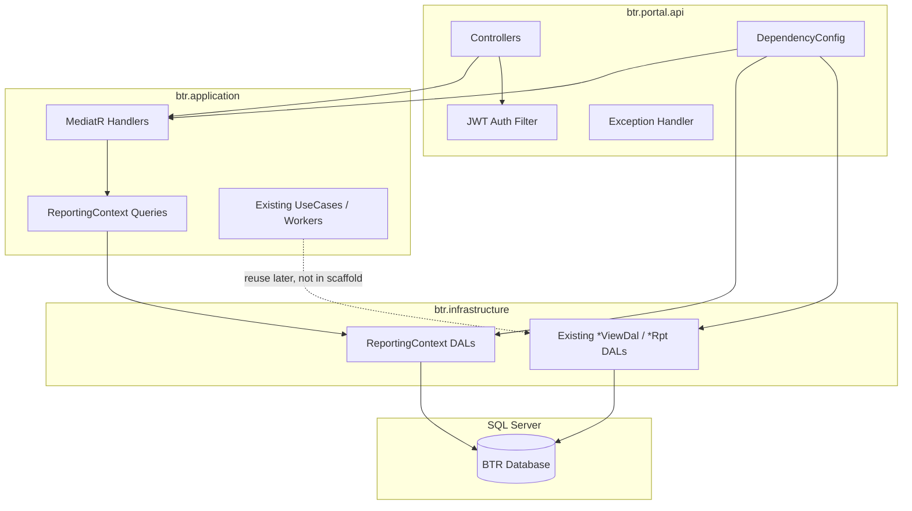

# Implementation Plan: BTR Portal API Scaffolding

## Document Status

| Field | Value |
| --- | --- |
| Task | BTR Portal API scaffolding (`btr.portal.api`) |
| Solution | `src/j05-btr-distrib/j05-btr-distrib.sln` |
| Scope | Scaffolding only — no dashboard business logic |
| Target runtime | .NET Framework 4.8 |
| Author role | Architect |
| Implementer input | This document |

---

## 1. Architecture Overview

### 1.1 Goal

Add a read-only HTTP API (`btr.portal.api`) to the existing BTR Desktop solution so a future Vue reporting portal can consume dashboard data. The API reuses `btr.application`, `btr.infrastructure`, `btr.domain`, and `btr.nuna` without changing transactional behavior in `btr.distrib`.

### 1.2 High-Level Architecture

```text
┌─────────────────────────────────────────────────────────────┐
│  Vue Portal (future)                                        │
│  - Dashboard UI                                             │
│  - JWT stored client-side                                   │
└──────────────────────────┬──────────────────────────────────┘
                           │ HTTPS / HTTP (internal LAN)
                           ▼
┌─────────────────────────────────────────────────────────────┐
│  IIS                                                        │
│  └── /btr-portal-api  →  btr.portal.api (ASP.NET Web API 2) │
│       ├── Controllers (thin)                                  │
│       ├── Auth (JWT)                                        │
│       ├── CORS / Error handling / Logging                   │
│       └── DI composition (MediatR, Scrutor scans)           │
└──────────────────────────┬──────────────────────────────────┘
                           │
          ┌────────────────┼────────────────┐
          ▼                ▼                ▼
   btr.application   btr.infrastructure   btr.domain
   (MediatR handlers,  (Dapper DALs,       (models)
    policies, workers)  ReportingContext)
          │                │
          └────────┬───────┘
                   ▼
            btr.nuna (shared helpers)
                   │
                   ▼
            SQL Server (same DB as BTR Desktop)
```

### 1.3 Design Principles Applied

| Principle | Decision |
| --- | --- |
| Reuse existing layers | API references Application + Infrastructure; no duplicate DAL logic in API project |
| Read-only V1 | No POST/PUT/DELETE for business entities; only `GET` dashboard placeholders + auth `POST` |
| No microservices | Single IIS-hosted API in same solution and same database |
| No architecture refactor | Do not move WinForms DI out of `btr.distrib`; copy registration pattern into portal |
| Match existing patterns | MediatR query/handler in Application; Dapper DAL in Infrastructure; Scrutor assembly scanning |

### 1.4 Why ASP.NET Web API 2 (not ASP.NET Core)

| Option | Verdict |
| --- | --- |
| **ASP.NET Web API 2 on .NET Framework 4.8** | **Selected.** Direct project references to existing class libraries; same runtime as solution; native IIS hosting on Windows Server alongside SQL Server |
| ASP.NET Core 8+ | Rejected for V1. Existing projects target `net48` and `btr.infrastructure` references `System.Windows.Forms`. Cross-targeting adds friction without benefit for an internal IIS deployment |

---

## 2. Solution Structure

### 2.1 New Project Placement

Add under `src/j05-btr-distrib/`:

```text
src/j05-btr-distrib/
├── btr.portal.api/              ← NEW
├── btr.application/             ← extend with ReportingContext
├── btr.infrastructure/          ← extend with ReportingContext
├── btr.domain/
├── btr.nuna/
├── btr.distrib/                 ← unchanged
├── btr.test/                    ← optional API smoke tests later
└── j05-btr-distrib.sln          ← add project reference
```

### 2.2 Solution Folder Nesting

Mirror existing layout in `j05-btr-distrib.sln`:

```text
j05-btr-distrib.sln
├── backend/                     (solution folder)
│   ├── btr.domain
│   ├── btr.application
│   ├── btr.infrastructure
│   ├── btr.portal.api           ← NEW, nested here
│   ├── btr.distrib
│   └── btr.sql
└── helpers/
    ├── btr.nuna
    └── btr.test
```

### 2.3 Project Definition

| Property | Value |
| --- | --- |
| Project name | `btr.portal.api` |
| Project type | ASP.NET Web Application (.NET Framework) |
| Template | Empty Web API 2 project (no MVC views) |
| Target framework | .NET Framework 4.8 |
| Output type | Library (IIS-hosted) |
| Root namespace | `btr.portal.api` |
| Assembly name | `btr.portal.api` |

### 2.4 Project References

```text
btr.portal.api
    → btr.application
    → btr.infrastructure
    (transitive: btr.domain, btr.nuna)
```

**Do not reference:**

- `btr.distrib` (WinForms host; would pull UI dependencies into API)
- `btr.sql` (database project; not a runtime reference)

### 2.5 Dependency Flow

```text
btr.portal.api  ──►  btr.application  ──►  btr.domain
        │                    │
        └──────────►  btr.infrastructure  ──►  btr.domain
                              │
                              └──────────►  btr.nuna
```

Rules:

- Controllers depend on MediatR (`IMediator`) only — never on DAL interfaces directly.
- Application handlers depend on Application contracts (`IDashboard*Dal`) — never on Infrastructure types.
- Infrastructure implements Application contracts.
- Domain models stay in `btr.domain`; API-specific response shapes stay in Application query response types or a dedicated `Dtos` subfolder under ReportingContext.

---

## 3. Dependency Diagram



---

## 4. API Conventions

### 4.1 Controller Organization

Group by portal concern, not by database table.

```text
btr.portal.api/
├── Controllers/
│   ├── HealthController.cs
│   ├── AuthController.cs
│   └── Dashboard/
│       ├── SalesDashboardController.cs
│       ├── PiutangDashboardController.cs
│       └── InventoryDashboardController.cs
├── Configurations/
│   ├── DependencyConfig.cs
│   ├── WebApiConfig.cs
│   └── CorsConfig.cs
├── Filters/
│   ├── JwtAuthenticationFilter.cs
│   └── GlobalExceptionFilter.cs
├── Models/
│   ├── ApiResponse.cs
│   ├── LoginRequest.cs
│   └── LoginResponse.cs
├── Infrastructure/
│   ├── JwtTokenService.cs
│   └── PortalConnStringFactory.cs
├── App_Start/
│   └── (WebApiConfig registration if using classic template)
├── Global.asax
├── Web.config
└── appsettings.json
```

**Routing convention:**

| Controller | Route prefix | Auth |
| --- | --- | --- |
| `HealthController` | `api/health` | Anonymous |
| `AuthController` | `api/auth` | Anonymous for login |
| `*DashboardController` | `api/dashboard/{area}` | JWT required |

Use attribute routing (`[RoutePrefix]`, `[Route]`) consistently.

### 4.2 Query / Handler Organization

Follow the existing MediatR pattern used in `ListFakturQuery`, `ListDataSalesPersonQuery`:

```text
btr.application/ReportingContext/
├── DashboardSalesAgg/
│   ├── Queries/
│   │   └── GetDashboardSalesQuery.cs      (IRequest + Handler in same file)
│   └── Contracts/
│       └── IDashboardSalesDal.cs
├── DashboardPiutangAgg/
│   ├── Queries/
│   │   └── GetDashboardPiutangQuery.cs
│   └── Contracts/
│       └── IDashboardPiutangDal.cs
└── DashboardInventoryAgg/
    ├── Queries/
    │   └── GetDashboardInventoryQuery.cs
    └── Contracts/
        └── IDashboardInventoryDal.cs
```

Handler skeleton pattern (placeholder response):

```csharp
public class GetDashboardSalesQuery : IRequest<DashboardSalesResponse> { }

public class DashboardSalesResponse
{
    public string Status { get; set; } = "not_implemented";
}

public class GetDashboardSalesHandler
    : IRequestHandler<GetDashboardSalesQuery, DashboardSalesResponse>
{
    private readonly IDashboardSalesDal _dal;

    public GetDashboardSalesHandler(IDashboardSalesDal dal) => _dal = dal;

    public Task<DashboardSalesResponse> Handle(
        GetDashboardSalesQuery request,
        CancellationToken cancellationToken)
    {
        return Task.FromResult(_dal.GetPlaceholder());
    }
}
```

Controller delegates to MediatR:

```csharp
[Authorize]
[RoutePrefix("api/dashboard/sales")]
public class SalesDashboardController : ApiController
{
    private readonly IMediator _mediator;

    public SalesDashboardController(IMediator mediator) => _mediator = mediator;

    [HttpGet, Route("")]
    public async Task<IHttpActionResult> Get()
    {
        var result = await _mediator.Send(new GetDashboardSalesQuery());
        return Ok(ApiResponse<DashboardSalesResponse>.Success(result));
    }
}
```

### 4.3 DTO Organization

| Layer | DTO location | Purpose |
| --- | --- | --- |
| API project | `Models/LoginRequest.cs`, `LoginResponse.cs` | HTTP contract for auth only |
| Application | `ReportingContext/*/Queries/*Response.cs` | Dashboard query results |
| Infrastructure | `ReportingContext/*/*Dto.cs` (optional) | Raw SQL row mapping if needed |
| Domain | `btr.domain` | Persistent entity models only — not API responses |

Do not expose `UserModel.Password` in any API response.

Use Mapster (`Adapt<>`) when mapping domain/DAL rows to response DTOs, consistent with `ListDataSalesPersonHandler`.

### 4.4 Response Format

Standard envelope for all JSON responses:

```json
{
  "status": "success",
  "code": 200,
  "message": null,
  "data": { }
}
```

Error example:

```json
{
  "status": "error",
  "code": 400,
  "message": "Invalid credentials",
  "data": null
}
```

Implement `ApiResponse<T>` in `btr.portal.api/Models/ApiResponse.cs` with factory methods `Success(T data)` and `Error(int code, string message)`.

HTTP status codes:

| Situation | HTTP | Envelope status |
| --- | --- | --- |
| Success | 200 | `success` |
| Validation / bad input | 400 | `error` |
| Unauthorized | 401 | `error` |
| Not found | 404 | `error` |
| Unhandled exception | 500 | `error` |

### 4.5 Error Handling Strategy

Use a Web API global exception filter (`GlobalExceptionFilter`) registered in `WebApiConfig`:

| Exception type | HTTP | Message exposed |
| --- | --- | --- |
| `ArgumentException`, `ValidationException` | 400 | `ex.Message` |
| `KeyNotFoundException` | 404 | `ex.Message` |
| `UnauthorizedAccessException` | 401 | Generic or `ex.Message` |
| All others | 500 | `"An unexpected error occurred."` (hide internals) |

Log full exception details server-side; never return stack traces to clients in production.

Align with existing application behavior where `KeyNotFoundException` signals "data not found" (see `ListFakturHandler`, `ListDataSalesPersonHandler`).

---

## 5. Dependency Injection

### 5.1 Registration Strategy

Use `Microsoft.Extensions.DependencyInjection` (already in solution at v7.x) with Web API's `IDependencyResolver` adapter.

Create `Configurations/DependencyConfig.cs`:

```csharp
public static class DependencyConfig
{
    public static IServiceProvider Configure(IConfiguration configuration)
    {
        var services = new ServiceCollection();

        services.AddApplicationPortal(configuration);
        services.AddInfrastructurePortal(configuration);
        services.AddPortalPresentation(configuration);

        return services.BuildServiceProvider();
    }
}
```

Split into three extension classes inside `btr.portal.api/Configurations/`:

| Extension | Responsibility |
| --- | --- |
| `ApplicationPortalExtensions.AddApplicationPortal` | MediatR, FluentValidation, Scrutor scans for Writers/Builders/Services |
| `InfrastructurePortalExtensions.AddInfrastructurePortal` | DatabaseOptions, Scrutor scans for DAL interfaces, ReportingContext registrations |
| `PortalPresentationExtensions.AddPortalPresentation` | JWT services, `IMediator` bridge, controllers |

### 5.2 Reuse of Existing Registrations

Copy the Scrutor scan blocks from `btr.distrib/Program.cs` (`ConfigureServices`) into Application and Infrastructure extension methods. Include:

**Application scans** (from `ApplicationAssemblyAnchor`):

- `INunaWriter<>`, `INunaWriter2<>`
- `INunaService<,>`, `INunaService<>`, `INunaServiceVoid<>`
- `INunaBuilder<>`

Also register:

- `AddMediatR` from `btr.application` assembly
- `AddValidatorsFromAssembly` for `btr.application`
- `INunaCounterBL`, `DateTimeProvider`, `ITglJamDal`

**Infrastructure scans** (from `InfrastructureAssemblyAnchor`):

- `IInsert<>`, `IUpdate<>`, `IDelete<>`
- `IGetData<,>`, `IListData<>`, `IListData<,>`, `IListData<,,>`, `IListData<,,,>`
- `INunaService<,>`, `INunaService<>`
- `ISaveChange<>`, `IDeleteEntity<>`, `ILoadEntity<,>`

**Explicit portal additions:**

```csharp
services.AddScoped<IDashboardSalesDal, DashboardSalesDal>();
services.AddScoped<IDashboardPiutangDal, DashboardPiutangDal>();
services.AddScoped<IDashboardInventoryDal, DashboardInventoryDal>();
services.AddScoped<IUserDal, UserDal>();           // auth
services.AddSingleton<IJwtTokenService, JwtTokenService>();
```

**Do not register** WinForms-specific scans from `WinformAssemblyAnchor` (`Form`, `IPrintDoc<>`, `IBrowser<>`, etc.).

### 5.3 Startup Configuration

**Global.asax.cs:**

```csharp
protected void Application_Start()
{
    var configuration = new ConfigurationBuilder()
        .SetBasePath(AppDomain.CurrentDomain.BaseDirectory)
        .AddJsonFile("appsettings.json", optional: false, reloadOnChange: true)
        .AddJsonFile($"appsettings.{Environment.MachineName}.json", optional: true)
        .Build();

    var serviceProvider = DependencyConfig.Configure(configuration);

    GlobalConfiguration.Configuration.DependencyResolver =
        new ServiceProviderDependencyResolver(serviceProvider);

    GlobalConfiguration.Configure(WebApiConfig.Register);
}
```

Implement `ServiceProviderDependencyResolver` (standard Web API + MS.DI adapter) in `Infrastructure/ServiceProviderDependencyResolver.cs`.

---

## 6. Authentication Decision

### 6.1 Recommendation: Reuse `BTR_User` for V1

Use the existing `BTR_User` table and `IUserDal` / `UserDal` for portal login.

**Login flow:**

1. Client `POST /api/auth/login` with `{ "userId": "...", "password": "..." }`.
2. API loads user via `IUserDal.GetData(new UserModel(userId))`.
3. Hash submitted password with `HashSha256()` (from `btr.nuna.Domain.StringExtensions`) — same as `LoginForm`.
4. Compare to `user.Password`.
5. On success, issue JWT containing claims: `sub` (UserId), `name` (UserName), `role` (RoleId), `role_name` (RoleName).
6. Return `{ token, expiresAt, user: { userId, userName, roleId, roleName } }`.

**Do not** replicate the WinForms "GOD MODE" backdoor from `LoginForm`.

### 6.2 Option Comparison

| Criterion | Reuse `BTR_User` | New `PortalUser` table |
| --- | --- | --- |
| Implementation effort | Low — DAL exists | High — schema migration, new DAL, admin UI |
| Credential parity with Desktop | Same users/passwords | Requires separate provisioning |
| Role alignment | Uses existing `BTR_Role` | Needs duplicate or mapped roles |
| Security isolation | Shared credential store | Can restrict portal access independently |
| Password policy | SHA256 (legacy, consistent) | Opportunity for bcrypt — but breaks parity |
| V1 fit | **Best fit** | Over-engineered for internal read-only portal |

### 6.3 Decision

**V1: Reuse `BTR_User`.**

Introduce `PortalUser` only if a future requirement needs:

- External users without Desktop accounts
- Different auth provider (AD/LDAP)
- Portal-only roles decoupled from Desktop `BTR_Role`

### 6.4 JWT Implementation (.NET Framework 4.8)

NuGet packages:

- `System.IdentityModel.Tokens.Jwt`
- `Microsoft.IdentityModel.Tokens`
- `Microsoft.Owin.Host.SystemWeb` (optional, if using OWIN pipeline)
- Or: custom `JwtAuthenticationFilter` extending `AuthorizationFilterAttribute` validating Bearer tokens

Configure via `appsettings.json`:

```json
"Jwt": {
  "Issuer": "btr-portal-api",
  "Audience": "btr-portal-vue",
  "Key": "<256-bit-secret-minimum>",
  "ExpiryMinutes": 480
}
```

Apply `[Authorize]` on dashboard controllers. Leave `HealthController` and `AuthController.Login` anonymous.

---

## 7. Reporting Context Design

### 7.1 Purpose

`ReportingContext` is a new bounded area for portal/dashboard read models. It isolates reporting queries from transactional aggregates (`FakturAgg`, `PiutangAgg`, etc.) while allowing Infrastructure implementations to delegate to existing `*Rpt` / `*ViewDal` classes where appropriate.

### 7.2 Folder Structure

**Application:**

```text
btr.application/ReportingContext/
├── DashboardSalesAgg/
│   ├── Contracts/
│   │   └── IDashboardSalesDal.cs
│   └── Queries/
│       └── GetDashboardSalesQuery.cs
├── DashboardPiutangAgg/
│   ├── Contracts/
│   │   └── IDashboardPiutangDal.cs
│   └── Queries/
│       └── GetDashboardPiutangQuery.cs
└── DashboardInventoryAgg/
    ├── Contracts/
    │   └── IDashboardInventoryDal.cs
    └── Queries/
        └── GetDashboardInventoryQuery.cs
```

**Infrastructure:**

```text
btr.infrastructure/ReportingContext/
├── DashboardSalesAgg/
│   └── DashboardSalesDal.cs
├── DashboardPiutangAgg/
│   └── DashboardPiutangDal.cs
└── DashboardInventoryAgg/
    └── DashboardInventoryDal.cs
```

### 7.3 Naming Conventions

| Element | Convention | Example |
| --- | --- | --- |
| Bounded context folder | `{BusinessArea}Context` at root of layer | `ReportingContext` |
| Feature aggregate | `Dashboard{Area}Agg` | `DashboardSalesAgg` |
| Query | `GetDashboard{Area}Query` | `GetDashboardSalesQuery` |
| Response | `Dashboard{Area}Response` | `DashboardSalesResponse` |
| DAL interface | `IDashboard{Area}Dal` | `IDashboardSalesDal` |
| DAL implementation | `Dashboard{Area}Dal` | `DashboardSalesDal` |

Differ from existing WinForms report folders (`*Rpt`) intentionally: `*Rpt` folders serve Desktop report forms; `ReportingContext` serves the Portal API read model layer.

### 7.4 Query Organization and Future Reuse

Existing reporting DALs to wire in later (not during scaffolding):

| Dashboard | Existing Infrastructure starting points |
| --- | --- |
| Sales | `SalesContext/SalesOmzetAgg/*`, `SalesContext/FakturInfoAgg/FakturViewDal` |
| Piutang | `FinanceContext/PiutangAgg/PIutangLunasViewDal`, `FinanceContext/PiutangSalesWilayahRpt/PiutangSalesWilayahDal` |
| Inventory | `InventoryContext/StokBalanceRpt/StokBalanceViewDal`, `InventoryContext/KartuStokRpt/*` |

Scaffold DALs return placeholder data. Future implementers inject or call existing DALs from `Dashboard*Dal` without moving SQL into the API project.

### 7.5 Domain Layer

No new domain entities required for scaffolding. Dashboard responses are read DTOs in Application query response types, not `btr.domain` models.

---

## 8. Initial Endpoints (Scaffolding Only)

### 8.1 Endpoint Table

| Method | Route | Auth | Handler | Scaffold behavior |
| --- | --- | --- | --- | --- |
| `GET` | `/api/health` | None | Inline in controller | Returns `{ status: "ok", version, timestamp }` |
| `POST` | `/api/auth/login` | None | `AuthController` + `IUserDal` | Validates credentials, returns JWT |
| `GET` | `/api/dashboard/sales` | JWT | `GetDashboardSalesQuery` | Returns `{ status: "not_implemented" }` |
| `GET` | `/api/dashboard/piutang` | JWT | `GetDashboardPiutangQuery` | Returns `{ status: "not_implemented" }` |
| `GET` | `/api/dashboard/inventory` | JWT | `GetDashboardInventoryQuery` | Returns `{ status: "not_implemented" }` |

### 8.2 Health Response Shape

```json
{
  "status": "success",
  "code": 200,
  "message": null,
  "data": {
    "status": "ok",
    "service": "btr.portal.api",
    "version": "1.0.0.0",
    "timestampUtc": "2026-06-05T12:00:00Z"
  }
}
```

---

## 9. CORS

### 9.1 Design

Enable CORS for a future Vue SPA using Web API's built-in CORS support.

**NuGet:** `Microsoft.AspNet.WebApi.Cors`

**Configuration** (`appsettings.json`):

```json
"Cors": {
  "AllowedOrigins": [
    "http://localhost:5173",
    "http://localhost:8080"
  ],
  "AllowCredentials": false
}
```

**WebApiConfig:**

```csharp
var corsOrigins = ConfigurationManager.AppSettings["Cors:AllowedOrigins"] 
    ?? "http://localhost:5173";
config.EnableCors(new EnableCorsAttribute(corsOrigins, "*", "*"));
```

For production, replace localhost origins with the internal IIS URL hosting the Vue app (e.g. `http://btr-server/btr-portal`).

V1 uses JWT in `Authorization` header (not cookies), so `AllowCredentials` can remain `false`.

---

## 10. Logging

### 10.1 Approach

No structured logging exists in `j05-btr-distrib` today. Introduce **NLog** for the API project — mature .NET Framework 4.8 support, file targets, minimal startup code.

**NuGet:** `NLog`, `NLog.Web`

### 10.2 Configuration

`NLog.config` in project root, copied to output:

| Target | Purpose |
| --- | --- |
| File (`logs/btr-portal-api-${shortdate}.log`) | Daily rolling file on server |
| Console (Debug builds only) | Local development |

Log levels:

- `Info` — request start/end, login success
- `Warn` — failed login, 400 responses
- `Error` — unhandled exceptions (with stack trace)

Do not log passwords or JWT tokens.

### 10.3 Integration Points

- `GlobalExceptionFilter` — log errors before returning envelope
- `AuthController` — log failed login attempts (UserId only, not password)
- Optional: Web API delegating handler for request/response timing

---

## 11. Configuration

### 11.1 Configuration Sources

| Source | Purpose |
| --- | --- |
| `appsettings.json` | Base settings (checked into repo with placeholders) |
| `appsettings.{MACHINE}.json` | Per-server overrides (gitignored or environment-specific) |
| `Web.config` `appSettings` | IIS-friendly overrides for connection strings and secrets |

Load order (first wins for MS.Configuration pattern — later files override if using standard builder):

```csharp
.AddJsonFile("appsettings.json", optional: false)
.AddJsonFile($"appsettings.{Environment.MachineName}.json", optional: true)
```

### 11.2 Connection String Strategy

**Problem:** `ConnStringHelper` reads `HKEY_CURRENT_USER\DrurySoftware\BTRApp`, which is appropriate for Desktop per-user installs but **not** for IIS Application Pool identity (no user registry context).

**Solution for Portal API:** Add `PortalConnStringFactory` in `btr.portal.api`:

```csharp
public static class PortalConnStringFactory
{
    public static DatabaseOptions FromConfiguration(IConfiguration config)
    {
        var section = config.GetSection(DatabaseOptions.SECTION_NAME);
        return new DatabaseOptions
        {
            ServerName = section["ServerName"],
            DbName = section["DbName"],
            IsTest = bool.Parse(section["IsTest"] ?? "false")
        };
    }
}
```

Register with:

```csharp
services.Configure<DatabaseOptions>(configuration.GetSection(DatabaseOptions.SECTION_NAME));
```

For portal deployment, set `Database:ServerName` and `Database:DbName` in server-side `appsettings.{MACHINE}.json`. Set `IsTest: false` but ensure `ConnStringHelper.Generate` uses appsettings values when registry is empty (existing fallback behavior already supports this — registry empty → uses provided ServerName/DbName).

**Important:** Verify on IIS that the app pool identity can reach SQL Server with the existing `btrLogin` SQL credentials embedded in `ConnStringHelper`. No change to SQL auth for V1.

Example production `appsettings.PROD-SERVER.json`:

```json
{
  "Database": {
    "ServerName": "LOCALHOST\\SQLEXPRESS",
    "DbName": "btr",
    "IsTest": false
  },
  "Jwt": {
    "Issuer": "btr-portal-api",
    "Audience": "btr-portal-vue",
    "Key": "REPLACE-WITH-STRONG-SECRET-256-BITS-MINIMUM",
    "ExpiryMinutes": 480
  },
  "Cors": {
    "AllowedOrigins": [ "http://btr-server/btr-portal" ]
  }
}
```

### 11.3 Environment Settings

| Setting | Location | Notes |
| --- | --- | --- |
| Database server/db | `Database` section | Required on each server |
| JWT secret | `Jwt:Key` | Server-only; never commit real secrets |
| CORS origins | `Cors:AllowedOrigins` | Per environment |
| Log path | `NLog.config` | Ensure IIS app pool has write access to `logs/` |

---

## 12. Deployment Strategy (IIS)

### 12.1 Virtual Directory Structure

Recommended IIS layout on the BTR server:

```text
Default Web Site (or dedicated "BTR" site)
├── btr-portal/              ← future Vue static site
└── btr-portal-api/          ← btr.portal.api IIS application
    ├── bin/
    ├── Global.asax
    ├── Web.config
    ├── appsettings.json
    ├── appsettings.{SERVER}.json
    └── logs/
```

API base URL example: `http://btr-server/btr-portal-api/api/health`

### 12.2 Application Pool Settings

| Setting | Value |
| --- | --- |
| .NET CLR Version | v4.0 |
| Managed Pipeline Mode | Integrated |
| Identity | ApplicationPoolIdentity (or dedicated service account with SQL access) |
| Start Mode | AlwaysRunning (optional) |

### 12.3 Publish Approach

1. Visual Studio: Right-click `btr.portal.api` → **Publish** → Folder profile.
2. Target folder: `publish\btr-portal-api\`.
3. Configuration: Release.
4. Copy published folder to IIS physical path for `/btr-portal-api`.
5. Ensure `logs/` folder exists with write permissions for app pool identity.

### 12.4 Web.config Considerations

- Set `compilation debug="false"` in Release.
- Configure `httpRuntime` / request limits if large dashboard payloads are expected later.
- Add `ASPNETCORE_ENVIRONMENT`-equivalent via custom `Environment` appSetting if needed (optional).

### 12.5 Post-Deploy Verification

```text
GET http://{server}/btr-portal-api/api/health          → 200 ok
POST http://{server}/btr-portal-api/api/auth/login       → 200 with token (valid user)
GET http://{server}/btr-portal-api/api/dashboard/sales   → 401 without token
GET http://{server}/btr-portal-api/api/dashboard/sales   → 200 with Bearer token, not_implemented body
```

---

## 13. NuGet Packages (btr.portal.api)

| Package | Version guidance | Purpose |
| --- | --- | --- |
| Microsoft.AspNet.WebApi | 5.2.x | Web API 2 core |
| Microsoft.AspNet.WebApi.Cors | 5.2.x | CORS |
| Microsoft.Extensions.DependencyInjection | 7.0.0 | Match existing solution |
| Microsoft.Extensions.Configuration.Json | 7.0.0 | appsettings.json |
| MediatR | 12.1.1 | Match btr.application |
| Scrutor | 4.2.2 | Match btr.distrib |
| FluentValidation.DependencyInjectionExtensions | 11.6.0 | Match btr.distrib |
| System.IdentityModel.Tokens.Jwt | 7.x | JWT |
| Microsoft.IdentityModel.Tokens | 7.x | JWT signing |
| Newtonsoft.Json | 13.0.1 | JSON serialization (Web API default) |
| NLog | 5.x | Logging |
| NLog.Web | 5.x | ASP.NET integration |

Use `packages.config` to stay consistent with other projects in `j05-btr-distrib` (non-SDK-style csproj).

---

## 14. Risk Assessment

| Risk | Impact | Mitigation |
| --- | --- | --- |
| Registry-based connection string fails under IIS | API cannot connect to DB | Use appsettings server overrides; document in deploy runbook |
| DI registration drift between distrib and portal | Missing service registrations at runtime | Copy scan blocks verbatim; add startup self-check endpoint later |
| JWT secret in config file | Token forgery if leaked | Machine-specific config outside git; strong key rotation procedure |
| Shared BTR_User credentials | Portal access equals Desktop access | Acceptable for V1 internal use; add portal role gate later using `BTR_Role` |
| Scrutor registers write DALs in read-only API | Accidental writes if endpoint added | V1 controllers are GET-only; code review gate for new endpoints |
| `ConnStringHelper` static cache | Wrong connection if config changes at runtime | IIS app pool recycle after config change |

---

## 15. Step-by-Step Implementation Plan

Implement in order. Each step should compile before proceeding.

### Phase 1 — Project Shell

| Step | Action | Done when |
| --- | --- | --- |
| 1.1 | Create `btr.portal.api` ASP.NET Web API 2 project (.NET 4.8) under `src/j05-btr-distrib/` | Project builds |
| 1.2 | Add project to `j05-btr-distrib.sln` under `backend` folder | Visible in solution |
| 1.3 | Add project references to `btr.application`, `btr.infrastructure` | References resolve |
| 1.4 | Install NuGet packages (Section 13) | packages.config complete |
| 1.5 | Add `appsettings.json`, `NLog.config`, `Web.config` transforms | Config loads at startup |

### Phase 2 — Cross-Cutting Infrastructure

| Step | Action | Done when |
| --- | --- | --- |
| 2.1 | Implement `ApiResponse<T>` envelope | Unit-compile |
| 2.2 | Implement `GlobalExceptionFilter` + register in `WebApiConfig` | Errors return JSON envelope |
| 2.3 | Implement `ServiceProviderDependencyResolver` | DI resolves controllers |
| 2.4 | Implement `DependencyConfig` + Application/Infrastructure/Presentation extensions | MediatR resolves |
| 2.5 | Configure CORS from appsettings | Preflight succeeds from localhost |
| 2.6 | Configure NLog | Log file written on request |

### Phase 3 — Authentication

| Step | Action | Done when |
| --- | --- | --- |
| 3.1 | Add `JwtOptions` class and bind from config | Options injected |
| 3.2 | Implement `JwtTokenService` (create + validate) | Token round-trip works |
| 3.3 | Implement `JwtAuthenticationFilter` or authorization handler | `[Authorize]` enforced |
| 3.4 | Implement `AuthController` with `POST /api/auth/login` using `IUserDal` + `HashSha256` | Valid user gets JWT |
| 3.5 | Verify invalid credentials return 401 with envelope | Manual test pass |

### Phase 4 — Reporting Context Scaffolding

| Step | Action | Done when |
| --- | --- | --- |
| 4.1 | Create Application `ReportingContext` folders and query/handler placeholders (3 dashboards) | Application project builds |
| 4.2 | Create Application DAL contracts (`IDashboard*Dal`) | Interfaces compile |
| 4.3 | Create Infrastructure `ReportingContext` DAL implementations returning placeholder | Infrastructure builds |
| 4.4 | Register ReportingContext DALs in `InfrastructurePortalExtensions` | DI resolves handlers |

### Phase 5 — Controllers

| Step | Action | Done when |
| --- | --- | --- |
| 5.1 | Implement `HealthController` — `GET /api/health` | Returns 200 ok |
| 5.2 | Implement `SalesDashboardController` — `GET /api/dashboard/sales` | Returns placeholder with JWT |
| 5.3 | Implement `PiutangDashboardController` — `GET /api/dashboard/piutang` | Returns placeholder with JWT |
| 5.4 | Implement `InventoryDashboardController` — `GET /api/dashboard/inventory` | Returns placeholder with JWT |

### Phase 6 — IIS Deployment Prep

| Step | Action | Done when |
| --- | --- | --- |
| 6.1 | Create Publish profile (Folder, Release) | `publish/` output generated |
| 6.2 | Document server `appsettings.{MACHINE}.json` template | Deploy runbook note in PR |
| 6.3 | Deploy to local IIS; verify all 5 endpoints | Post-deploy checklist pass |
| 6.4 | Confirm SQL connectivity from IIS app pool | Dashboard endpoints return placeholder (not SQL error) |

### Phase 7 — Verification (No Business Logic)

| Step | Action | Done when |
| --- | --- | --- |
| 7.1 | Confirm no changes to `btr.distrib` behavior | Desktop app still builds |
| 7.2 | Confirm no write endpoints exposed | Route audit complete |
| 7.3 | Confirm `BTR_User` login works for at least one test user | Auth smoke test |
| 7.4 | Confirm CORS headers present for configured Vue origin | Browser preflight test |

---

## 16. Out of Scope (Explicit)

The Implementer must **not** do the following as part of this scaffolding task:

- Implement real dashboard SQL or chart data
- Build the Vue frontend
- Refactor `btr.distrib/Program.cs` DI into a shared library
- Create `PortalUser` table or separate auth store
- Introduce microservices, message queues, or separate databases
- Modify existing `*Rpt` DAL query logic
- Add write/mutation endpoints for business entities

---

## 17. Files to Create (Checklist)

### btr.portal.api (new project)

```text
btr.portal.api/
├── App_Start/WebApiConfig.cs
├── Configurations/
│   ├── ApplicationPortalExtensions.cs
│   ├── InfrastructurePortalExtensions.cs
│   ├── PortalPresentationExtensions.cs
│   └── DependencyConfig.cs
├── Controllers/
│   ├── HealthController.cs
│   ├── AuthController.cs
│   └── Dashboard/
│       ├── SalesDashboardController.cs
│       ├── PiutangDashboardController.cs
│       └── InventoryDashboardController.cs
├── Filters/
│   ├── GlobalExceptionFilter.cs
│   └── JwtAuthenticationFilter.cs
├── Infrastructure/
│   ├── JwtTokenService.cs
│   ├── JwtOptions.cs
│   └── ServiceProviderDependencyResolver.cs
├── Models/
│   ├── ApiResponse.cs
│   ├── LoginRequest.cs
│   └── LoginResponse.cs
├── Properties/AssemblyInfo.cs
├── Global.asax
├── Global.asax.cs
├── Web.config
├── appsettings.json
├── NLog.config
├── packages.config
└── btr.portal.api.csproj
```

### btr.application (additions)

```text
ReportingContext/DashboardSalesAgg/Contracts/IDashboardSalesDal.cs
ReportingContext/DashboardSalesAgg/Queries/GetDashboardSalesQuery.cs
ReportingContext/DashboardPiutangAgg/Contracts/IDashboardPiutangDal.cs
ReportingContext/DashboardPiutangAgg/Queries/GetDashboardPiutangQuery.cs
ReportingContext/DashboardInventoryAgg/Contracts/IDashboardInventoryDal.cs
ReportingContext/DashboardInventoryAgg/Queries/GetDashboardInventoryQuery.cs
```

### btr.infrastructure (additions)

```text
ReportingContext/DashboardSalesAgg/DashboardSalesDal.cs
ReportingContext/DashboardPiutangAgg/DashboardPiutangDal.cs
ReportingContext/DashboardInventoryAgg/DashboardInventoryDal.cs
```

### Solution

- Update `j05-btr-distrib.sln` with new project entry and nested folder mapping

---

## 18. Success Criteria

Scaffolding is complete when:

1. `btr.portal.api` builds and runs under IIS on the target server.
2. All five endpoints respond with documented shapes.
3. JWT authentication protects dashboard routes.
4. `ReportingContext` placeholder handlers and DALs exist in Application and Infrastructure.
5. `btr.distrib` remains unchanged and builds successfully.
6. An Implementer can begin dashboard business logic by filling in `Dashboard*Dal` without redesigning the API layer.

---

## 19. References

| Artifact / Code | Relevance |
| --- | --- |
| `btr.distrib/Program.cs` | DI registration template to copy |
| `btr.application/.../ListFakturQuery.cs` | MediatR query/handler pattern |
| `btr.distrib/SharedForm/LoginForm.cs` | Password validation (SHA256) |
| `btr.infrastructure/SupportContext/UserAgg/UserDal.cs` | User data access |
| `btr.infrastructure/Helpers/ConnStringHelper.cs` | Connection string behavior (IIS caveat) |
| `btr.infrastructure/Helpers/DatabaseOptions.cs` | Configuration section name |
| `src/j06-pkl-btrade-api/btrade.webapi/` | Reference for JWT/CORS/envelope patterns (ASP.NET Core; adapt to Web API 2) |
| `docs/foundation/LANDSCAPE.md` | Portal added as new system under Supporting Systems (future doc update) |
