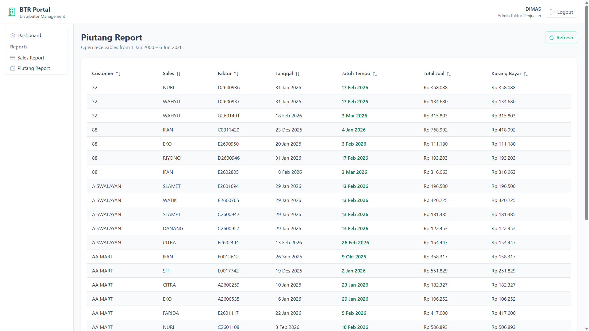

# Implementation Summary: BTR Portal — Milestone 10 (Piutang Report V1)

## Status

Milestone 10 is complete. `GET /api/reports/piutang` returns open receivable rows from existing BTR reporting sources with footer summary totals that reconcile with the M5 Piutang Dashboard. The portal adds the Piutang Report page at `/reports/piutang` with a PrimeVue DataTable and shared `ReportSummaryBar` component. All M10 verification checks pass.

---

## 1. Files Added

### Backend — Application (`ReportingContext/PiutangReportAgg`)

| File | Purpose |
| --- | --- |
| `Contracts/IPiutangReportDal.cs` | Report DAL contract |
| `Queries/GetPiutangReportQuery.cs` | MediatR query, handler, `PiutangReportResponse`, `PiutangReportSummary`, `PiutangReportRow` |

### Backend — Infrastructure

| File | Purpose |
| --- | --- |
| `ReportingContext/PiutangReportAgg/PiutangReportDal.cs` | Wraps `IPiutangSalesWilayahDal`; applies open-balance filter; computes footer totals using dashboard logic |

### Backend — Portal API

| File | Purpose |
| --- | --- |
| `Controllers/Reports/PiutangReportController.cs` | Thin MediatR delegate — `GET /api/reports/piutang` |

### Backend — Tests

| File | Purpose |
| --- | --- |
| `btr.test/ReportingContext/PiutangReportDalTest.cs` | Unit tests for filter, summary, customer-key, and row ordering |

### Frontend

| File | Purpose |
| --- | --- |
| `src/stores/piutangReportStore.ts` | Loading / error / data state |
| `src/components/reports/ReportSummaryBar.vue` | Shared footer summary bar (reusable for M11/M12) |
| `src/views/reports/PiutangReportView.vue` | PrimeVue DataTable report page with summary bar |

### Documentation

| File | Purpose |
| --- | --- |
| `screenshots/milestone-10-piutang-report.png` | UI verification screenshot |

---

## 2. Files Modified

| File | Change |
| --- | --- |
| `btr.application/btr.application.csproj` | Added `PiutangReportAgg` compile includes |
| `btr.infrastructure/btr.infrastructure.csproj` | Added `PiutangReportDal.cs` compile include |
| `btr.portal.api/btr.portal.api.csproj` | Added `PiutangReportController.cs` compile include |
| `btr.test/btr.test.csproj` | Added `PiutangReportDalTest.cs` compile include |
| `btr.portal.api/Configurations/InfrastructurePortalExtensions.cs` | Registered `IPiutangReportDal` → `PiutangReportDal` |
| `btr.portal.api/Configurations/PortalPresentationExtensions.cs` | Registered `PiutangReportController` |
| `src/models/reports.ts` | Added `PiutangReportResponse`, `PiutangReportSummary`, `PiutangReportRow` types |
| `src/api/reportsApi.ts` | Added `fetchPiutangReport()` |
| `src/router/index.ts` | Added `/reports/piutang` route |
| `src/layouts/MainLayout.vue` | Added Piutang Report sidebar menu item |

---

## 3. Existing DALs Reused

| DAL / Service | Interface | Used for |
| --- | --- | --- |
| `PiutangSalesWilayahDal` | `IPiutangSalesWilayahDal` | Load per-faktur receivable rows via `ListData(Periode)` — same source as desktop FF1 and M5 dashboard |
| `TglJamDal` | `ITglJamDal` | Period end date (`2000-01-01` → today) and `GeneratedAt` timestamp |

`IPiutangSalesWilayahDal` is auto-registered via existing Scrutor `IListData<PiutangSalesWilayahDto, Periode>` scan. `PiutangReportDal` orchestrates these dependencies; it does not duplicate SQL or business rules.

### Logic reused from `DashboardPiutangDal` (verbatim copy)

| Logic | Purpose |
| --- | --- |
| `OpenReceivablesPeriode()` | Period `2000-01-01` → today |
| `KurangBayar > 1` filter | Open balance only |
| `ResolveCustomerKey()` | Distinct customer count for footer |
| Summary aggregation | `TotalPiutang = Sum(KurangBayar)`, `TotalCustomer = distinct customer keys` |

### Not used (by design)

| Component | Reason |
| --- | --- |
| `PiutangSalesWilayahForm` UI filters | Fixed filter — no Show Paid toggle in V1 |
| Payment/element subqueries (direct) | Already inside `PiutangSalesWilayahDal`; deferred columns not mapped |
| `PelunasanInfoForm`, `PiutangTrackerForm` | Out of M10 V1 scope |

---

## 4. API Endpoints Created

### Endpoint

```
GET /api/reports/piutang
Authorization: Bearer <JWT>
```

No query parameters.

### Response

```json
{
  "Status": "success",
  "Code": 200,
  "Message": null,
  "Data": {
    "PeriodFrom": "2000-01-01T00:00:00",
    "PeriodTo": "2026-06-06T23:59:59",
    "GeneratedAt": "2026-06-06T11:37:17.17",
    "Summary": {
      "TotalPiutang": 16042764169.35,
      "TotalCustomer": 1551
    },
    "Rows": [
      {
        "CustomerName": "32",
        "SalesName": "NURI",
        "FakturCode": "D2600936",
        "FakturDate": "2026-01-31T00:00:00",
        "JatuhTempo": "2026-02-17T00:00:00",
        "TotalJual": 358088.22,
        "KurangBayar": 358088.22
      }
    ]
  }
}
```

| Field | Type | Meaning |
| --- | --- | --- |
| `PeriodFrom` / `PeriodTo` | `DateTime` | Open receivables window (`2000-01-01` → today) |
| `GeneratedAt` | `DateTime` | Server timestamp when report was built |
| `Summary.TotalPiutang` | `decimal` | Sum of `KurangBayar` where `> 1` — reconciles with M5 dashboard |
| `Summary.TotalCustomer` | `int` | Distinct customer count — reconciles with M5 dashboard |
| `Rows` | `PiutangReportRow[]` | Filtered rows ordered by Customer, FakturDate, FakturCode |

Anonymous requests return HTTP 401.

---

## 5. Frontend Pages Created

### Route

| Path | Component | Auth |
| --- | --- | --- |
| `/reports/piutang` | `PiutangReportView.vue` | Required |

### Navigation

Sidebar menu:

```
Reports
├── Sales Report
└── Piutang Report
```

### DataTable features

| Feature | Implementation |
| --- | --- |
| Columns | Customer, Sales, Faktur, Tanggal, Jatuh Tempo, Total Jual, Kurang Bayar (7 columns) |
| Jatuh Tempo emphasis | Subtle primary-color styling (M14 prep) |
| Footer summary | `ReportSummaryBar` — Total Piutang, Total Customer from API `Summary` |
| Loading state | DataTable `:loading` + Refresh button spinner |
| Empty state | Custom `#empty` template — "No open receivables found." |
| Pagination | Client-side, 25 rows default, options 10/25/50/100 |
| Sorting | Column sort enabled |

No filtering, export, charts, or drilldown.

---

## 6. Verification Results

| # | Check | Result |
| --- | --- | --- |
| 1 | Backend build succeeds | Pass — `j05-btr-distrib.sln` Debug build, zero errors |
| 2 | Frontend build succeeds | Pass — `npm run build` (vue-tsc + vite) |
| 3 | PiutangReportDal unit tests | Pass — 3/3 tests |
| 4 | Authorization | Pass — anonymous `GET /api/reports/piutang` → HTTP 401 |
| 5 | MediatR pipeline | Pass — `GetPiutangReportQuery` → Handler → `IPiutangReportDal` → `IPiutangSalesWilayahDal` |
| 6 | Controller has no DAL reference | Pass — `PiutangReportController` calls MediatR only |
| 7 | Rows filtered | Pass — all returned rows have `KurangBayar > 1` |
| 8 | Column count | Pass — 7 fields per row, no deferred fields |
| 9 | **KPI reconciliation** | **Pass** — dashboard and report totals match exactly |
| 10 | Dashboard unchanged | Pass — M5 Piutang KPI still loads on `/dashboard` |
| 11 | UI renders correctly | Pass — see screenshot |

### KPI reconciliation (mandatory acceptance test)

Dev database verification against running API:

```powershell
# Login
$login = curl.exe -s -X POST http://localhost:5057/api/auth/login `
  -H "Content-Type: application/json" --data-raw '{"UserId":"DIMAS","Password":"1111"}'
$token = ($login | ConvertFrom-Json).Data.Token

# Fetch dashboard and report
$dash = curl.exe -s http://localhost:5057/api/dashboard/piutang -H "Authorization: Bearer $token" | ConvertFrom-Json
$rpt = curl.exe -s http://localhost:5057/api/reports/piutang -H "Authorization: Bearer $token" | ConvertFrom-Json

# Assert reconciliation
$dash.Data.TotalPiutang -eq $rpt.Data.Summary.TotalPiutang   # True
$dash.Data.TotalCustomer -eq $rpt.Data.Summary.TotalCustomer # True
```

| Metric | Dashboard | Report Summary | Match |
| --- | --- | --- | --- |
| Total Piutang | 16,042,764,169.35 | 16,042,764,169.35 | Yes |
| Total Customer | 1,551 | 1,551 | Yes |
| Row count | — | 11,536 | — |

### Full test suite note

Running all 79 tests in `btr.test` yields 70 passed / 9 failed. Failures are pre-existing database-integration tests (`SalesOmzetReconcileTest`, DAL tests requiring live SQL Server tables) unrelated to M10 changes. All 3 new `PiutangReportDalTest` tests pass.

---

## 7. Known Limitations

| Limitation | Notes |
| --- | --- |
| **Large dataset — single API call** | Dev database returned 11,536 open receivable rows in one response (~2 MB JSON). Client-side pagination limits DOM rendering; full dataset loaded upfront (same as M9). Monitor in production; server-side pagination deferred to post-M15. |
| **No date-range parameters** | Fixed period `2000-01-01` → today per product decision |
| **No search or export** | Out of V1 scope |
| **Deferred columns** | Wilayah, Customer Code, Alamat, Bayar Tunai/Giro, Retur, Potongan, Materai/Admin not exposed |
| **Show Paid toggle** | Not available — fixed `KurangBayar > 1` filter |
| **Initial load time** | ~12s for authenticated API call with 11K rows on dev hardware; UI load follows API response time |

---

## 8. Deviations from Implementation Plan

None. Implementation follows `implementation-plan-m10-piutang-report-v1.md` exactly.

Minor additions beyond the plan checklist:

| Addition | Rationale |
| --- | --- |
| `PiutangReportDalTest.cs` (3 unit tests) | Plan marked as "recommended" — implemented with stub DALs (no Moq dependency) |

---

## 9. Screenshot

### Piutang Report page



Shows:

- Reports sidebar with Piutang Report entry (active)
- Period label: open receivables from 1 Jan 2000 – 6 Jun 2026
- DataTable with 7 columns including emphasized Jatuh Tempo
- Client-side pagination (462 pages at 25 rows/page)
- Footer summary bar with Total Piutang and Total Customer from API
- Generated-at timestamp

---

## 10. User Workflow

1. User opens BTR Portal and signs in.
2. Dashboard loads KPI summary including M5 Piutang card (unchanged).
3. User clicks **Reports → Piutang Report** (or navigates to `/reports/piutang`).
4. Page loads open receivable rows from `GET /api/reports/piutang`.
5. DataTable displays 7 columns; user can sort and paginate.
6. Footer summary bar shows **Total Piutang** and **Total Customer** matching dashboard KPIs.
7. **Refresh** reloads the report from the API.
8. When no open receivables exist, the empty state message is shown (summary totals will be 0).

---

## 11. Out of Scope (unchanged)

- Date range / customer / sales filters
- Export (Excel/PDF)
- Charts, aging buckets, drilldown (M14)
- Show Paid toggle
- Server-side pagination
- Retrofitting M9 Sales Report with footer totals
