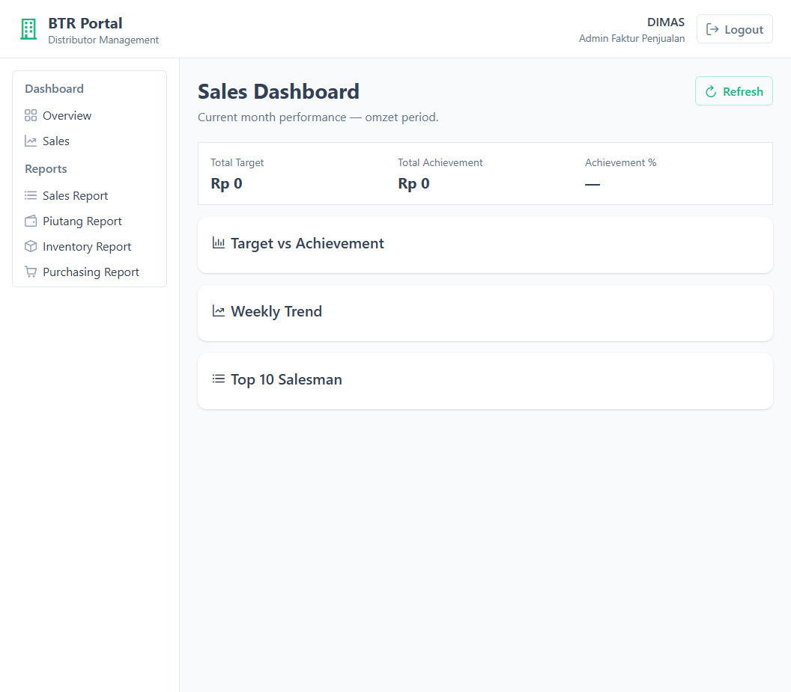
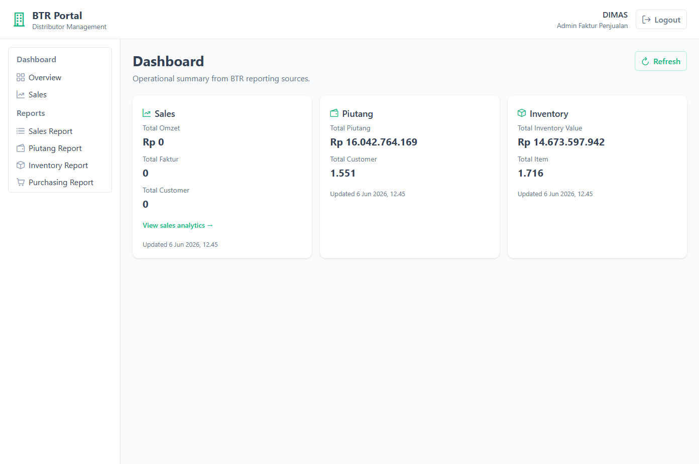

# Implementation Summary: BTR Portal — Milestone 13 (Sales Dashboard V3)

## Status

Milestone 13 is complete. `GET /api/dashboard/sales` now returns Target vs Achievement KPIs, company-level bar chart data, and Top 10 salesman ranking while preserving all M4/M7/M8 response fields. The portal adds `/dashboard/sales` as a dedicated analytics page with shared detail-page components. Dashboard home is refactored to summary KPI cards with a Sales detail link; the M8 Sales Trend card is removed from home. All verification checks pass.

---

## Files Added

### Backend

| File | Purpose |
| --- | --- |
| *(none)* | All backend changes extend existing files within `DashboardSalesAgg` and `SalesOmzetAgg` |

### Frontend

| File | Purpose |
| --- | --- |
| `src/views/dashboard/SalesDashboardView.vue` | M13 sales analytics detail page |
| `src/components/dashboard/DashboardDetailLayout.vue` | Shared detail page shell (header, refresh, error slot) — reused by M14/M15 |
| `src/components/dashboard/WeeklyTrendChart.vue` | Extracted M8 weekly line chart |
| `src/components/dashboard/TargetVsAchievementChart.vue` | Company-level Target vs Achievement bar chart |
| `src/components/dashboard/Top10RankingTable.vue` | Generic Top 10 ranking DataTable — reused by M14/M15 |

### Documentation

| File | Purpose |
| --- | --- |
| `screenshots/milestone-13-sales-dashboard.png` | Full `/dashboard/sales` page |
| `screenshots/milestone-13-dashboard-home.png` | Summary-only home with Sales link |

---

## Files Modified

### Backend

| File | Change |
| --- | --- |
| `ReportingContext/DashboardSalesAgg/Queries/GetDashboardSalesQuery.cs` | Added `DashboardSalesTargetVsAchievement`, `DashboardSalesRankingItem`; extended `DashboardSalesResponse` with `TotalTarget`, `TotalAchievement`, `AchievementPercent`, `TargetVsAchievement`, `TopSalesmanRanking` |
| `ReportingContext/DashboardSalesAgg/DashboardSalesDal.cs` | Injected `ISalesOmzetTargetDal`; added target sum, achievement percent, ranking via `BuildManagerComparison(topCount: 10)` |
| `SalesContext/SalesOmzetAgg/Contracts/ISalesOmzetTargetDal.cs` | Added `SumTargetAmountForMonth(int year, int month)` |
| `SalesContext/SalesOmzetAgg/SalesOmzetTargetDal.cs` | Implemented month-sum SQL against `BTR_SalesOmzetTarget` |
| `btr.test/SalesContext/SalesOmzetTargetTest.cs` | Updated `StubTargetDal` to implement new interface method |

### Frontend

| File | Change |
| --- | --- |
| `src/models/dashboard.ts` | Extended sales types with M13 fields |
| `src/services/formatters.ts` | Added `formatPercent()` |
| `src/stores/dashboardStore.ts` | Added `loadSales()` action |
| `src/views/dashboard/DashboardHomeView.vue` | Removed `SalesTrendCard`; added Sales detail link; stub comments for M14/M15 links |
| `src/layouts/MainLayout.vue` | Nested Dashboard menu (Overview + Sales) |
| `src/router/index.ts` | Added `/dashboard/sales` route |

---

## Files Deleted

| File | Reason |
| --- | --- |
| `src/components/SalesTrendCard.vue` | Weekly trend extracted to `WeeklyTrendChart.vue` on detail page only |

---

## Existing Components Reused

| Component | Usage in M13 |
| --- | --- |
| `KpiCard.vue` | Home summary cards (unchanged) |
| PrimeVue `Chart` + Chart.js | Weekly line chart, Target vs Achievement bar chart |
| PrimeVue `DataTable` / `Column` | Top 10 ranking table |
| PrimeVue `Card`, `Button`, `Message` | Detail layout and chart wrappers |

---

## Existing DALs Reused

| DAL / Service | Interface | Used for |
| --- | --- | --- |
| `SalesOmzetDal` | `ISalesOmzetDal` | Load omzet rows for current month (same as M4/M8) |
| `SalesOmzetTargetDal` | `ISalesOmzetTargetDal` | Extended with `SumTargetAmountForMonth` — existing `GetTargetAmount` unchanged |
| `TglJamDal` | `ITglJamDal` | Current month period and `GeneratedAt` |

---

## Existing Builders Reused

| Builder / Policy | Method | M13 usage |
| --- | --- | --- |
| `SalesOmzetChartSummaryBuilder` | `Build(rows, periode, mode)` | `RecognizedOmzet`, `PipelineOmzet`, `ByWeek` — identical to M8 |
| `SalesOmzetChartSummaryBuilder` | `BuildManagerComparison(rows, topCount: 10)` | Top 10 salesman ranking |
| `SalesOmzetChartAchievementPolicy` | `ComputePercent(achievement, target)` | Aggregate `AchievementPercent` |
| `SalesOmzetChartAmountPolicy` | (via builder) | Completed omzet amount rules |

**Not used (by design):** `SalesOmzetTargetResolver`, `Build()` with `targetAmount`, desktop default Top 15.

---

## API Contract Changes

### Endpoint (unchanged)

```
GET /api/dashboard/sales
Authorization: Bearer <JWT>
```

### Additive response fields

| Field | Type | Meaning |
| --- | --- | --- |
| `TotalTarget` | `decimal` | Sum of all `TargetAmount` rows for current month |
| `TotalAchievement` | `decimal` | Same as `CompletedOmzet` / `RecognizedOmzet` |
| `AchievementPercent` | `decimal?` | Policy percent; `null` when `TotalTarget <= 0` |
| `TargetVsAchievement` | object | `{ TargetAmount, AchievementAmount }` for bar chart |
| `TopSalesmanRanking` | array | `{ Rank, SalesPersonName, CompletedOmzet }` — max 10, pre-sorted descending |

All M4/M7/M8 fields (`TotalOmzet`, `WeeklyTrend`, etc.) unchanged in semantics.

`SalesDashboardController`, MediatR handler, and DI registrations unchanged.

---

## Frontend Changes

| Area | Change |
| --- | --- |
| Routes | `/dashboard` (summary home), `/dashboard/sales` (M13 analytics) |
| Sidebar | Dashboard → Overview, Sales |
| Home | Summary KPI cards only; Sales card links to detail page |
| Detail page | KPI row → Target vs Achievement bar → Weekly Trend line → Top 10 table |
| Store | `loadSales()` fetches sales endpoint only; `loadDashboard()` unchanged for home |

---

## KPI Reconciliation Results

Verified against live API (`DIMAS` / dev DB, June 2026):

| Check | Expected | Result |
| --- | --- | --- |
| `TotalAchievement` === `CompletedOmzet` | Exact match | **Pass** — both `0.0` |
| `TotalAchievement` === `TotalOmzet` | Exact match (M8) | **Pass** — both `0.0` |
| `TotalTarget` === `TargetVsAchievement.TargetAmount` | Exact match | **Pass** — both `0.00` |
| `AchievementPercent` when `TotalTarget <= 0` | `null` | **Pass** |
| Ranking count | ≤ 10 | **Pass** — `0` items |
| `WeeklyTrend` buckets | 5 June weeks (M8) | **Pass** — unchanged structure |

Home KPI values unchanged: Piutang `Rp 16.042.764.169` / 1.551 customers; Inventory `Rp 14.673.597.942` / 1.716 items.

---

## Regression Verification Results

| Check | Result |
| --- | --- |
| M7 Frontend Foundation (login, layout, routing) | **Pass** |
| M8 Sales KPI on home (`TotalOmzet`, Faktur, Customer) | **Pass** |
| M8 `WeeklyTrend` on detail page | **Pass** — same data, repositioned |
| M9 Sales Report route | **Pass** — sidebar link present |
| M10 Piutang Report | **Pass** — home Piutang KPI loads |
| M11 Inventory Report | **Pass** — home Inventory KPI loads |
| M12 Purchasing Report | **Pass** — sidebar link present |
| JWT auth — login works | **Pass** |
| Anonymous `GET /api/dashboard/sales` | **Pass** — HTTP 401 |
| No Sales Trend card on home | **Pass** |

---

## Build Verification Results

| # | Command | Result |
| --- | --- | --- |
| 1 | `j05-btr-distrib.sln` Debug (VS MSBuild) | **Pass** — zero errors |
| 2 | `npm run build` in `btr.portal.web` | **Pass** — zero errors |
| 3 | Login + JWT | **Pass** |
| 4 | `/dashboard` home | **Pass** — summary cards + Sales link |
| 5 | `/dashboard/sales` | **Pass** — full M13 layout renders |

---

## Known Limitations

| Item | Detail |
| --- | --- |
| Dev DB omzet | Current month has zero omzet rows — charts show empty states (expected) |
| Piutang/Inventory home links | Stub comments only — M14/M15 add detail routes and links |
| No drilldown / date filters / export | Out of scope per product decision |

---

## Deviations From Plan

None. Implementation follows `implementation-plan-m13-sales-dashboard-v3.md` exactly.

Optional `DashboardSalesDalTest.cs` unit tests were not added (marked recommended, not required). Existing `SalesOmzetTargetTest` stub updated for interface compatibility.

---

## Screenshot References

### Sales Dashboard (`/dashboard/sales`)



Shows: KPI row (Total Target, Total Achievement, Achievement %), Target vs Achievement chart, Weekly Trend chart, Top 10 Salesman table.

### Dashboard Home (summary only)



Shows: Three summary KPI cards, nested Dashboard sidebar, "View sales analytics →" link on Sales card, no Sales Trend card.

---

## User Workflow

1. Sign in at `/login` with BTR credentials.
2. Land on `/dashboard` — see summary KPI cards for Sales, Piutang, Inventory.
3. Click **View sales analytics →** on the Sales card, or use sidebar **Dashboard → Sales**.
4. On `/dashboard/sales`, review Target vs Achievement KPIs, bar chart, weekly trend, and Top 10 salesman ranking.
5. Use **Refresh** to reload sales data only (`loadSales()`).
6. Navigate **Dashboard → Overview** to return to summary home.
7. Reports (M9–M12) remain accessible via sidebar **Reports** submenu.

---

## Architecture Notes for M14/M15

Shared components ready for reuse without refactoring:

- `DashboardDetailLayout.vue` — page shell with title, subtitle, refresh, error
- `Top10RankingTable.vue` — generic ranking table with configurable columns
- Detail route pattern (`/dashboard/{domain}`)
- Store pattern (`loadSales()` → M14 adds `loadPiutang()`, M15 adds `loadInventory()`)
- Nested sidebar pattern (M14/M15 add Piutang and Inventory sub-items)
