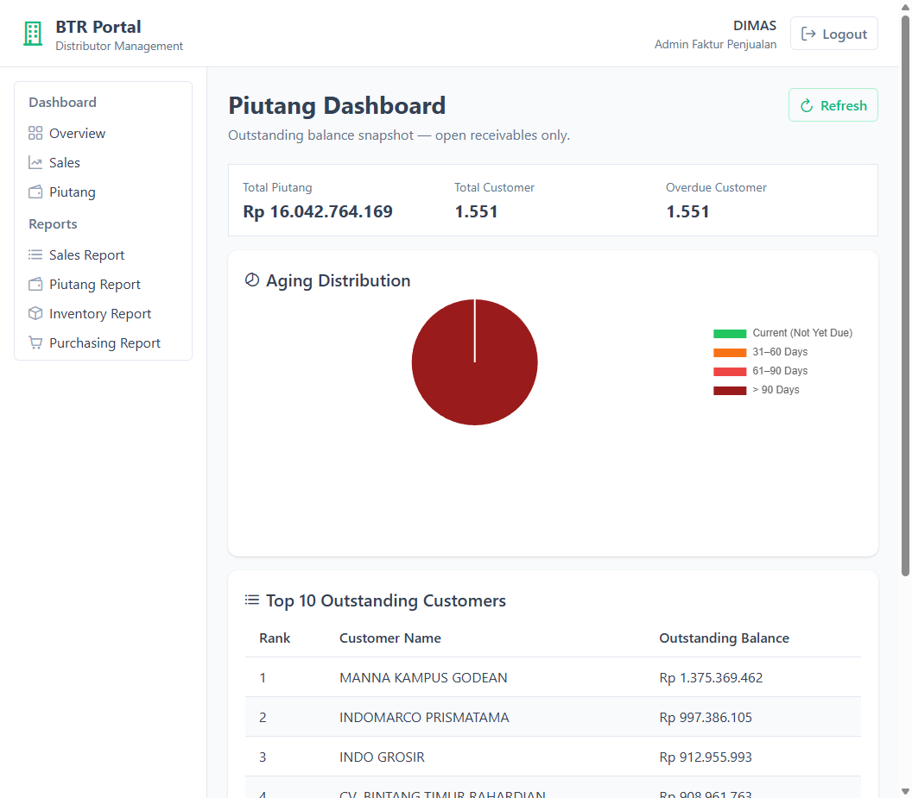
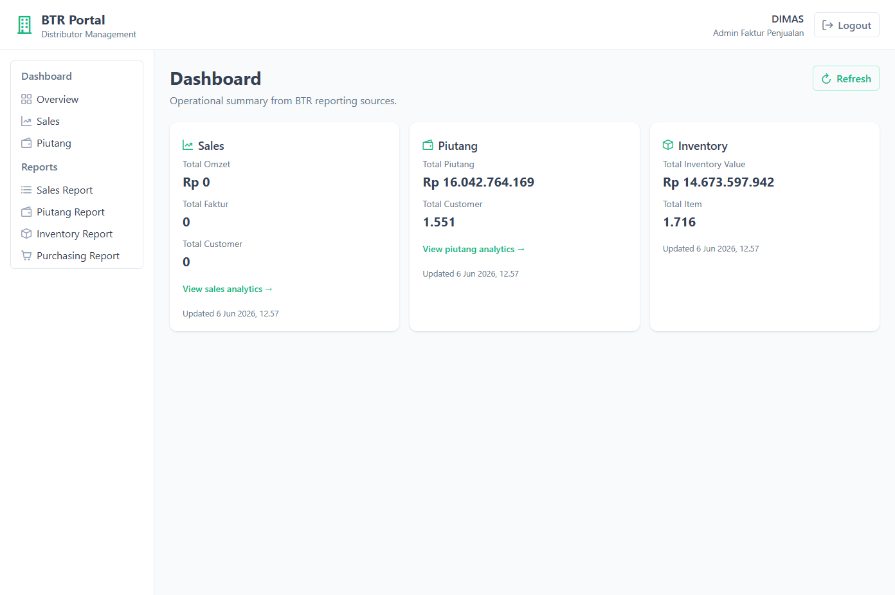
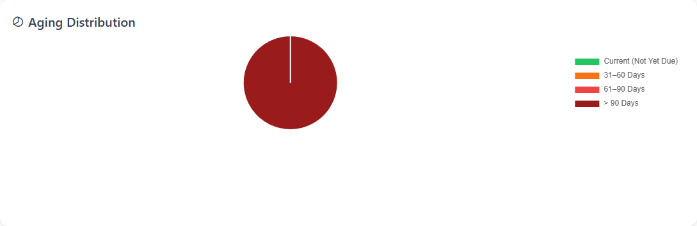
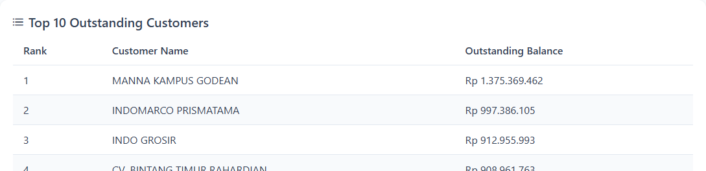

# Implementation Summary: BTR Portal — Milestone 14 (Piutang Dashboard V2)

## Status

Milestone 14 is complete. `GET /api/dashboard/piutang` now returns aging bucket analysis, overdue customer KPI, and Top 10 outstanding customer ranking while preserving all M5 response fields. The portal adds `/dashboard/piutang` as a dedicated analytics page reusing M13 shared detail-page components. Dashboard home Piutang KPI card links to the detail page. All verification checks pass.

---

## Files Added

### Backend

| File | Purpose |
| --- | --- |
| *(none)* | All backend changes extend existing files within `DashboardPiutangAgg` |

### Frontend

| File | Purpose |
| --- | --- |
| `src/views/dashboard/PiutangDashboardView.vue` | M14 piutang analytics detail page |
| `src/components/dashboard/AgingPieChart.vue` | 5-bucket aging distribution pie chart |

### Documentation

| File | Purpose |
| --- | --- |
| `screenshots/milestone-14-piutang-dashboard.png` | Full `/dashboard/piutang` page |
| `screenshots/milestone-14-dashboard-home.png` | Summary home with Piutang link |
| `screenshots/milestone-14-aging-pie-chart.png` | Aging Distribution pie chart |
| `screenshots/milestone-14-top10-customers.png` | Top 10 Outstanding Customers table |

---

## Files Modified

### Backend

| File | Change |
| --- | --- |
| `ReportingContext/DashboardPiutangAgg/Queries/GetDashboardPiutangQuery.cs` | Added `DashboardPiutangAgingBucket`, `DashboardPiutangTopCustomer`; extended `DashboardPiutangResponse` with `OverdueCustomer`, `AgingBuckets`, `TopCustomers` |
| `ReportingContext/DashboardPiutangAgg/DashboardPiutangDal.cs` | Added aging bucket assignment, overdue customer count, top 10 customer ranking over same filtered row set as M5/M10 |

### Frontend

| File | Change |
| --- | --- |
| `src/models/dashboard.ts` | Extended piutang types with M14 fields |
| `src/stores/dashboardStore.ts` | Added `loadPiutang()` action |
| `src/views/dashboard/DashboardHomeView.vue` | Added Piutang detail link |
| `src/layouts/MainLayout.vue` | Added Dashboard → Piutang submenu item |
| `src/router/index.ts` | Added `/dashboard/piutang` route |
| `src/components/dashboard/Top10RankingTable.vue` | Wrapped content in PrimeVue `#content` slot (rendering fix) |
| `src/components/dashboard/TargetVsAchievementChart.vue` | Wrapped content in `#content` slot (M13 regression fix) |
| `src/components/dashboard/WeeklyTrendChart.vue` | Wrapped content in `#content` slot (M13 regression fix) |

---

## Files Deleted

| File | Reason |
| --- | --- |
| *(none)* | |

---

## Existing Components Reused

| Component | Usage in M14 |
| --- | --- |
| `DashboardDetailLayout.vue` | Page shell (header, refresh, error) — from M13 |
| `Top10RankingTable.vue` | Top 10 customer ranking table — from M13 |
| `KpiCard.vue` | Home summary Piutang card (unchanged) |
| PrimeVue `Chart` + Chart.js | Aging pie chart |
| PrimeVue `DataTable` / `Column` | Top 10 ranking table |
| PrimeVue `Card`, `Button`, `Message` | Detail layout and chart wrappers |

---

## Existing DALs Reused

| DAL / Service | Interface | Used for |
| --- | --- | --- |
| `PiutangSalesWilayahDal` | `IPiutangSalesWilayahDal` | Load per-faktur receivable rows via `ListData(Periode)` — same source as M5/M10 |
| `TglJamDal` | `ITglJamDal` | Period end date (`2000-01-01` → today), `GeneratedAt`, and aging reference date |

**Not used (by design):** `PiutangReportDal` — dashboard DAL duplicates aggregation inline to avoid cross-aggregate coupling (same pattern as M10).

---

## API Contract Changes

### Endpoint (unchanged)

```
GET /api/dashboard/piutang
Authorization: Bearer <JWT>
```

### Additive response fields

| Field | Type | Meaning |
| --- | --- | --- |
| `OverdueCustomer` | `int` | Distinct customers with sum of overdue-bucket balances > 0 (Current excluded) |
| `AgingBuckets` | array | Five buckets — `{ BucketKey, BucketLabel, Amount, SortOrder }`; amounts sum to `TotalPiutang` |
| `TopCustomers` | array | `{ Rank, CustomerName, OutstandingBalance }` — max 10, pre-sorted descending |

All M5 fields (`TotalPiutang`, `TotalCustomer`, `GeneratedAt`) unchanged in semantics.

`PiutangDashboardController`, MediatR handler, and DI registrations unchanged.

---

## Frontend Changes

| Area | Change |
| --- | --- |
| Routes | `/dashboard` (summary home), `/dashboard/piutang` (M14 analytics) |
| Sidebar | Dashboard → Overview, Sales, **Piutang** |
| Home | Piutang card links to detail page via "View piutang analytics →" |
| Detail page | KPI row → Aging pie chart → Top 10 customer table |
| Store | `loadPiutang()` fetches piutang endpoint only; `loadDashboard()` unchanged for home |

---

## Aging Bucket Verification

Verified against live API (`DIMAS` / dev DB, June 2026):

| BucketKey | BucketLabel | Amount |
| --- | --- | --- |
| `Current` | Current (Not Yet Due) | Rp 248.657,76 |
| `Days1To30` | 1–30 Days | Rp 0,00 |
| `Days31To60` | 31–60 Days | Rp 28.860,00 |
| `Days61To90` | 61–90 Days | Rp 473.185,92 |
| `DaysOver90` | > 90 Days | Rp 16.042.013.465,67 |

| Check | Expected | Result |
| --- | --- | --- |
| `AgingBuckets.Sum(Amount)` === `TotalPiutang` | Exact match | **Pass** — both `16.042.764.169,35` |
| Bucket count | Always 5 | **Pass** |
| Boundaries use `JatuhTempo.Date` | Inclusive rules per plan | **Pass** — implemented via `ResolveAgingBucketKey` |
| Zero buckets emitted | All 5 present | **Pass** — `Days1To30` amount `0` |

---

## KPI Reconciliation Results

| Check | Expected | Result |
| --- | --- | --- |
| `TotalPiutang` === M5 home card | Exact match | **Pass** — `Rp 16.042.764.169,35` |
| `TotalPiutang` === M10 report footer | Exact match | **Pass** — `Summary.TotalPiutang` matches |
| `TotalCustomer` === M5 home card | Exact match | **Pass** — `1.551` |
| `TotalCustomer` === M10 report footer | Exact match | **Pass** — `Summary.TotalCustomer` matches |
| `OverdueCustomer` ≤ `TotalCustomer` | True | **Pass** — `1.551` ≤ `1.551` |
| Ranking count | ≤ 10 | **Pass** — `10` items |
| Ranking sorted descending | By `OutstandingBalance` | **Pass** |
| Sum of Top 10 | ≤ `TotalPiutang` | **Pass** — `Rp 7.125.790.341,33` ≤ `Rp 16.042.764.169,35` |

---

## Regression Verification Results

| Check | Result |
| --- | --- |
| M13 Sales Dashboard V3 (`/dashboard/sales`) | **Pass** — charts/table render after `#content` slot fix |
| M9 Sales Report (`/reports/sales`) | **Pass** — API `success` |
| M10 Piutang Report (`/reports/piutang`) | **Pass** — footer totals match dashboard |
| M11 Inventory Report (`/reports/inventory`) | **Pass** — API `success` |
| M12 Purchasing Report (`/reports/purchasing`) | **Pass** — API `success` |
| M7 Frontend Foundation (login, layout, routing) | **Pass** |
| M8 Sales KPI on home | **Pass** — unchanged |
| JWT auth — login works | **Pass** |
| Anonymous `GET /api/dashboard/piutang` | **Pass** — HTTP 401 |
| Dashboard home Piutang KPI | **Pass** — same values as M5 |

---

## Build Verification Results

| # | Command | Result |
| --- | --- | --- |
| 1 | `j05-btr-distrib.sln` Debug (MSBuild) | **Pass** — zero errors |
| 2 | `npm run build` in `btr.portal.web` | **Pass** — zero errors |
| 3 | Login + JWT | **Pass** |
| 4 | `/dashboard` home | **Pass** — Piutang link present |
| 5 | `/dashboard/piutang` | **Pass** — KPI row, pie chart, Top 10 table render |

---

## Known Limitations

| Item | Detail |
| --- | --- |
| Dev DB aging skew | Vast majority of open balance is in `> 90 Days` bucket — pie chart appears single-segment (expected for this dataset) |
| Zero-bucket pie slices | Chart omits zero-amount buckets from pie segments; legend shows non-zero buckets only |
| Inventory home link | Stub comment only — M15 adds detail route and link |
| No drilldown / date filters / export | Out of scope per product decision |
| Local API port | Dev environment uses IIS Express on port `5051`; frontend requires `.env` with `VITE_API_BASE_URL` |

---

## Deviations From Plan

| Deviation | Rationale |
| --- | --- |
| PrimeVue `#content` slot fix in `Top10RankingTable.vue`, `TargetVsAchievementChart.vue`, `WeeklyTrendChart.vue` | PrimeVue 4 `Card` requires explicit `#content` slot; without it chart/table body rendered empty. Fix restores M13 components and enables M14 rendering. `AgingPieChart.vue` implemented with `#content` from the start. |

Optional `DashboardPiutangDalTest.cs` unit tests were not added (marked recommended, not required).

---

## Screenshot References

### Piutang Dashboard (`/dashboard/piutang`)



Shows: KPI row (Total Piutang, Total Customer, Overdue Customer), Aging Distribution pie chart, Top 10 Outstanding Customers table.

### Dashboard Home (Piutang link)



Shows: Piutang summary card with "View piutang analytics →" link; nested Dashboard sidebar with Piutang item.

### Aging Distribution Pie Chart



### Top 10 Outstanding Customers



---

## User Workflow

1. Sign in at `/login` with BTR credentials.
2. Land on `/dashboard` — see summary KPI cards for Sales, Piutang, Inventory.
3. Click **View piutang analytics →** on the Piutang card, or use sidebar **Dashboard → Piutang**.
4. On `/dashboard/piutang`, review Total Piutang / Total Customer / Overdue Customer KPIs, aging distribution pie chart, and Top 10 outstanding customers table.
5. Use **Refresh** to reload piutang data only (`loadPiutang()`).
6. Navigate **Dashboard → Overview** to return to summary home.
7. Use **Reports → Piutang Report** to trace KPI values to underlying faktur rows (M10).
8. Reports (M9–M12) and Sales detail page (M13) remain accessible via sidebar.

---

## Architecture Notes for M15

Shared components ready for reuse without refactoring:

- `DashboardDetailLayout.vue` — page shell
- `Top10RankingTable.vue` — generic ranking table (now with PrimeVue 4 `#content` slot)
- Detail route pattern (`/dashboard/{domain}`)
- Store pattern (`loadInventory()` to be added in M15)
- Nested sidebar pattern (M15 adds Inventory sub-item)
