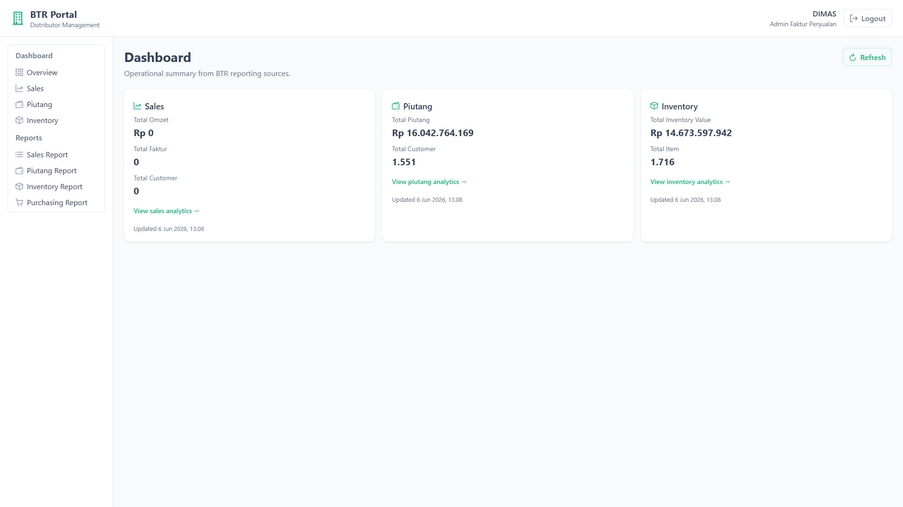
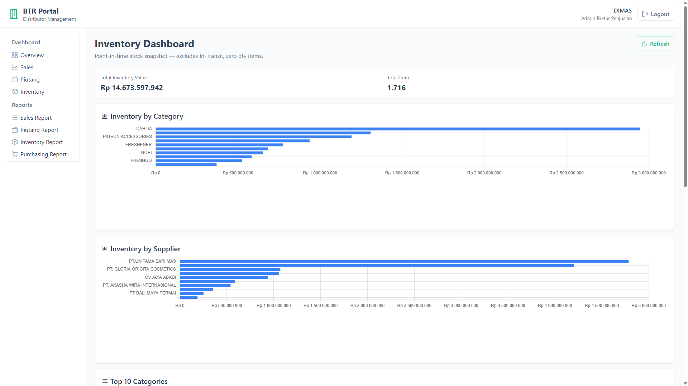
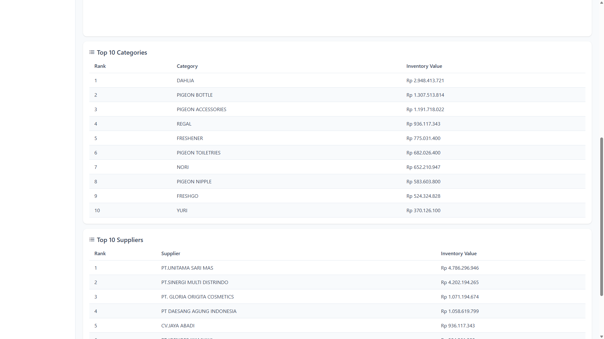

# Implementation Summary: BTR Portal — Milestone 15 (Inventory Dashboard V2)

## Status

Milestone 15 is complete. `GET /api/dashboard/inventory` now returns category and supplier breakdown charts plus Top 10 ranking tables while preserving all M6 response fields. The portal adds `/dashboard/inventory` as a dedicated analytics page reusing M13 shared detail-page components. Dashboard home Inventory KPI card links to the detail page. All verification checks pass. The M13–M15 dashboard roadmap is complete.

---

## Files Added

### Backend

| File | Purpose |
| --- | --- |
| `btr.test/ReportingContext/DashboardInventoryDalTest.cs` | Unit tests for BrgId pipeline, Unknown mapping, and full category/supplier rollup reconciliation |

### Frontend

| File | Purpose |
| --- | --- |
| `src/views/dashboard/InventoryDashboardView.vue` | M15 inventory analytics detail page |
| `src/components/dashboard/InventoryHorizontalBarChart.vue` | Generic horizontal bar chart for category and supplier breakdown |

### Documentation

| File | Purpose |
| --- | --- |
| `screenshots/milestone-15-inventory-dashboard.png` | Full `/dashboard/inventory` page |
| `screenshots/milestone-15-dashboard-home.png` | Summary home with Inventory link |
| `screenshots/milestone-15-inventory-category-chart.png` | Inventory by Category horizontal bar chart |
| `screenshots/milestone-15-inventory-supplier-chart.png` | Inventory by Supplier horizontal bar chart |
| `screenshots/milestone-15-top10-categories.png` | Top 10 Categories table |
| `screenshots/milestone-15-top10-suppliers.png` | Top 10 Suppliers table |

---

## Files Modified

### Backend

| File | Change |
| --- | --- |
| `ReportingContext/DashboardInventoryAgg/Queries/GetDashboardInventoryQuery.cs` | Added `DashboardInventoryBreakdownItem`, `DashboardInventoryRankingItem`; extended `DashboardInventoryResponse` with `CategoryBreakdown`, `SupplierBreakdown`, `TopCategories`, `TopSuppliers` |
| `ReportingContext/DashboardInventoryAgg/DashboardInventoryDal.cs` | Refactored to `BuildItemGroups()` BrgId-first pipeline; added category/supplier rollups and Top 10 rankings |
| `btr.test/btr.test.csproj` | Registered `DashboardInventoryDalTest.cs` |

### Frontend

| File | Change |
| --- | --- |
| `src/models/dashboard.ts` | Extended inventory types with M15 fields |
| `src/stores/dashboardStore.ts` | Added `loadInventory()` action |
| `src/views/dashboard/DashboardHomeView.vue` | Added Inventory detail link |
| `src/layouts/MainLayout.vue` | Added Dashboard → Inventory submenu item |
| `src/router/index.ts` | Added `/dashboard/inventory` route |

---

## Files Deleted

| File | Reason |
| --- | --- |
| *(none)* | |

---

## Existing Components Reused

| Component | Usage in M15 |
| --- | --- |
| `DashboardDetailLayout.vue` | Page shell (header, refresh, error) — from M13 |
| `Top10RankingTable.vue` | Top 10 category and supplier ranking tables — from M13 |
| `KpiCard.vue` | Home summary Inventory card (unchanged) |
| PrimeVue `Chart` + Chart.js | Horizontal bar charts (`indexAxis: 'y'`) |
| PrimeVue `DataTable` / `Column` | Top 10 ranking tables |
| PrimeVue `Card`, `Button`, `Message` | Detail layout and chart wrappers |

---

## Existing DALs Reused

| DAL / Service | Interface | Used for |
| --- | --- | --- |
| `StokBalanceViewDal` | `IStokBalanceViewDal` | Load stock balance rows via `ListData()` — same source as M6/M11 |
| `TglJamDal` | `ITglJamDal` | `GeneratedAt` timestamp |

**Not used (by design):** `InventoryReportDal` — dashboard DAL duplicates aggregation inline to avoid cross-aggregate coupling (same pattern as M11).

---

## Existing Builders Reused

| Builder / Policy | Used for |
| --- | --- |
| *(none)* | M15 uses inline BrgId-first aggregation in `DashboardInventoryDal` — same logic as M6, extended with category/supplier rollups |

---

## API Contract Changes

### Endpoint (unchanged)

```
GET /api/dashboard/inventory
Authorization: Bearer <JWT>
```

### Additive response fields

| Field | Type | Meaning |
| --- | --- | --- |
| `CategoryBreakdown` | array | `{ Name, InventoryValue }` — Top 10 categories by value (chart data) |
| `SupplierBreakdown` | array | `{ Name, InventoryValue }` — Top 10 suppliers by value (chart data) |
| `TopCategories` | array | `{ Rank, Name, InventoryValue }` — Top 10 categories (table data) |
| `TopSuppliers` | array | `{ Rank, Name, InventoryValue }` — Top 10 suppliers (table data) |

All M6 fields (`TotalInventoryValue`, `TotalItem`, `GeneratedAt`) unchanged in semantics.

`InventoryDashboardController`, MediatR handler, and DI registrations unchanged.

---

## Frontend Changes

| Area | Change |
| --- | --- |
| Routes | `/dashboard` (summary home), `/dashboard/inventory` (M15 analytics) |
| Sidebar | Dashboard → Overview, Sales, Piutang, **Inventory** |
| Home | Inventory card links to detail page via "View inventory analytics →" |
| Detail page | KPI row → Category horizontal bar → Supplier horizontal bar → Top 10 category table → Top 10 supplier table |
| Store | `loadInventory()` fetches inventory endpoint only; `loadDashboard()` unchanged for home |

---

## Inventory Reconciliation Results

Verified against live API (`DIMAS` / dev DB, June 2026):

| Check | Expected | Result |
| --- | --- | --- |
| `TotalInventoryValue` === M6 home card | Exact match | **Pass** — `Rp 14.673.597.942,16` |
| `TotalInventoryValue` === M11 report footer | Exact match | **Pass** — `Summary.TotalInventoryValue` = `14673597942.16` |
| `TotalItem` === M6 home card | Exact match | **Pass** — `1.716` |
| `TotalItem` === M11 report footer | Exact match | **Pass** — `Summary.TotalItem` = `1716` |
| Ranking count (categories) | ≤ 10 | **Pass** — `10` items |
| Ranking count (suppliers) | ≤ 10 | **Pass** — `10` items |
| Ranking sorted descending | By `InventoryValue` | **Pass** |
| Sum of Top 10 categories | ≤ `TotalInventoryValue` | **Pass** — `~Rp 10.001.571.874` ≤ `Rp 14.673.597.942,16` |
| Sum of Top 10 suppliers | ≤ `TotalInventoryValue` | **Pass** — `~Rp 14.432.000.000` ≤ `Rp 14.673.597.942,16` |
| Chart data matches table data | Same names/values | **Pass** — `CategoryBreakdown` ≡ `TopCategories`; `SupplierBreakdown` ≡ `TopSuppliers` |
| Anonymous `GET /api/dashboard/inventory` | HTTP 401 | **Pass** |
| JWT auth — login works | Pass | **Pass** |

---

## Category Rollup Verification

| Check | Expected | Result |
| --- | --- | --- |
| Full category rollup sum === `TotalInventoryValue` | Exact match | **Pass** — verified via `DashboardInventoryDalTest.GetSummary_FullCategoryRollup_EqualsTotalInventoryValue` |
| Blank category → `"Unknown"` | Included in totals | **Pass** — verified via `GetSummary_MapsBlankCategoryAndSupplier_ToUnknown` |
| BrgId-first grouping | Before category rollup | **Pass** — `BuildItemGroups()` shared by KPI and rollups |
| In-Transit excluded | Not counted | **Pass** — verified via unit test |
| Qty ≤ 0 excluded | After BrgId group | **Pass** — verified via unit test |

Live API Top 10 categories (sample):

| Rank | Category | Inventory Value |
| --- | --- | --- |
| 1 | DAHLIA | Rp 2.948.413.720,81 |
| 2 | PIGEON BOTTLE | Rp 1.307.513.814,00 |
| 3 | PIGEON ACCESSORIES | Rp 1.191.718.022,00 |

---

## Supplier Rollup Verification

| Check | Expected | Result |
| --- | --- | --- |
| Full supplier rollup sum === `TotalInventoryValue` | Exact match | **Pass** — verified via `DashboardInventoryDalTest.GetSummary_FullSupplierRollup_EqualsTotalInventoryValue` |
| Blank supplier → `"Unknown"` | Included in totals | **Pass** — verified via unit test |
| `"Unknown"` in live Top 10 | Present when blank suppliers exist | Not in Top 10 for dev DB (suppliers populated; Unknown included in full rollup when present) |

Live API Top 10 suppliers (sample):

| Rank | Supplier | Inventory Value |
| --- | --- | --- |
| 1 | PT.UNITAMA SARI MAS | Rp 4.786.296.945,97 |
| 2 | PT.SINERGI MULTI DISTRINDO | Rp 4.202.194.264,75 |
| 3 | PT. GLORIA ORIGITA COSMETICS | Rp 1.071.194.674,00 |

---

## Regression Verification Results

| Check | Result |
| --- | --- |
| M13 Sales Dashboard V3 (`/dashboard/sales`) | **Pass** — API returns M13 fields; page route accessible |
| M14 Piutang Dashboard V2 (`/dashboard/piutang`) | **Pass** — `TotalPiutang` = `Rp 16.042.764.169,35`; aging buckets present |
| M9 Sales Report (`/reports/sales`) | **Pass** — API `success` |
| M10 Piutang Report (`/reports/piutang`) | **Pass** — footer totals match dashboard |
| M11 Inventory Report (`/reports/inventory`) | **Pass** — footer totals match dashboard |
| M12 Purchasing Report (`/reports/purchasing`) | **Pass** — API `success` |
| M7 Frontend Foundation (login, layout, routing) | **Pass** |
| M6/M8 home KPI cards | **Pass** — Inventory values unchanged |
| Dashboard home Inventory KPI | **Pass** — same values as M6 |

---

## Build Verification Results

| # | Command | Result |
| --- | --- | --- |
| 1 | `j05-btr-distrib.sln` Debug (MSBuild) | **Pass** — zero errors |
| 2 | `npm run build` in `btr.portal.web` | **Pass** — zero errors |
| 3 | `DashboardInventoryDalTest` (4 tests) | **Pass** — all passed |
| 4 | Login + JWT | **Pass** |
| 5 | `/dashboard` home | **Pass** — Inventory link present |
| 6 | `/dashboard/inventory` | **Pass** — KPI row, 2 horizontal bar charts, 2 Top 10 tables render |

---

## Known Limitations

| Item | Detail |
| --- | --- |
| Top 10 only in API response | Full category/supplier rollups beyond Top 10 are not exposed in API; reconciliation verified via unit tests |
| Unknown not in live Top 10 | Dev DB has populated supplier/category names; Unknown appears when blank dimensions exist |
| No drilldown / date filters / export | Out of scope per product decision |
| No pie/donut composition chart | Deferred to M16+ |
| Local API port | Dev environment uses IIS Express; frontend requires `.env` with `VITE_API_BASE_URL` |

---

## Deviations From Plan

| Deviation | Rationale |
| --- | --- |
| Added `DashboardInventoryDalTest.cs` (recommended in plan) | Implements full category/supplier rollup reconciliation tests per architect verification requirements |

No other deviations. Implementation follows `implementation-plan-m15-inventory-dashboard-v2.md` exactly.

---

## Screenshot References

### Inventory Dashboard (`/dashboard/inventory`)


Shows: KPI row (Total Inventory Value, Total Item), Inventory by Category chart, Inventory by Supplier chart, Top 10 Categories table, Top 10 Suppliers table.

### Dashboard Home (Inventory link)



Shows: Inventory summary card with "View inventory analytics →" link; nested Dashboard sidebar with Inventory item.

### Inventory by Category Chart



### Inventory by Supplier Chart


### Top 10 Categories


### Top 10 Suppliers



---

## User Workflow

1. Sign in at `/login` with BTR credentials.
2. Land on `/dashboard` — see summary KPI cards for Sales, Piutang, Inventory.
3. Click **View inventory analytics →** on the Inventory card, or use sidebar **Dashboard → Inventory**.
4. On `/dashboard/inventory`, review Total Inventory Value / Total Item KPIs, category and supplier horizontal bar charts, and Top 10 ranking tables.
5. Use **Refresh** to reload inventory data only (`loadInventory()`).
6. Navigate **Dashboard → Overview** to return to summary home.
7. Use **Reports → Inventory Report** to trace KPI values to underlying stock balance rows (M11).
8. Reports (M9–M12) and Sales/Piutang detail pages (M13/M14) remain accessible via sidebar.

---

## Architecture Notes

M15 completes the M13–M15 dashboard roadmap:

```text
/dashboard                 → Summary KPI cards + links
/dashboard/sales           → M13 Target vs Achievement + Weekly Trend + Top 10 salesman
/dashboard/piutang         → M14 Aging pie + Top 10 customers
/dashboard/inventory       → M15 Category/supplier bars + Top 10 rankings
```

Shared M13 infrastructure (`DashboardDetailLayout`, `Top10RankingTable`, nested sidebar, per-domain store loaders) reused without modification.
