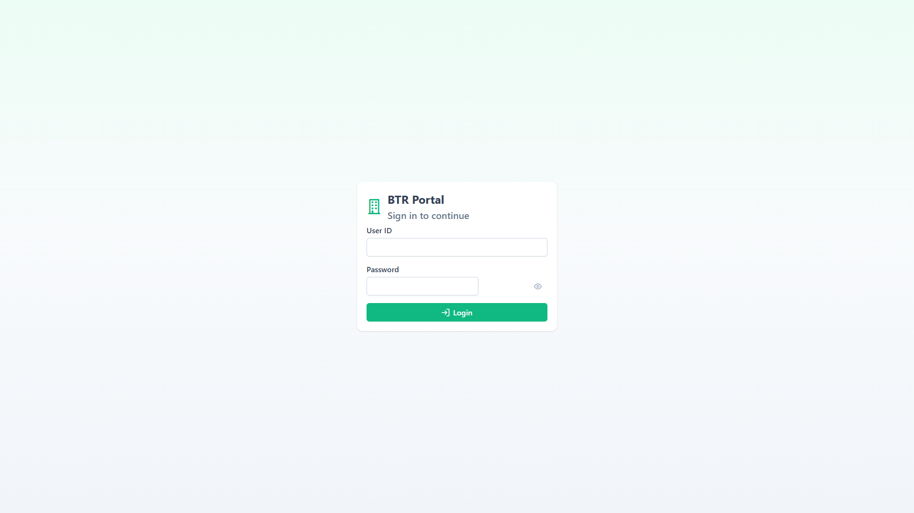
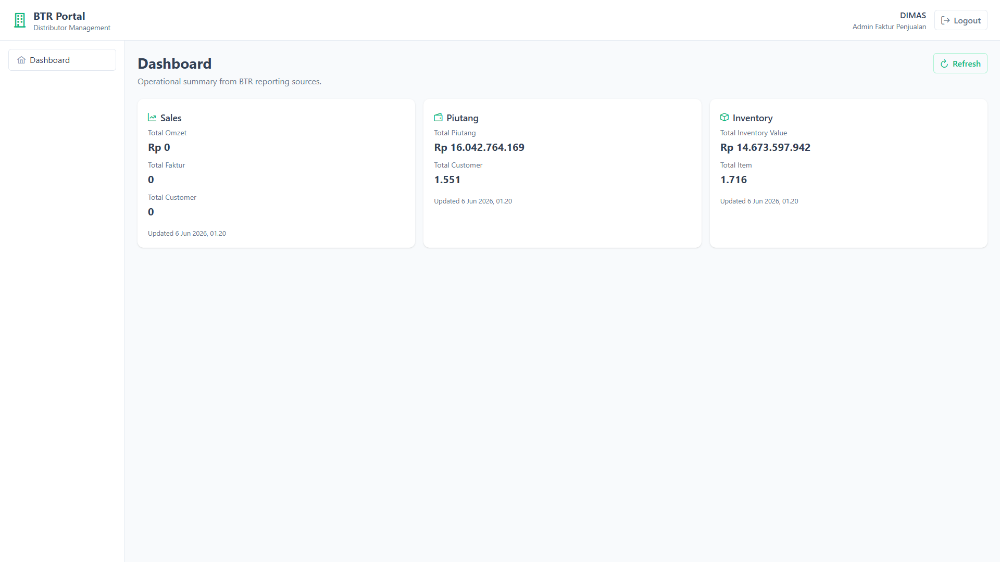

# Implementation Summary: BTR Portal Web — Milestone 7 (Frontend Foundation)

## Status

Milestone 7 is complete. The `btr.portal.web` Vue 3 application builds successfully, integrates with `btr.portal.api`, and delivers login, JWT persistence, route protection, main layout, and dashboard KPI home. All verification checks pass.

---

## 1. Project Structure

```text
src/j05-btr-distrib/btr.portal.web/
├── .env.development
├── .env.example
├── index.html
├── package.json
├── README.md
├── tsconfig.json
├── tsconfig.app.json
├── vite.config.ts
├── public/
│   └── favicon.svg
└── src/
    ├── main.ts
    ├── App.vue
    ├── api/
    │   ├── httpClient.ts          # Axios instance, JWT interceptor, global 401 handling
    │   ├── authApi.ts             # POST /api/auth/login
    │   └── dashboardApi.ts        # GET dashboard sales / piutang / inventory
    ├── router/
    │   └── index.ts               # Routes + navigation guard
    ├── stores/
    │   ├── authStore.ts           # Login state, localStorage persistence
    │   └── dashboardStore.ts      # Parallel dashboard KPI loading
    ├── layouts/
    │   └── MainLayout.vue         # Header, sidebar, logout, user display
    ├── views/
    │   ├── auth/
    │   │   └── LoginView.vue      # /login
    │   └── dashboard/
    │       └── DashboardHomeView.vue  # /dashboard
    ├── components/
    │   └── KpiCard.vue            # Reusable PrimeVue KPI card shell
    ├── models/
    │   ├── api.ts                 # ApiResponse<T> envelope
    │   ├── auth.ts                # Login request/response types
    │   └── dashboard.ts           # Dashboard response DTOs
    ├── services/
    │   ├── authStorage.ts         # localStorage read/write/clear
    │   ├── authEvents.ts          # 401 handler hook (avoids circular imports)
    │   └── formatters.ts          # IDR currency + number formatting
    └── styles/
        └── main.css
```

Deliverable doc and screenshots:

```text
docs/work/btr-portal-api-scaffolding/
├── implementation-summary-milestone-7.md
└── screenshots/
    ├── milestone-7-login.png
    └── milestone-7-dashboard.png
```

---

## 2. Packages Installed

| Package | Version | Purpose |
| --- | --- | --- |
| `vue` | ^3.5.34 | UI framework |
| `typescript` | ~6.0.2 | Type safety |
| `vite` | ^8.0.12 | Dev server and production build |
| `@vitejs/plugin-vue` | ^6.0.6 | Vue SFC support |
| `vue-tsc` | ^3.2.8 | Vue TypeScript checking |
| `vue-router` | ^5.1.0 | Client routing + guards |
| `pinia` | ^3.0.4 | State management |
| `axios` | ^1.17.0 | HTTP client |
| `primevue` | ^4.5.5 | UI components |
| `@primevue/themes` | ^4.5.4 | Aura theme preset |
| `primeicons` | ^7.0.0 | Icon set |

**Note:** `@primevue/themes` shows an npm deprecation notice pointing to `@primeuix/themes`. Current PrimeVue 4.5 setup still uses the installed package successfully; migration can be deferred to a later milestone.

---

## 3. Authentication Flow

1. User opens `/login` and submits **User ID** + **Password**.
2. `LoginView` validates required fields client-side.
3. `authStore.login()` calls `POST /api/auth/login` with `{ UserId, Password }` (PascalCase body matching API).
4. On success, the store saves:
   - `Token`
   - `ExpiresAt`
   - `User` (`UserId`, `UserName`, `RoleId`, `RoleName`)
5. Values persist in `localStorage` via `authStorage.ts`:
   - `btr_portal_token`
   - `btr_portal_expires_at`
   - `btr_portal_user`
6. Router redirects to `/dashboard` (or original `redirect` query target).
7. On app startup, `authStore` hydrates from `localStorage` if token is not expired.
8. Axios request interceptor attaches `Authorization: Bearer <token>` to protected API calls.
9. Axios response interceptor on **401**:
   - Clears `localStorage`
   - Calls `authStore.logout()` via `authEvents`
   - Redirects to `/login`
10. **Logout** button clears store + storage and navigates to `/login`.

---

## 4. Routing Structure

| Path | Layout | Auth | Component | Purpose |
| --- | --- | --- | --- | --- |
| `/login` | None | Public | `LoginView` | Sign in |
| `/` | — | — | redirect | → `/dashboard` |
| `/dashboard` | `MainLayout` | Required | `DashboardHomeView` | KPI home |
| `/*` | — | — | redirect | → `/dashboard` |

**Navigation guard (`router.beforeEach`):**

- Routes with `meta.requiresAuth` redirect unauthenticated users to `/login?redirect=<original-path>`.
- Authenticated users visiting `/login` are redirected to `/dashboard`.

---

## 5. Screens Created

### Login (`/login`)

- User ID text field
- Password field with visibility toggle
- Login button with loading state
- Client validation messages
- API error display (invalid credentials, network errors)
- PrimeVue `Card`, `InputText`, `Password`, `Button`, `Message`

### Main Layout (authenticated shell)

- Header with BTR Portal branding
- Sidebar menu (Dashboard entry for future module expansion)
- User name + role display
- Logout button

### Dashboard Home (`/dashboard`)

Three KPI cards loaded in parallel from API:

| Card | API | Fields displayed |
| --- | --- | --- |
| Sales | `GET /api/dashboard/sales` | Total Omzet, Total Faktur, Total Customer |
| Piutang | `GET /api/dashboard/piutang` | Total Piutang, Total Customer |
| Inventory | `GET /api/dashboard/inventory` | Total Inventory Value, Total Item |

Each card shows `GeneratedAt` timestamp. Refresh button reloads all three endpoints. No charts, grids, filters, or drilldown.

---

## 6. Verification Results

| # | Check | Result |
| --- | --- | --- |
| 1 | Login works | Pass — `DIMAS` / `1111` → JWT returned, redirected to dashboard |
| 2 | JWT persists after refresh | Pass — reload `/dashboard` stays authenticated |
| 3 | Dashboard loads all 3 APIs | Pass — Sales, Piutang, Inventory KPIs populated from dev DB |
| 4 | Logout works | Pass — clears session, returns to `/login` |
| 5 | Unauthorized user redirected to login | Pass — `/dashboard` without token → `/login?redirect=/dashboard` |
| 6 | Application builds successfully | Pass — `npm run build` (vue-tsc + vite) |

### API verification (curl, IIS Express port 5050)

```powershell
# Anonymous dashboard → 401
curl.exe -o NUL -w "%{http_code}" http://localhost:5050/api/dashboard/sales

# Login
curl.exe -s -X POST http://localhost:5050/api/auth/login `
  -H "Content-Type: application/json" `
  -d '{"UserId":"DIMAS","Password":"1111"}'

# Authenticated dashboards (Bearer token from login)
curl.exe http://localhost:5050/api/dashboard/sales -H "Authorization: Bearer <token>"
curl.exe http://localhost:5050/api/dashboard/piutang -H "Authorization: Bearer <token>"
curl.exe http://localhost:5050/api/dashboard/inventory -H "Authorization: Bearer <token>"
```

**Sample dev DB dashboard responses:**

| Endpoint | Key values |
| --- | --- |
| Sales | `TotalOmzet: 0`, `TotalFaktur: 0`, `TotalCustomer: 0` |
| Piutang | `TotalPiutang: 16042764169.35`, `TotalCustomer: 1551` |
| Inventory | `TotalInventoryValue: 14673597942.16`, `TotalItem: 1716` |

### Local run

```powershell
# Terminal 1 — API
& "C:\Program Files\IIS Express\iisexpress.exe" `
  /path:"src\j05-btr-distrib\btr.portal.api" /port:5050

# Terminal 2 — Frontend
cd src\j05-btr-distrib\btr.portal.web
npm run dev
```

Open `http://localhost:5173`.

---

## 7. Screenshots

### Login page



### Dashboard home (authenticated)



---

## 8. Remaining Work for Milestone 8

Milestone 8 should build on this foundation without reworking auth or layout.

### Reporting modules

- [ ] Add report routes under `views/reports/` (sales, piutang, inventory drilldowns)
- [ ] Sidebar navigation entries per report module
- [ ] PrimeVue DataTable grids for tabular reports
- [ ] Date range / warehouse / supplier filters aligned with desktop report parameters

### Visualization

- [ ] Chart components for sales omzet trends (weekly buckets from existing API extensions)
- [ ] Piutang aging or customer distribution charts
- [ ] Inventory category/supplier breakdown charts

### UX and platform

- [ ] Global toast/notification service for non-blocking API errors
- [ ] Loading skeletons for dashboard cards
- [ ] Role-based menu visibility (claims already available in JWT/user object)
- [ ] Session expiry warning before `ExpiresAt`
- [ ] IIS static hosting + production `VITE_API_BASE_URL` configuration
- [ ] Migrate PrimeVue theme package to `@primeuix/themes` when upgrading PrimeVue

### Explicitly out of scope until later milestones

- CRUD pages
- Role management UI
- Settings pages
- Export (Excel/PDF)

---

## Architecture Notes

- **API envelope:** Frontend types match backend PascalCase JSON (`Status`, `Code`, `Message`, `Data`).
- **Separation:** `api/` for HTTP, `stores/` for state, `services/` for storage/formatting side effects.
- **Minimal scope:** Only `authStore` and `dashboardStore` — no premature module stores.
- **CORS:** API `appsettings.json` already allows `http://localhost:5173`; frontend uses `VITE_API_BASE_URL=http://localhost:5050`.
