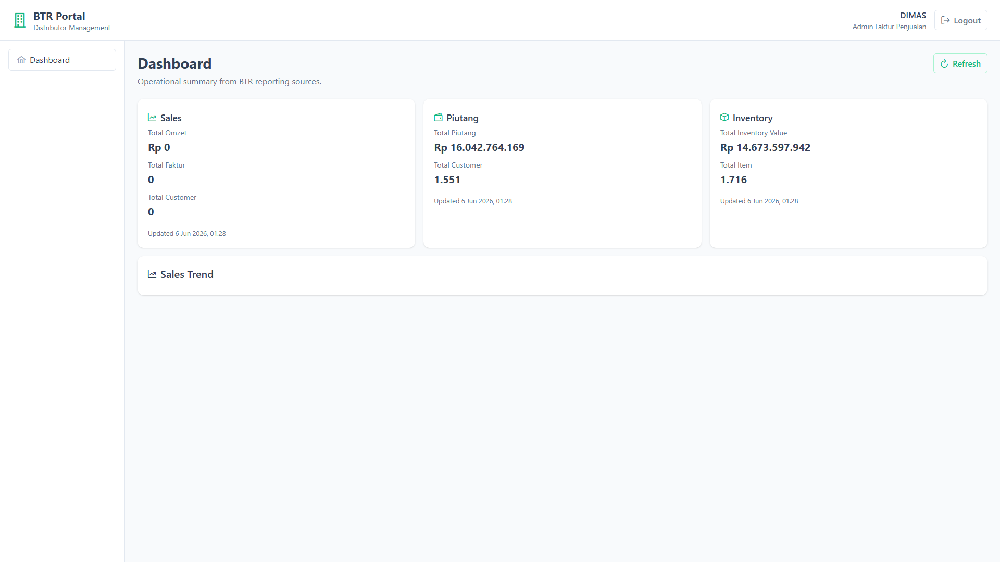

# Implementation Summary: BTR Portal — Milestone 8 (Sales Dashboard V2)

## Status

Milestone 8 is complete. `GET /api/dashboard/sales` now exposes completed omzet, pipeline omzet, and weekly trend data from existing `SalesOmzetChartSummaryBuilder` outputs. The dashboard home adds a Sales Trend card with KPI summary and a PrimeVue line chart. All verification checks pass.

---

## 1. Existing Sales Logic Reused

### Investigation findings

| Component | Location | Reused output |
| --- | --- | --- |
| `SalesOmzetChartSummaryBuilder` | `btr.application/SalesContext/SalesOmzetAgg/Services/` | `RecognizedOmzet`, `PipelineOmzet`, `ByWeek` |
| `SalesOmzetChartAmountPolicy` | `btr.application/SalesContext/SalesOmzetAgg/Policies/` | Amount rules (via builder): Completed/Pending → `FakturTotal`; Outstanding → `OrderTotal` |
| `SalesOmzetChartWeekGrouper` | (used by builder) | Weekly bucket labels and recognized-amount grouping |
| `SalesOmzetDal` | `btr.infrastructure` | Loads `BTR_SalesOmzet` rows for current month |
| `SalesOmzetPeriodPolicy` | (via DAL) | Omzet Period filter — same default as desktop |
| `SalesOmzetChartForm.BindWeeklyChart()` | Desktop reference | Weekly chart binds `summary.ByWeek` → `RecognizedAmount` per `WeekLabel` |

### Not wired (by design)

| Component | Reason |
| --- | --- |
| `SalesOmzetTargetResolver` | Target/achievement not in M8 scope; builder already supports optional `targetAmount` for a later milestone |
| `BuildManagerComparison()` | Salesperson bar chart / drilldown out of scope |
| `ByStatus` slices | Status stacked chart out of scope |

### Calculation mapping

| API field | Builder property | Desktop equivalent |
| --- | --- | --- |
| `TotalOmzet` | `RecognizedOmzet` | "Omzet diakui" KPI (M4, unchanged) |
| `CompletedOmzet` | `RecognizedOmzet` | Completed rows only (`IncludeInRecognizedTotal`) |
| `PipelineOmzet` | `PipelineOmzet` | Pending + Outstanding rows (`IncludeInPipelineTotal`) |
| `WeeklyTrend[].RecognizedAmount` | `ByWeek[].RecognizedAmount` | Weekly column chart in `SalesOmzetChartForm` |

No new SQL, tables, or calculation policies were introduced.

---

## 2. New DTO Shape

`DashboardSalesResponse` extended in `GetDashboardSalesQuery.cs`:

```json
{
  "Status": "success",
  "Code": 200,
  "Message": null,
  "Data": {
    "TotalOmzet": 0.0,
    "CompletedOmzet": 0.0,
    "PipelineOmzet": 0.0,
    "TotalFaktur": 0,
    "TotalCustomer": 0,
    "GeneratedAt": "2026-06-06T01:28:25.86",
    "WeeklyTrend": [
      {
        "WeekStart": "2026-06-01T00:00:00",
        "WeekEnd": "2026-06-07T00:00:00",
        "WeekLabel": "01 Jun–07 Jun",
        "RecognizedAmount": 0.0
      }
    ]
  }
}
```

| Field | Type | Meaning |
| --- | --- | --- |
| `TotalOmzet` | `decimal` | Recognized omzet — backward compatible with M4/M7 |
| `CompletedOmzet` | `decimal` | Same as `RecognizedOmzet` (explicit completed-sales KPI) |
| `PipelineOmzet` | `decimal` | Pending + outstanding omzet from existing builder |
| `TotalFaktur` | `int` | Unchanged — faktur count in period |
| `TotalCustomer` | `int` | Unchanged — distinct customers in period |
| `GeneratedAt` | `DateTime` | Unchanged — server timestamp |
| `WeeklyTrend` | `DashboardSalesWeekTrendItem[]` | Weekly recognized omzet buckets for current month |

`DashboardSalesWeekTrendItem` mirrors `SalesOmzetWeekSlice` without exposing internal domain types to the API layer.

---

## 3. Chart Data Structure

Weekly trend items map 1:1 from `SalesOmzetWeekSlice`:

| Property | Source | Chart usage |
| --- | --- | --- |
| `WeekLabel` | `SalesOmzetChartWeekGrouper` label (e.g. `01 Jun–07 Jun`) | X-axis labels |
| `RecognizedAmount` | Sum of completed omzet in bucket | Y-axis values (line chart) |
| `WeekStart` / `WeekEnd` | Calendar week boundaries within period | Available for tooltips / future filters |

Frontend chart dataset:

```typescript
{
  labels: WeeklyTrend.map(w => w.WeekLabel),
  datasets: [{
    label: 'Omzet diakui',
    data: WeeklyTrend.map(w => w.RecognizedAmount),
    // line chart, green stroke — matches desktop weekly chart intent
  }]
}
```

When all `RecognizedAmount` values are zero, the card shows an empty-state message (same condition as `SalesOmzetChartForm.BindWeeklyChart`).

---

## 4. Frontend Changes

### New dependency

| Package | Version | Purpose |
| --- | --- | --- |
| `chart.js` | ^4.x | Required peer for PrimeVue `Chart` component |

### Files changed / added

| File | Change |
| --- | --- |
| `src/models/dashboard.ts` | Added `CompletedOmzet`, `PipelineOmzet`, `WeeklyTrend`, `DashboardSalesWeekTrendItem` |
| `src/components/SalesTrendCard.vue` | **New** — KPI summary + PrimeVue line chart |
| `src/views/dashboard/DashboardHomeView.vue` | Renders `SalesTrendCard` below existing KPI grid |
| `package.json` / `package-lock.json` | Added `chart.js` |

### Sales Trend Card layout

- **Summary row:** Completed Omzet, Pipeline Omzet, Total Faktur, Total Customer
- **Chart section:** "Weekly Omzet Trend" line chart (PrimeVue `Chart` + Chart.js)
- **Footer:** `GeneratedAt` timestamp
- Existing three KPI cards (Sales, Piutang, Inventory) unchanged above the trend card

Piutang and inventory charts were not implemented (per M8 constraints).

---

## 5. Backend Files Changed

| File | Change |
| --- | --- |
| `ReportingContext/DashboardSalesAgg/Queries/GetDashboardSalesQuery.cs` | Extended `DashboardSalesResponse`; added `DashboardSalesWeekTrendItem` |
| `ReportingContext/DashboardSalesAgg/DashboardSalesDal.cs` | Maps `summary.RecognizedOmzet`, `summary.PipelineOmzet`, `summary.ByWeek` |

`SalesDashboardController`, MediatR handler, and DI registrations unchanged.

---

## 6. Verification Results

| # | Check | Result |
| --- | --- | --- |
| 1 | Login still works | Pass — `POST /api/auth/login` → JWT for `DIMAS` |
| 2 | Existing KPI cards still work | Pass — Sales/Piutang/Inventory cards load on dashboard |
| 3 | Sales chart loads | Pass — Sales Trend card renders; empty state when no weekly data |
| 4 | No new business calculations | Pass — all metrics from `SalesOmzetChartSummaryBuilder.Build()` |
| 5 | Full frontend build | Pass — `npm run build` (vue-tsc + vite) |
| 6 | Full backend build | Pass — `j05-btr-distrib.sln` Debug build |
| 7 | Dashboard authorization | Pass — anonymous `GET /api/dashboard/sales` → HTTP 401 |

### API sample (authenticated, dev DB June 2026)

```powershell
curl.exe -s -X POST http://localhost:5050/api/auth/login `
  -H "Content-Type: application/json" `
  --data-raw '{"UserId":"DIMAS","Password":"1111"}'

curl.exe http://localhost:5050/api/dashboard/sales -H "Authorization: Bearer <token>"
```

Response includes `CompletedOmzet`, `PipelineOmzet`, and five `WeeklyTrend` buckets for June 2026 (zeros when no omzet rows exist in period — expected for dev DB).

### Local run

```powershell
# API (port 5050)
& "C:\Program Files\IIS Express\iisexpress.exe" `
  /path:"src\j05-btr-distrib\btr.portal.api" /port:5050

# Frontend
cd src\j05-btr-distrib\btr.portal.web
npm run dev
```

Open `http://localhost:5173`, sign in, navigate to `/dashboard`.

---

## 7. Screenshots

### Dashboard with Sales Trend card



Shows:

- Unchanged Sales, Piutang, and Inventory KPI cards
- New Sales Trend card with Completed/Pipeline omzet summary
- Weekly Omzet Trend section (empty state for current dev DB period)

---

## 8. Out of Scope (unchanged)

- Piutang / inventory charts
- Drilldown, filters, exports, report pages
- Target vs achievement (`SalesOmzetTargetResolver`)
- Status stacked chart (`ByStatus`)
- Salesperson comparison chart (`BuildManagerComparison`)

---

## 9. Future Improvements

| Item | Description |
| --- | --- |
| Target line overlay | Pass `SalesOmzetTargetResolver.ResolveTarget()` into builder `targetAmount` |
| Date range parameters | Optional `from` / `to` query params |
| Status breakdown chart | Expose `ByStatus` for funnel visualization |
| Sales period mode toggle | `SalesOmzetPeriodFilterMode.SalesPeriod` |
