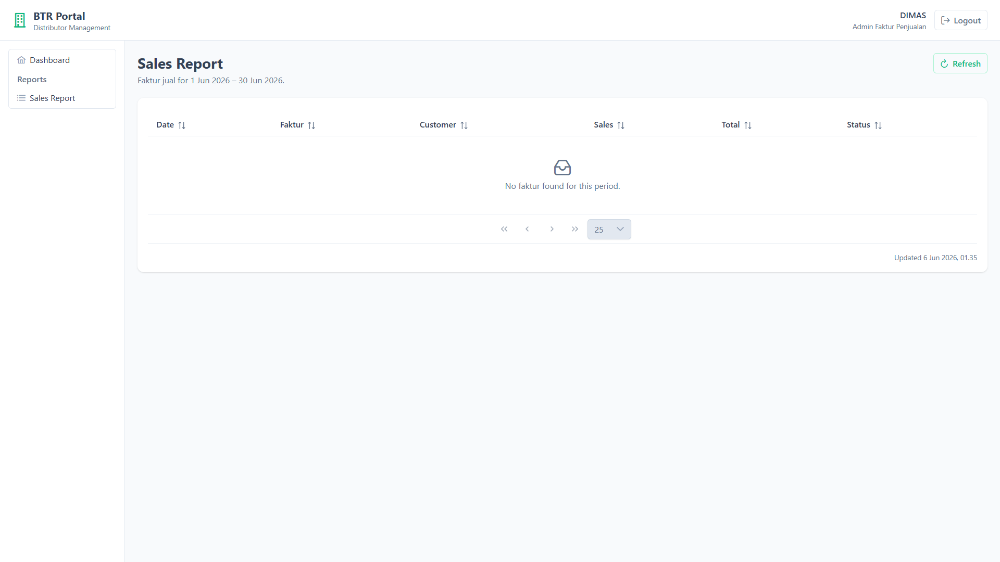
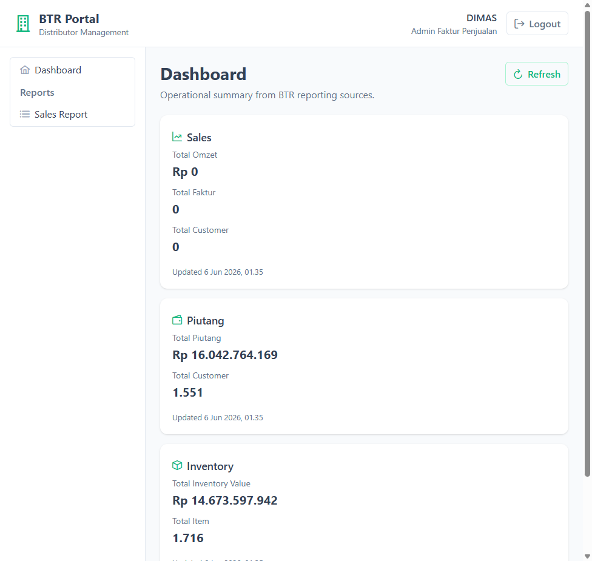

# Implementation Summary: BTR Portal — Milestone 9 (Sales Report V1)

## Status

Milestone 9 is complete. `GET /api/reports/sales` returns faktur-level sales rows from existing BTR reporting sources. The portal adds the first report page at `/reports/sales` with a PrimeVue DataTable. All verification checks pass.

---

## 1. Investigation Findings

### Sales report landscape

| Component | Location | Role |
| --- | --- | --- |
| Desktop report | `FakturInfoForm` | Tabular **Info Faktur Jual** — one row per faktur |
| Data read model | `FakturViewDal` (`IFakturViewDal`) | Lists fakturs from `BTR_Faktur` with period filter, excludes voided (`VoidDate = '3000-01-01'`) |
| Row DTO | `FakturView` | Faktur date, code, customer, sales person, totals, control status |
| Period filter | `Periode` (`Tgl1`, `Tgl2`) | `FakturDate BETWEEN @Tgl1 AND @Tgl2` — same SQL predicate as desktop |
| Item-level alternative | `FakturPerCustomerDal` | Line-item detail (`BTR_FakturItem`) — not used for portal V1 (too granular) |

### Decision: reuse path for portal V1

| Portal field | Source (`FakturView`) | Desktop equivalent |
| --- | --- | --- |
| `FakturDate` | `Tgl` | Faktur date column |
| `FakturCode` | `FakturCode` | Faktur code column |
| `CustomerName` | `Customer` | Customer name column |
| `SalesName` | `SalesPersonName` | Sales person column |
| `FakturTotal` | `GrandTotal` | Grand total column (after discount + tax) |
| `Status` | `StatusFaktur == 2` → `"Kembali"` | `Kembali` / Excel `"YA"` for returned fakturs |

| Behavior | Portal default | Desktop reference |
| --- | --- | --- |
| Period | Current calendar month via `ITglJamDal.Now` | Same month window as dashboard; uses `Periode` filter like `FakturInfoForm.Proses()` |
| Void filter | Active fakturs only (`ListData`) | `FakturTerhapusCheck` unchecked |
| Customer keyword filter | Not applied | Out of scope for M9 |
| Deleted fakturs | Not included | `ListTerhapus` not used |

No new SQL, tables, or report calculations were introduced.

---

## 2. Existing DAL Reused

| DAL / Service | Interface | Used for |
| --- | --- | --- |
| `FakturViewDal` | `IFakturViewDal` | Load faktur rows for current month from `BTR_Faktur` |
| `TglJamDal` | `ITglJamDal` | Server date for current-month period and `GeneratedAt` |

`FakturViewDal` is auto-registered via existing Scrutor `IListData<,>` scan in `InfrastructurePortalExtensions`. `SalesReportDal` orchestrates these dependencies; it does not duplicate SQL or business rules.

### Not used (by design)

| Component | Reason |
| --- | --- |
| `FakturPerCustomerDal` | Item-level report — not faktur summary |
| `SalesOmzetDal` | Aggregate omzet model — dashboard only |
| `ListTerhapus` | Deleted fakturs excluded by default |

---

## 3. Existing Report Reused

| Desktop screen | Reused query | Reused DTO | Reused filter |
| --- | --- | --- | --- |
| **Info Faktur Jual** (`FakturInfoForm`) | `IFakturViewDal.ListData(Periode)` | `FakturView` | `Periode` + non-void fakturs |

MediatR handler maps `FakturView` → `SalesReportRow` for the API response shape.

---

## 4. API Contract

### Endpoint

```
GET /api/reports/sales
Authorization: Bearer <JWT>
```

No query parameters (current month fixed default).

### Response

```json
{
  "Status": "success",
  "Code": 200,
  "Message": null,
  "Data": {
    "PeriodFrom": "2026-06-01T00:00:00",
    "PeriodTo": "2026-06-30T23:59:59",
    "GeneratedAt": "2026-06-06T01:34:21.09",
    "Rows": [
      {
        "FakturDate": "2026-06-05T00:00:00",
        "FakturCode": "FK-001",
        "CustomerName": "PT Example",
        "SalesName": "BUDI",
        "FakturTotal": 1500000.0,
        "Status": ""
      }
    ]
  }
}
```

| Field | Type | Meaning |
| --- | --- | --- |
| `PeriodFrom` / `PeriodTo` | `DateTime` | Current calendar month boundaries |
| `GeneratedAt` | `DateTime` | Server timestamp when report was built |
| `Rows` | `SalesReportRow[]` | Faktur rows ordered by date, then faktur code |
| `FakturDate` | `DateTime` | Faktur date (`FakturView.Tgl`) |
| `FakturCode` | `string` | Faktur number |
| `CustomerName` | `string` | Customer name |
| `SalesName` | `string` | Sales person name |
| `FakturTotal` | `decimal` | Grand total (after discount + tax) |
| `Status` | `string` | `"Kembali"` when faktur control status is returned; otherwise empty |

Anonymous requests return HTTP 401.

---

## 5. Backend Files

### Application (`ReportingContext/SalesReportAgg`)

| File | Purpose |
| --- | --- |
| `Contracts/ISalesReportDal.cs` | Report DAL contract |
| `Queries/GetSalesReportQuery.cs` | MediatR query, handler, `SalesReportResponse`, `SalesReportRow` |

### Infrastructure

| File | Purpose |
| --- | --- |
| `ReportingContext/SalesReportAgg/SalesReportDal.cs` | Calls `IFakturViewDal.ListData`, maps rows |

### Portal API

| File | Purpose |
| --- | --- |
| `Controllers/Reports/SalesReportController.cs` | Thin MediatR delegate — `GET /api/reports/sales` |
| `Configurations/InfrastructurePortalExtensions.cs` | Registers `ISalesReportDal` |
| `Configurations/PortalPresentationExtensions.cs` | Registers controller |

---

## 6. Frontend Page

### Route

| Path | Component | Auth |
| --- | --- | --- |
| `/reports/sales` | `SalesReportView.vue` | Required |

### Navigation

Sidebar menu:

```
Reports
└── Sales Report
```

### Files added

| File | Purpose |
| --- | --- |
| `src/models/reports.ts` | `SalesReportResponse`, `SalesReportRow` types |
| `src/api/reportsApi.ts` | `GET /api/reports/sales` |
| `src/stores/salesReportStore.ts` | Loading / error / data state |
| `src/views/reports/SalesReportView.vue` | PrimeVue DataTable report page |
| `src/services/formatters.ts` | Added `formatDate()` |
| `src/router/index.ts` | Report route |
| `src/layouts/MainLayout.vue` | Reports menu group |

### DataTable features

| Feature | Implementation |
| --- | --- |
| Columns | Date, Faktur, Customer, Sales, Total, Status |
| Loading state | DataTable `:loading` + Refresh button spinner |
| Empty state | Custom `#empty` template |
| Pagination | Client-side, 25 rows default, options 10/25/50/100 |
| Sorting | Column sort enabled |

No filtering, export, charts, or drilldown.

---

## 7. Verification Results

| # | Check | Result |
| --- | --- | --- |
| 1 | Existing dashboard still works | Pass — Sales/Piutang/Inventory KPIs load on `/dashboard` |
| 2 | Sales report loads data | Pass — API returns `Rows` array; UI renders table with period label |
| 3 | No direct SQL in controller | Pass — `SalesReportController` calls MediatR only |
| 4 | Data flows through MediatR | Pass — `GetSalesReportQuery` → `GetSalesReportHandler` → `ISalesReportDal` → `IFakturViewDal` |
| 5 | Frontend build succeeds | Pass — `npm run build` (vue-tsc + vite) |
| 6 | Backend build succeeds | Pass — `j05-btr-distrib.sln` Debug build |
| 7 | Authorization | Pass — anonymous `GET /api/reports/sales` → HTTP 401 |

### API verification (IIS Express port 5056)

```powershell
# Build
& "C:\Program Files\Microsoft Visual Studio\2022\Enterprise\MSBuild\Current\Bin\MSBuild.exe" `
  "src\j05-btr-distrib\j05-btr-distrib.sln" /p:Configuration=Debug

# Run
& "C:\Program Files\IIS Express\iisexpress.exe" `
  /path:"src\j05-btr-distrib\btr.portal.api" /port:5056

# Anonymous (401)
curl.exe -o NUL -w "%{http_code}" http://localhost:5056/api/reports/sales

# Login
curl.exe -s -X POST http://localhost:5056/api/auth/login `
  -H "Content-Type: application/json" `
  --data-raw '{"UserId":"DIMAS","Password":"1111"}'

# Authenticated sales report
curl.exe http://localhost:5056/api/reports/sales -H "Authorization: Bearer <token>"

# Dashboard unchanged
curl.exe http://localhost:5056/api/dashboard/sales -H "Authorization: Bearer <token>"
```

**Note:** Dev database (`btr_yk`) returned zero faktur rows for June 2026 current month — expected when no fakturs exist in that period. The response confirms the SQL pipeline executed without error.

### Local run

```powershell
# Terminal 1 — API
& "C:\Program Files\IIS Express\iisexpress.exe" `
  /path:"src\j05-btr-distrib\btr.portal.api" /port:5050

# Terminal 2 — Frontend
cd src\j05-btr-distrib\btr.portal.web
npm run dev
```

Open `http://localhost:5173`, sign in, navigate to **Reports → Sales Report**.

---

## 8. Screenshots

### Sales Report page



Shows:

- Reports sidebar menu with Sales Report entry
- Period label for current month
- DataTable with column headers and empty state
- Pagination controls
- Generated-at timestamp

### Dashboard still working



Shows unchanged Sales, Piutang, and Inventory KPI cards after M9 changes.

---

## 9. User Workflow

1. User opens BTR Portal and signs in (`DIMAS` / password).
2. Dashboard loads KPI summary (unchanged from M7/M8).
3. User clicks **Reports → Sales Report** in the sidebar (or navigates to `/reports/sales`).
4. Page loads faktur rows for the **current calendar month** from `GET /api/reports/sales`.
5. DataTable displays columns: Date, Faktur, Customer, Sales, Total, Status.
6. User can sort columns and paginate through results.
7. **Refresh** reloads the report from the API.
8. When no fakturs exist in the period, the empty state message is shown.

---

## 10. Out of Scope (unchanged)

- Date range / customer / warehouse filters
- Export (Excel/PDF)
- Charts and drilldown
- Item-level reports (`FakturPerCustomerDal`)
- Deleted faktur toggle (`ListTerhapus`)

---

## 11. Future Improvements

| Item | Description |
| --- | --- |
| Date range parameters | Optional `from` / `to` query params aligned with `FakturInfoForm` period picker |
| Customer search | Wire desktop keyword filter from `FakturInfoForm.Filter()` |
| Deleted fakturs toggle | Optional `includeDeleted` flag → `ListTerhapus` |
| Server-side pagination | For large periods when date filters are added |
| Piutang / inventory reports | Follow same MediatR + DataTable pattern |
