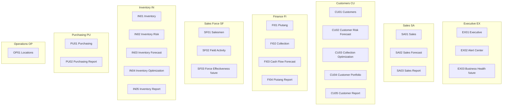

# BTR Portal — Navigation UX Specification

**Audience:** Architect, Business Owner, Trainers, Helpdesk  
**Purpose:** Authoritative UX specification for BTR Portal navigation Information Architecture, menu codes, and naming conventions. This document addresses menu structure and stable menu codes — not visual design or implementation.  
**Status:** Approved — ready for Architect implementation planning  
**Related docs:** [btr-portal-domain.md](./btr-portal-domain.md), [btr-portal-operational.md](./btr-portal-operational.md), [btr-portal-architecture.md](./btr-portal-architecture.md)

---

## 1. Executive Summary

BTR Portal currently exposes **24 navigation items** in a mostly flat structure: 19 items under a single "Dashboard" heading and 5 under "Reports." Although technically correct, this structure is difficult for business owners to understand, weak for remote support communication, and does not scale cleanly as new milestones are added.

This specification defines a **business-first Information Architecture** organized into **8 domain groups** (Executive, Sales, Customers, Finance, Sales Force, Inventory, Purchasing, Operations). Each menu item receives a **stable, visible code** (e.g. `EX01`, `CU03`, `PU01`) designed for WhatsApp, phone, and SOP communication in distributed organizations.

**Approved direction:**

1. Replace the flat "Dashboard / Reports" split with domain-grouped navigation.
2. Introduce permanent two-letter domain prefixes with a single sequential numbering per domain (`EX01`–`EX99`).
3. Nest reports within their business domain using the same numbering sequence (e.g. `SA03` Sales Report).
4. **Preserve existing business labels** — IA changes; business vocabulary remains stable.
5. Keep all existing routes unchanged; IA changes are navigation metadata only.

BTR Portal has not yet been deployed to production. This document describes the target navigation structure and can be handed directly to the Architect to produce the implementation plan.

---

## 2. Background and Design Principles

### 2.1 Problem Statement

The current navigation has grown organically through milestones M16–M31. Each new capability appends to a flat list. Users, trainers, and support staff struggle to:

- Find related features (e.g. the Customer chain M17 → M29 → M30 → M31)
- Distinguish Dashboard, Management, Analytics, and Report (terms that overlap in business conversation)
- Refer to a specific page unambiguously during remote support

### 2.2 Distributed Organization Context

BTR Portal is used across a distributed organization. Support and training typically happen via WhatsApp, voice message, telephone, screenshots, and remote desktop — not face-to-face at a shared monitor. **Visible menu codes are a UX feature**, not an internal implementation detail.

| Old communication | New communication |
| ----------------- | ----------------- |
| "Open Purchasing Management Dashboard" | "Open **PU01**" |
| "Go to the 7th menu, Customer Risk Forecast" | "Open **CU02**" |
| "Check Reports, then Customer Report" | "Open **CU05**" |

### 2.3 Design Principles

| Principle | Requirement |
| --------- | ----------- |
| **Business-first navigation** | Group by business domain (Sales, Finance, Inventory), not by implementation type (Dashboard, Report) |
| **Stable menu codes** | Every menu has a permanent code; codes never renumber; labels may change only with explicit PO approval |
| **Communication-first UX** | Codes must work in WhatsApp, SOPs, screenshots, and voice calls |
| **Scalability** | Future milestones (M32, M25, deferred reports) slot in without restructuring |
| **Mental model** | Users identify business area first, then locate the page |
| **Vocabulary stability** | Improve IA and grouping; do not redefine established business terminology |

### 2.4 Scope

**In scope:** Information Architecture, menu codes, naming conventions, navigation wireframes.  
**Out of scope:** Vue component visual redesign, route renaming, Desktop deep links, rollout or migration planning.

---

## 3. Current State Analysis

### 3.1 Navigation Source

Navigation is hardcoded in `MainLayout.vue`. There is no database-driven menu, no role-based filtering, and **no visible menu codes**. Vue Router `routeName` values (e.g. `customer-risk-forecast-dashboard`) serve as developer identifiers only.

Authoritative current menu (as of M31):

```text
BTR Portal
├── Dashboard (19 items — flat)
│   ├── Executive
│   ├── Alert Center
│   ├── Sales
│   ├── Sales Forecast
│   ├── Piutang
│   ├── Customers
│   ├── Customer Risk Forecast
│   ├── Collection Optimization
│   ├── Customer Portfolio
│   ├── Salesmen
│   ├── Field Activity
│   ├── Collection
│   ├── Cash Flow Forecast
│   ├── Inventory
│   ├── Inventory Risk
│   ├── Inventory Forecast
│   ├── Inventory Optimization
│   ├── Purchasing
│   └── Locations
└── Reports (5 items — flat)
    ├── Sales Report
    ├── Customer Report
    ├── Piutang Report
    ├── Inventory Report
    └── Purchasing Report
```

**Documentation gap:** `btr-portal-operational.md` §Navigation Structure lists only 9 dashboard items and 4 reports — missing Sales Forecast, Collection, Cash Flow Forecast, Customer chain (M29–M31), Field Activity, Inventory Forecast/Optimization, Locations, and Customer Report.

### 3.2 Current Menu Inventory

| # | Sidebar Label | Route | Route Name | Milestone | Maturity Level |
| - | ------------- | ----- | ---------- | --------- | -------------- |
| 1 | Executive | `/dashboard` | `dashboard` | M16 | Decision Support |
| 2 | Alert Center | `/alerts` | `alert-center` | M23 | Decision Support |
| 3 | Sales | `/dashboard/sales` | `sales-dashboard` | M16 | Analytics |
| 4 | Sales Forecast | `/dashboard/sales-forecast` | `sales-forecast-dashboard` | M26 | Forecasting |
| 5 | Piutang | `/dashboard/piutang` | `piutang-dashboard` | M16 | Analytics |
| 6 | Customers | `/dashboard/customers` | `customers-dashboard` | M17 | Analytics |
| 7 | Customer Risk Forecast | `/dashboard/customer-risk-forecast` | `customer-risk-forecast-dashboard` | M29 | Forecasting |
| 8 | Collection Optimization | `/dashboard/collection-optimization` | `collection-optimization-dashboard` | M30 | Optimization |
| 9 | Customer Portfolio | `/dashboard/customer-portfolio` | `customer-portfolio-dashboard` | M31 | Optimization |
| 10 | Salesmen | `/dashboard/salesmen` | `salesmen-dashboard` | M18 | Analytics |
| 11 | Field Activity | `/dashboard/field-activity` | `field-activity-dashboard` | M18.5 | Analytics |
| 12 | Collection | `/dashboard/collection` | `collection-dashboard` | M20 | Analytics |
| 13 | Cash Flow Forecast | `/dashboard/cash-flow-forecast` | `cash-flow-forecast-dashboard` | M27 | Forecasting |
| 14 | Inventory | `/dashboard/inventory` | `inventory-dashboard` | M16 | Analytics |
| 15 | Inventory Risk | `/dashboard/inventory-risk` | `inventory-risk-dashboard` | M19 | Decision Support |
| 16 | Inventory Forecast | `/dashboard/inventory-forecast` | `inventory-forecast-dashboard` | M28 | Forecasting |
| 17 | Inventory Optimization | `/dashboard/inventory-optimization` | `inventory-optimization-dashboard` | M28.5 | Optimization |
| 18 | Purchasing | `/dashboard/purchasing` | `purchasing-dashboard` | M21 | Decision Support |
| 19 | Locations | `/dashboard/locations` | `locations-dashboard` | M22 | Analytics |
| 20 | Sales Report | `/reports/sales` | `sales-report` | M16 | Reporting |
| 21 | Customer Report | `/reports/customers` | `customer-report` | M31 | Reporting |
| 22 | Piutang Report | `/reports/piutang` | `piutang-report` | M16 | Reporting |
| 23 | Inventory Report | `/reports/inventory` | `inventory-report` | M16 | Reporting |
| 24 | Purchasing Report | `/reports/purchasing` | `purchasing-report` | M16 | Reporting |

### 3.3 UX Findings

#### Discoverability — Poor

Related features are scattered across the flat list:

- **Customer chain** (M17 → M29 → M30 → M31) occupies positions 6–9 but is interrupted by unrelated items above (Piutang) and below (Salesmen).
- **Finance surfaces** appear at positions 5, 12, and 13 (Piutang, Collection, Cash Flow Forecast) with no grouping.
- **Inventory cluster** (positions 14–17) is consecutive but unlabeled; users cannot tell the maturity progression.
- **Reports** are separated from their domain dashboards in a different top-level section, forcing users to remember two navigation areas.

#### Scalability — Poor

Every new milestone appends to the growing Dashboard list. Evidence:

- M26–M31 added 7 items in approximately one year.
- `DashboardAlertCenterComposer` links only 10 of 19 dashboards in its Domain Dashboards panel — newer items are absent from cross-navigation.
- At current growth rate, the Dashboard section will exceed 25 items within 2–3 milestone cycles without structural change.

#### Consistency — Weak

| Pattern | Examples | Problem |
| ------- | -------- | ------- |
| Top-level "Dashboard" | All 19 analytics items | Overloaded term; hides business domain |
| Top-level "Reports" | All 5 report items | Separated from related domain dashboards |
| Report duplication | Sales Report vs Sales | Same domain concept split across two sections |
| Long compound names | Customer Risk Forecast, Collection Optimization | Hard to speak on phone without a code |

#### Business Mental Model — Weak

The top-level section "Dashboard" groups 19 unrelated business areas. A business owner asking "where is Finance?" must scan Piutang (position 5), Collection (position 12), Cash Flow Forecast (position 13), and Piutang Report (under Reports). There is no Finance group.

The management journey documented in `btr-portal-domain.md` is:

```text
What is happening?     → Executive
What needs attention?  → Alert Center
Why?                   → Domain Dashboard
Show evidence          → Report
```

Current navigation does not reflect this journey structurally — it presents a single undifferentiated list.

#### Communication Usability — Poor

| Support scenario | Current difficulty |
| ---------------- | ------------------ |
| WhatsApp: "open customer risk page" | Ambiguous — could mean Customers (M17) or Customer Risk Forecast (M29) |
| Phone: "go to collection optimization" | Easily confused with Collection (M20) |
| SOP: "navigate to Dashboard → Reports → Customer Report" | Two-level path across sections; no stable identifier |
| Screenshot annotation | Must circle long label text; no compact code to highlight |

No speakable, stable identifier exists. Route names like `collection-optimization-dashboard` are developer artifacts.

#### Naming Consistency — Acceptable at Item Level

Individual menu labels are consistent with milestone names and `btr-portal-domain.md`. The primary naming problem is **structural** — the "Dashboard / Reports" grouping — not the business vocabulary of individual items.

### 3.4 Secondary Navigation Gaps

Beyond the sidebar, navigation consistency is incomplete:

1. **Alert Center Domain Dashboards panel** — links only 10 dashboards; omits 9 current surfaces.
2. **In-page section navigation** — individual dashboards use anchor links with no relation to sidebar structure.
3. **Cross-dashboard navigation components** — `CustomerNavigationSection`, `PurchasingNavigationSection`, etc. link to related pages but use no menu codes.
4. **Investigation drill-down** — `InvestigationRegistry` uses signal keys and path strings, not menu codes.

These gaps should be addressed when menu codes are implemented in the sidebar and propagated to secondary navigation.

---

## 4. Proposed Information Architecture

### 4.1 Design Decision: Domain-First, Two-Level Hierarchy

Replace the flat "Dashboard / Reports" split with **8 business domain groups**. Within each group, items follow the portal maturity progression using **existing business labels**:

```text
Analytics → Forecast → Optimization → Report
```

Reports are numbered sequentially within the same domain prefix as dashboards. Users do not need separate coding schemes for dashboards versus reports.

### 4.2 Navigation Wireframes

#### Wireframe A — Full Sidebar

```text
BTR Portal
│
├── Executive
│     EX01  Executive
│     EX02  Alert Center
│
├── Sales
│     SA01  Sales
│     SA02  Sales Forecast
│     SA03  Sales Report
│
├── Customers
│     CU01  Customers
│     CU02  Customer Risk Forecast
│     CU03  Collection Optimization
│     CU04  Customer Portfolio
│     CU05  Customer Report
│
├── Finance
│     FI01  Piutang
│     FI02  Collection
│     FI03  Cash Flow Forecast
│     FI04  Piutang Report
│
├── Sales Force
│     SF01  Salesmen
│     SF02  Field Activity
│
├── Inventory
│     IN01  Inventory
│     IN02  Inventory Risk
│     IN03  Inventory Forecast
│     IN04  Inventory Optimization
│     IN05  Inventory Report
│
├── Purchasing
│     PU01  Purchasing
│     PU02  Purchasing Report
│
└── Operations
      OP01  Locations
```

#### Wireframe B — Domain Group Detail (Customers)

Illustrates how the M17→M31 milestone chain becomes visible through grouping:

```text
Customers
  CU01  Customers                  ← M17  "What is happening?"
  CU02  Customer Risk Forecast     ← M29  "What may happen?"
  CU03  Collection Optimization    ← M30  "Who should we contact?"
  CU04  Customer Portfolio         ← M31  "What should Management do?"
  CU05  Customer Report            ←      "Show me the evidence"
```

### 4.3 Proposed Hierarchy



### 4.4 Sidebar Display Order

Recommended top-to-bottom order:

1. Executive
2. Sales
3. Customers
4. Finance
5. Sales Force
6. Inventory
7. Purchasing
8. Operations

This order follows the management morning scan pattern: start at Executive, then revenue (Sales, Customers), then cash (Finance), then execution (Sales Force), then capital (Inventory, Purchasing), then network (Operations).

### 4.5 Domain Groups and Rationale

| Group | Prefix | Rationale | Current Items Absorbed |
| ----- | ------ | --------- | ---------------------- |
| **Executive** | EX | Cross-domain oversight; landing page and exception hub | Executive, Alert Center |
| **Sales** | SA | Revenue performance, forward view, and sales evidence | Sales, Sales Forecast, Sales Report |
| **Customers** | CU | Full customer lifecycle chain per M17→M31 milestone sequence | Customers, Customer Risk Forecast, Collection Optimization, Customer Portfolio, Customer Report |
| **Finance** | FI | Receivable exposure and cash conversion | Piutang, Collection, Cash Flow Forecast, Piutang Report |
| **Sales Force** | SF | People performance and field execution | Salesmen, Field Activity |
| **Inventory** | IN | Stock capital lifecycle | Inventory, Inventory Risk, Inventory Forecast, Inventory Optimization, Inventory Report |
| **Purchasing** | PU | Purchase intake, posting, and supplier dependency | Purchasing, Purchasing Report |
| **Operations** | OP | Physical network and location concentration | Locations |

### 4.6 Key IA Decisions

#### Decision 1: Collection Optimization (M30) under Customers, not Finance

**Rationale:** The accepted milestone chain is M17 → M29 → M30 → M31. M30 consumes M29 forecast output and answers "who should we contact today?" — a customer-centric action question. Finance users access it via the Customers group; SOPs and training will reference `CU03`.

#### Decision 2: Reports nested within domain groups using the same code sequence

**Rationale:** Eliminates the ambiguous top-level "Reports" section. A Sales Manager finds SA01, SA02, and SA03 together under Sales. One numbering scheme per domain — no separate report code convention.

#### Decision 3: Alert Center stays in Executive

**Rationale:** Alert Center (M23) aggregates cross-domain exceptions. It is an executive oversight tool, not an Operations function. Code `EX02` places it immediately after the landing page `EX01`.

#### Decision 4: Remove top-level "Dashboard" and "Reports" section labels

**Rationale:** "Dashboard" is overloaded — it currently means "everything that is not a Report." Domain group headings (Sales, Finance, Inventory) match how business owners already speak.

#### Decision 5: Preserve existing business labels

**Rationale:** This refactoring improves Information Architecture, not business vocabulary. Menu labels remain consistent with milestone names and `btr-portal-domain.md`.

#### Decision 6: Single Purchasing menu (PU01) for current release

**Rationale:** M21 Purchasing Management capabilities are delivered as one surface. `PU01` is Purchasing; `PU02` is Purchasing Report. A separate Purchasing Management menu is not introduced unless the product is later split into multiple pages. Future purchasing surfaces reserve `PU03` onward.

### 4.7 Authoritative Menu Table

| Code | Label | Route | Milestone | Maturity |
| ---- | ----- | ----- | --------- | -------- |
| EX01 | Executive | `/dashboard` | M16 | Decision Support |
| EX02 | Alert Center | `/alerts` | M23 | Decision Support |
| SA01 | Sales | `/dashboard/sales` | M16 | Analytics |
| SA02 | Sales Forecast | `/dashboard/sales-forecast` | M26 | Forecasting |
| SA03 | Sales Report | `/reports/sales` | M16 | Reporting |
| CU01 | Customers | `/dashboard/customers` | M17 | Analytics |
| CU02 | Customer Risk Forecast | `/dashboard/customer-risk-forecast` | M29 | Forecasting |
| CU03 | Collection Optimization | `/dashboard/collection-optimization` | M30 | Optimization |
| CU04 | Customer Portfolio | `/dashboard/customer-portfolio` | M31 | Optimization |
| CU05 | Customer Report | `/reports/customers` | M31 | Reporting |
| FI01 | Piutang | `/dashboard/piutang` | M16 | Analytics |
| FI02 | Collection | `/dashboard/collection` | M20 | Analytics |
| FI03 | Cash Flow Forecast | `/dashboard/cash-flow-forecast` | M27 | Forecasting |
| FI04 | Piutang Report | `/reports/piutang` | M16 | Reporting |
| SF01 | Salesmen | `/dashboard/salesmen` | M18 | Analytics |
| SF02 | Field Activity | `/dashboard/field-activity` | M18.5 | Analytics |
| IN01 | Inventory | `/dashboard/inventory` | M16 | Analytics |
| IN02 | Inventory Risk | `/dashboard/inventory-risk` | M19 | Decision Support |
| IN03 | Inventory Forecast | `/dashboard/inventory-forecast` | M28 | Forecasting |
| IN04 | Inventory Optimization | `/dashboard/inventory-optimization` | M28.5 | Optimization |
| IN05 | Inventory Report | `/reports/inventory` | M16 | Reporting |
| PU01 | Purchasing | `/dashboard/purchasing` | M21 | Decision Support |
| PU02 | Purchasing Report | `/reports/purchasing` | M16 | Reporting |
| OP01 | Locations | `/dashboard/locations` | M22 | Analytics |

### 4.8 Sidebar Display Pattern

Each menu row displays: **`CODE` · Label**

Examples:

- `EX01 · Executive`
- `CU03 · Collection Optimization`
- `PU01 · Purchasing`

This is an IA specification, not a visual design spec. Implementation may adjust typography, spacing, and code prominence — but the code must remain visible and readable in screenshots.

### 4.9 Implementation Constraints (for Architect)

| Constraint | Detail |
| ---------- | ------ |
| **Routes** | All existing URLs remain unchanged. IA is navigation metadata only. |
| **Route names** | Vue Router `routeName` values remain unchanged. |
| **Menu data model** | Extend `NavItem` in `MainLayout.vue` with `code` and `group` fields — or externalize to a navigation config file. |
| **Backend cross-links** | `DashboardAlertCenterComposer` and `InvestigationRegistry` should adopt menu codes for consistent cross-navigation labels. |
| **In-page navigation** | `*NavigationSection.vue` components should adopt codes in link labels. |
| **Documentation** | Update `btr-portal-operational.md` menu hierarchy to match this specification. |
| **Presentation Mode** | Menu codes remain visible in Presentation Mode. |
| **Role-based menu** | All authenticated users see all groups (RBAC deferred per domain doc §12.5). |

**Explicit out of scope for implementation plan:** visual sidebar redesign, collapsible group behavior, route path changes, BTR Desktop deep links.

---

## 5. Menu Coding Specification

### 5.1 Prefix Convention

| Prefix | Domain | Scope |
| ------ | ------ | ----- |
| `EX` | Executive | Cross-domain oversight, landing, alerts |
| `SA` | Sales | Revenue, billing performance, sales report |
| `CU` | Customers | Customer analytics, risk, optimization, portfolio, customer report |
| `FI` | Finance | Piutang, collection, cash forecast, piutang report |
| `SF` | Sales Force | Salesman and field activity |
| `IN` | Inventory | Stock capital, risk, forecast, optimization, inventory report |
| `PU` | Purchasing | Purchase intake, supplier dependency, purchasing report |
| `OP` | Operations | Locations, warehouses, depo (future) |

### 5.2 Numbering Convention

| Rule | Detail |
| ---- | ------ |
| Format | Two uppercase letters + two digits: `XX##` |
| Sequence | Single sequential numbering `01`, `02`, … `99` within each domain prefix |
| Dashboards and reports | Same sequence — reports are the next available number in the domain (e.g. `SA03` Sales Report follows `SA02` Sales Forecast) |
| Ordering | Numbers reflect maturity order within domain: Analytics → Forecast → Optimization → Report |
| Gaps | Reserve gaps for future inserts by assigning next available number; never renumber existing codes |
| Immutability | Once published, a code is permanent. Label changes do not affect the code. |
| Retirement | Deprecated menus: code marked retired in documentation; route may redirect; code is never reassigned |

There is **one coding scheme** per domain. Users identify any menu by its code alone — `SA03` is as speakable as `SA01`.

### 5.3 Relationship to BTR Desktop Menu Codes

BTR Desktop uses a separate code namespace (e.g. `RO2` Sales Omzet Chart, `FF1` Piutang Sales Wilayah, `FT1` Lunas Piutang). Portal codes (`SA01`, `FI01`, `CU03`) are **independent** and must be documented as such to avoid support confusion.

| System | Example | Namespace |
| ------ | ------- | --------- |
| BTR Desktop | `RO2`, `FF1`, `FT1` | Transactional screens |
| BTR Portal | `SA01`, `FI01`, `CU03` | Analytics and decision support |

SOPs should state: "Portal code CU03" vs "Desktop screen FF1" when both involve piutang.

### 5.4 Rules for Assigning New Codes

1. Identify the business domain group.
2. Assign the next available sequential number in that domain.
3. Cross-domain surfaces default to Executive (`EX`) unless clearly domain-specific.
4. Document the new code in this specification and `btr-portal-operational.md` before release.
5. Never renumber existing codes to "fill gaps" or improve sorting.

### 5.5 Future Expansion Strategy

| Scenario | Action |
| -------- | ------ |
| New page in existing domain | Next number: e.g. `CU06`, `PU03` |
| New business domain (unlikely) | New two-letter prefix with PO approval |
| Feature enhancement within existing page | No new code — same code, evolved content |
| Page split into two surfaces | New code for new surface; old code retained on original |

99 codes per domain is sufficient for the product lifetime at current milestone velocity.

---

## 6. Naming Conventions

### 6.1 Guiding Rule

**Preserve existing business labels.** This navigation refactoring changes Information Architecture — grouping, ordering, and codes — not the business vocabulary established in milestone documentation.

Do not introduce alternative terminology (e.g. "Overview," "Queue," "Stock Actions") when an established label already exists.

### 6.2 Label Stability

The following labels are **authoritative** and must not be renamed as part of this IA change:

| Label | Code | Source |
| ----- | ---- | ------ |
| Executive | EX01 | M16 |
| Alert Center | EX02 | M23 |
| Sales | SA01 | M16 |
| Sales Forecast | SA02 | M26 |
| Sales Report | SA03 | M16 |
| Customers | CU01 | M17 |
| Customer Risk Forecast | CU02 | M29 |
| Collection Optimization | CU03 | M30 |
| Customer Portfolio | CU04 | M31 |
| Customer Report | CU05 | M31 |
| Piutang | FI01 | M16 |
| Collection | FI02 | M20 |
| Cash Flow Forecast | FI03 | M27 |
| Piutang Report | FI04 | M16 |
| Salesmen | SF01 | M18 |
| Field Activity | SF02 | M18.5 |
| Inventory | IN01 | M16 |
| Inventory Risk | IN02 | M19 |
| Inventory Forecast | IN03 | M28 |
| Inventory Optimization | IN04 | M28.5 |
| Inventory Report | IN05 | M16 |
| Purchasing | PU01 | M21 |
| Purchasing Report | PU02 | M16 |
| Locations | OP01 | M22 |

### 6.3 Structural Naming Changes Only

The only naming changes in this specification are **structural**:

| Change | Before | After |
| ------ | ------ | ----- |
| Section heading removed | "Dashboard" (top-level) | Domain group name (e.g. "Sales") |
| Section heading removed | "Reports" (top-level) | Report items nested under domain group |
| Code added | (none) | `CODE · Label` on every menu row |

Individual page titles and business concepts are unchanged.

### 6.4 Communication Examples

| Context | Before | After |
| ------- | ------ | ----- |
| SOP step | "Navigate to Dashboard → Customer Risk Forecast" | "Open **CU02**" |
| WhatsApp | "Cek Collection Optimization buat customer pak Budi" | "Buka **CU03**, cari pak Budi" |
| Training slide | "Sales Forecast Dashboard shows projected omzet" | "**SA02** Sales Forecast shows projected omzet" |
| Helpdesk ticket | "User cannot find Purchasing dashboard" | "User cannot find **PU01**" |

---

## 7. Future Expansion Map

### 7.1 Planned Milestones

| Milestone | Code | Group | Label | Notes |
| --------- | ---- | ----- | ----- | ----- |
| M32 Executive Business Health | EX03 | Executive | Business Health | Cross-domain daily brief |
| M16 Phase 2 promotions | — | — | — | KPI promotions on EX01 only; no new menu |
| M25 Sales Force Effectiveness | SF03 | Sales Force | Sales Force Effectiveness | Next available SF code |
| M22 V2 Depo Analytics | OP02 | Operations | Depo Analytics | Next available OP code |
| Alert Center field signals | — | — | — | Expands EX02 content; not a new menu |
| Filtering Phase | — | — | — | Feature within existing pages; not new nav |
| Purchasing page split (if ever) | PU03 | Purchasing | TBD | Only if product splits into multiple pages |

### 7.2 Deferred Platform Capabilities

From `btr-portal-domain.md` §12.5:

| Capability | Proposed Code | Group | Label |
| ---------- | ------------- | ----- | ----- |
| Collection Report | FI05 | Finance | Collection Report |
| Salesman Report | SF04 | Sales Force | Salesman Report |
| Retur Analytics (future) | TBD | TBD | PO decides domain ownership |

### 7.3 Scalability Stress Test

| Scenario | Resolution | Restructuring Required? |
| -------- | ---------- | ----------------------- |
| M33 new customer feature | `CU06` under Customers | No |
| M34 inventory feature | `IN06` under Inventory | No |
| New warehouse KPIs | `OP02`, `OP03` under Operations | No |
| 5 new milestones in one year | Next available codes per domain | No |
| 50 total menu items | ~6 per domain average; 99 capacity per domain | No |
| Entirely new business area | New prefix (e.g. `HR`) with PO approval | New group only |

The domain-group structure absorbs growth by appending codes within groups. The flat list problem is eliminated.

### 7.4 Customer Milestone Chain in Proposed IA

The Customers group makes the M17→M31 chain visible:

```text
CU01  Customers               — "What is happening?"         (M17)
CU02  Customer Risk Forecast  — "What may happen?"           (M29)
CU03  Collection Optimization — "Who should we contact?"     (M30)
CU04  Customer Portfolio      — "What should Management do?" (M31)
CU05  Customer Report         — "Show me the evidence"
```

---

## 8. Persona UX Evaluation

### 8.1 Evaluation Matrix

| Persona | Current Pain | Proposed Benefit |
| ------- | ------------ | ---------------- |
| **Business Owner** | Cannot find "Finance" in 19-item flat list | FI01–FI04 grouped under Finance; morning scan: EX01 → domain group |
| **Sales Manager** | Sales, Sales Forecast, and Salesmen scattered | SA01, SA02, SA03 under Sales; SF01 under Sales Force; "buka SA02" |
| **Finance Manager** | Piutang, Collection, and Collection Optimization in different areas | FI01–FI04 under Finance; Collection Optimization clearly at CU03 under Customers |
| **Purchasing Manager** | Purchasing and Purchasing Report in different sections | PU01 and PU02 together under Purchasing |
| **Inventory Manager** | Inventory cluster unlabeled; report in separate section | IN01–IN05 together; maturity order visible |
| **Trainer** | Long menu paths in SOPs | Stable codes in all training materials; domain cheat sheets |
| **Helpdesk** | Screenshot + "which menu?" requires label matching | "Open CU03" is unambiguous; code visible in screenshot |
| **Remote Support** | Voice message: long names easily misheard | "CU02" or "PU01" — compact, unique codes |

### 8.2 Communication Scenarios

#### Scenario A: WhatsApp support — collection priority

**Before:**

> Support: "Buka Dashboard, scroll ke Collection Optimization, cari customer PT Maju"  
> User: "Yang Collection biasa atau Collection Optimization?"  
> Support: "Yang Collection Optimization, nomor 8 dari atas"

**After:**

> Support: "Buka **CU03**, cari PT Maju"  
> User: "OK sudah"

#### Scenario B: Phone training — morning executive scan

**Before:**

> Trainer: "Setiap pagi buka Executive Dashboard, lalu kalau ada alert buka Alert Center, lalu masuk ke domain dashboard yang relevan"

**After:**

> Trainer: "Setiap pagi buka **EX01**. Kalau ada alert, buka **EX02**. Lalu masuk ke domain yang relevan — misalnya Finance mulai dari **FI01**"

#### Scenario C: SOP excerpt — inventory dead stock review

**Before:**

```text
1. Login ke BTR Portal
2. Klik Dashboard → Inventory Risk
3. Review Inventory Attention List
4. Klik item → Inventory Report terbuka
```

**After:**

```text
1. Login ke BTR Portal
2. Buka IN02 (Inventory → Inventory Risk)
3. Review Inventory Attention List
4. Klik item → IN05 (Inventory Report) terbuka
```

#### Scenario D: Screenshot annotation

**Before:** Support circles "Collection Optimization" in a 19-item list where text is small and similar items are adjacent.

**After:** Support circles `CU03` — a compact, unique identifier visible even in low-resolution screenshots.

### 8.3 Trainer and Helpdesk Enablement

Recommended training artifacts:

1. **Domain cheat sheet** — one page per domain group with codes and labels
2. **Code quick-reference card** — all 24 codes on a single reference card
3. **SOP template update** — replace menu path references with codes
4. **WhatsApp support playbook** — standard phrases using codes

---

## 9. Appendix: Structural Change Summary

| Current Structure | Target Structure |
| ----------------- | ---------------- |
| Top-level "Dashboard" (19 flat items) | 8 domain groups with nested items |
| Top-level "Reports" (5 flat items) | Reports nested within domain groups |
| No menu codes | `CODE · Label` on every item |
| Business labels unchanged | Business labels unchanged |

| Code | Label | Previous Section | Domain Group |
| ---- | ----- | ---------------- | ------------ |
| EX01 | Executive | Dashboard | Executive |
| EX02 | Alert Center | Dashboard | Executive |
| SA01 | Sales | Dashboard | Sales |
| SA02 | Sales Forecast | Dashboard | Sales |
| SA03 | Sales Report | Reports | Sales |
| CU01 | Customers | Dashboard | Customers |
| CU02 | Customer Risk Forecast | Dashboard | Customers |
| CU03 | Collection Optimization | Dashboard | Customers |
| CU04 | Customer Portfolio | Dashboard | Customers |
| CU05 | Customer Report | Reports | Customers |
| FI01 | Piutang | Dashboard | Finance |
| FI02 | Collection | Dashboard | Finance |
| FI03 | Cash Flow Forecast | Dashboard | Finance |
| FI04 | Piutang Report | Reports | Finance |
| SF01 | Salesmen | Dashboard | Sales Force |
| SF02 | Field Activity | Dashboard | Sales Force |
| IN01 | Inventory | Dashboard | Inventory |
| IN02 | Inventory Risk | Dashboard | Inventory |
| IN03 | Inventory Forecast | Dashboard | Inventory |
| IN04 | Inventory Optimization | Dashboard | Inventory |
| IN05 | Inventory Report | Reports | Inventory |
| PU01 | Purchasing | Dashboard | Purchasing |
| PU02 | Purchasing Report | Reports | Purchasing |
| OP01 | Locations | Dashboard | Operations |

---

## Document Maintenance

When navigation changes:

1. Update this specification with new codes before release.
2. Update `btr-portal-operational.md` menu hierarchy and code reference.
3. Never renumber existing codes.
4. New business labels require explicit Product Owner approval.

**Success criterion:** A trainer, helpdesk agent, or business owner can locate any portal page by domain group and code without reading source code.
