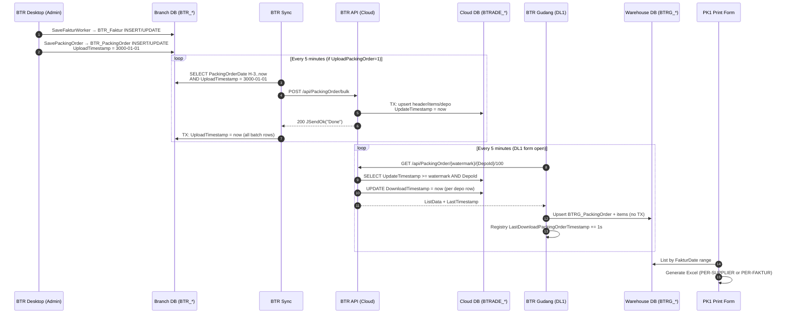
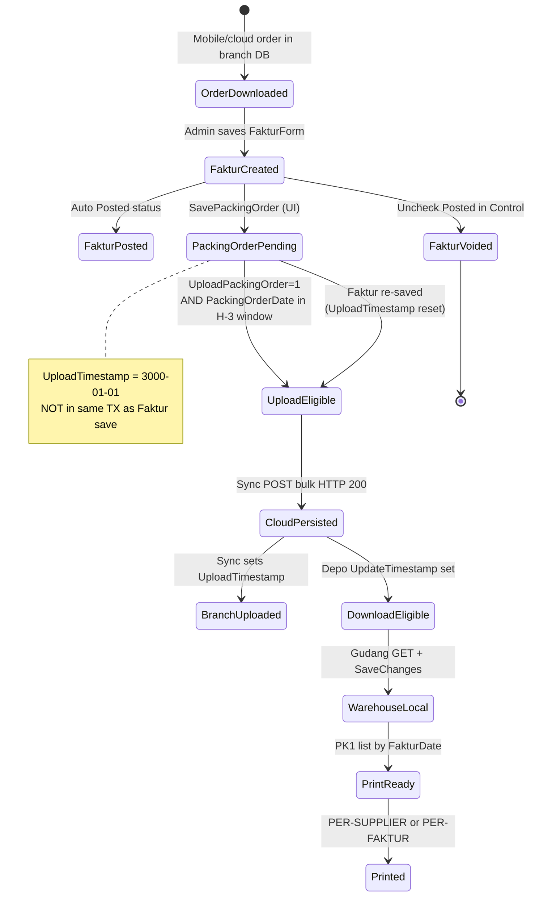
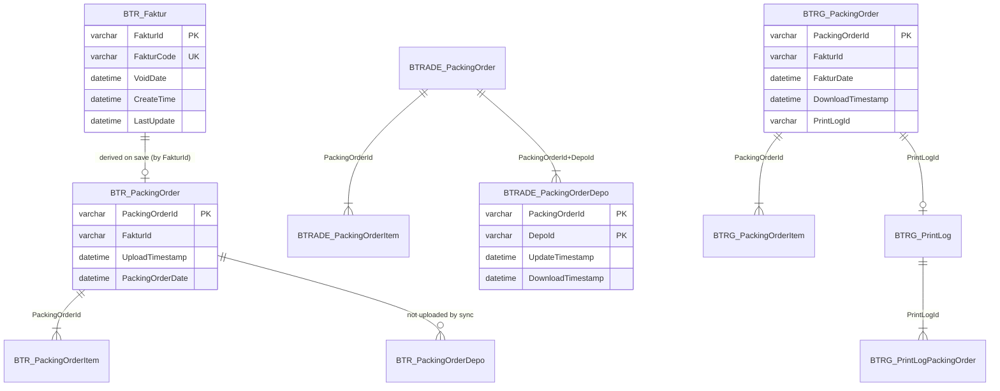
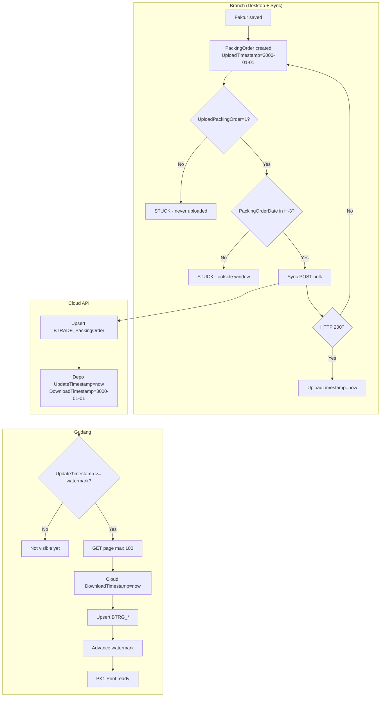

# Architecture Investigation Report: Faktur Distribution (Current Implementation)

**Date:** 2026-07-07  
**Scope:** Document how Faktur data currently flows from BTR Desktop creation to BTR Gudang warehouse printing.  
**Constraint:** Investigation only — no redesign or refactor proposals.

---

## Executive Summary

Faktur is **not synchronized as a first-class entity**. Warehouse fulfillment data travels as a **Packing Order** payload that embeds Faktur header fields (`FakturId`, `FakturCode`, `FakturDate`, `AdminName`, `GrandTotal`) plus line items.

| Application | Role | Database |
|-------------|------|----------|
| **BTR Desktop** (`j05-btr-distrib`) | Creates Faktur; derives local Packing Order | Branch SQL Server (`BTR_*`) |
| **BTR Sync** (`j07-btrade-sync`) | Polls and bulk-uploads eligible Packing Orders | Same branch DB |
| **BTR API** (`j06-pkl-btrade-api`) | Cloud hub; upsert on upload; incremental download | Cloud SQL Server (`BTRADE_*`) |
| **BTR Gudang** (`j07-btr-gudang`) | Polls and downloads Packing Orders; prints Excel | Local warehouse DB (`btrgd` / `BTRG_*`) |

**Observed reliability posture:** The pipeline is **best-effort, at-least-once with gaps**. It does **not** provide exactly-once delivery. Several stages can permanently skip records (date-window filters, watermark advancement on partial failure, fire-and-forget uploads, disabled-by-default upload flag).

**Business printing in Gudang today:**
- **Picking** → `Print Per-Supplier` (`DocType = PER-SUPPLIER`) — items grouped across selected fakturs
- **Packing** → `Print Per-Faktur` (`DocType = PER-FAKTUR`) — one section per faktur

---

## 1. Overall Architecture

### 1.1 Component Map

```
┌─────────────────────────────────────────────────────────────────────────────┐
│ BRANCH OFFICE                                                               │
│                                                                             │
│  ┌──────────────────┐    Save Faktur     ┌─────────────────────────────┐   │
│  │ BTR Desktop      │ ─────────────────► │ BTR_Faktur (+ items, etc.)  │   │
│  │ (btr.distrib)    │                    └─────────────────────────────┘   │
│  │                  │    SavePackingOrder (UI, separate step)             │
│  │                  │ ─────────────────► BTR_PackingOrder                  │
│  │                  │                    UploadTimestamp = 3000-01-01     │
│  └──────────────────┘                                                       │
│           │                                                                 │
│           │  shared SQL Server (registry: HKCU\DrurySoftware\BTRApp)        │
│           ▼                                                                 │
│  ┌──────────────────┐   5-min timer      POST /api/PackingOrder/bulk       │
│  │ BTR Sync         │ ────────────────────────────────────────────────┐     │
│  │ (j07-btrade-sync)│   (if UploadPackingOrder=1)                     │     │
│  └──────────────────┘                                                 │     │
└───────────────────────────────────────────────────────────────────────│─────┘
                                                                        │
                                                                        ▼
┌─────────────────────────────────────────────────────────────────────────────┐
│ CLOUD                                                                       │
│  ┌──────────────────┐   GET /api/PackingOrder/{ts}/{depo}/{page}          │
│  │ BTR API          │ ◄──────────────────────────────────────────────┐    │
│  │ (j06-pkl-btrade) │                                                    │    │
│  │                  │ ───────────────────────────────────────────────►   │    │
│  └──────────────────┘                                                    │    │
│           │                                                              │    │
│           ▼                                                              │    │
│  BTRADE_PackingOrder / Item / Depo                                       │    │
└──────────────────────────────────────────────────────────────────────────│────┘
                                                                           │
┌──────────────────────────────────────────────────────────────────────────│────┐
│ WAREHOUSE                                                                │    │
│  ┌──────────────────┐   5-min timer (DL1 form must be open)               │    │
│  │ BTR Gudang       │ ◄──────────────────────────────────────────────────┘    │
│  │ (j07-btr-gudang) │                                                          │
│  │                  │ ──► BTRG_PackingOrder / Item                             │
│  │  PK1 Print Form  │ ──► Excel (Picking / Packing)                          │
│  └──────────────────┘                                                          │
└────────────────────────────────────────────────────────────────────────────────┘
```

### 1.2 Manual Processes

| Process | Who | When |
|---------|-----|------|
| Create / edit Faktur | Admin in BTR Desktop | Business event |
| Enable upload | Operator in BTR Sync Konfigurasi | One-time / as needed (`UploadPackingOrder` registry flag) |
| Extended upload window | Operator context menu in Sync | H-6 manual trigger |
| Open DL1 Downloader | Warehouse operator | App must be running for auto-poll |
| Manual download | Warehouse operator | "Download Now" in DL1 |
| Print picking / packing | Warehouse operator | PK1 form, date range + row selection |

### 1.3 Sequence Diagram (End-to-End)



---

## 2. Lifecycle of a Faktur

### 2.1 Stage-by-Stage Trace

| # | Stage | Trigger | Location | Persistent marker |
|---|-------|---------|----------|-------------------|
| 1 | **Sales Order exists** | Prior mobile/cloud sync | `BTR_Order` | `StatusSync` (e.g. `DOWNLOADED`) |
| 2 | **Faktur created** | Admin saves in `FakturForm` | `BTR_Faktur`, `BTR_FakturItem`, `BTR_OrderMap` | `VoidDate = 3000-01-01` (active) |
| 3 | **Order marked invoiced** | Same transaction as save | `BTR_Order` | `StatusSync = "TERBIT FAKTUR"` |
| 4 | **Inventory reduced** | `GenStokFakturWorker` in save TX | Stock tables | Ref type `FAKTUR` |
| 5 | **Control status Posted** | MediatR `SavedFakturEvent` | `BTR_FakturControlStatus` | `StatusFaktur = Posted` |
| 6 | **Piutang created** | UI `SavePiutang` (after save) | Piutang tables | — |
| 7 | **Packing Order created** | UI `SavePackingOrder` (after save) | `BTR_PackingOrder`, `BTR_PackingOrderItem` | `UploadTimestamp = 3000-01-01` |
| 8 | **Eligible for upload** | Packing order exists + flag on + in date window + sentinel timestamp | — | Implicit |
| 9 | **Sync discovers** | 5-min timer / startup / manual H-3/H-6 | Sync in-memory filter | — |
| 10 | **Uploaded to cloud** | HTTP 200 from bulk endpoint | `BTRADE_PackingOrder*` | `BTRADE_PackingOrderDepo.UpdateTimestamp` |
| 11 | **Upload acknowledged (branch)** | Local TX after HTTP 200 | `BTR_PackingOrder` | `UploadTimestamp = now` |
| 12 | **Eligible for download** | `UpdateTimestamp >= watermark` for depo | Cloud depo row | `DownloadTimestamp = 3000-01-01` until pulled |
| 13 | **Gudang discovers** | 5-min DL1 timer / manual | — | Registry watermark |
| 14 | **Downloaded** | HTTP 200 + deserialize | — | Cloud `DownloadTimestamp = now` |
| 15 | **Persisted locally** | Per-order `SaveChanges` | `BTRG_PackingOrder`, `BTRG_PackingOrderItem` | `DownloadTimestamp = now` |
| 16 | **Ready for printing** | Visible in PK1 by `FakturDate` | — | — |
| 17 | **Printed** | User action | `BTRG_PrintLog`, `BTRG_PrintLogPackingOrder` | `PrintLogId` on packing order |

### 2.2 State Transition Diagram



### 2.3 Critical Boundary: Faktur Save vs Packing Order

`SaveFaktur()` and `SavePackingOrder()` are **separate UI steps** in `FakturForm.SaveButton_Click`:

```917:925:src/j05-btr-distrib/btr.distrib/SalesContext/FakturAgg/FakturForm.cs
        private void SaveButton_Click(object sender, EventArgs e)
        {
            try
            {
                var faktur = SaveFaktur();
                var customer = _customerDal.GetData(faktur);
                SavePiutang(faktur);
                SavePackingOrder(faktur,customer);
```

A Faktur can exist in `BTR_Faktur` without a corresponding `BTR_PackingOrder` if `SavePackingOrder` throws. Such a Faktur will **never reach the warehouse** through the current pipeline.

---

## 3. Data Model

### 3.1 Database Relationship Diagram



### 3.2 Branch Database (BTR Desktop + Sync)

#### `BTR_Faktur` — source invoice

| Column | Type | Sync relevance |
|--------|------|----------------|
| `FakturId` | VARCHAR(13) PK | Carried in packing order payload |
| `FakturCode` | VARCHAR(11) UNIQUE | Carried in payload |
| `FakturDate` | DATETIME | Carried in payload |
| `VoidDate` | DATETIME | `3000-01-01` = active; **no sync void propagation** |
| `CreateTime`, `LastUpdate` | DATETIME | Audit only |
| `GrandTotal`, `UserId` (→ AdminName) | | Carried in payload |

**No upload/sync flag on `BTR_Faktur`.**

DDL: `src/j05-btr-distrib/btr.sql/Tables/SalesContext/BTR_Faktur.sql`

#### `BTR_PackingOrder` — sync source entity

| Column | Type | Meaning |
|--------|------|---------|
| `PackingOrderId` | VARCHAR(26) PK | ULID; idempotency key end-to-end |
| `PackingOrderDate` | DATETIME | **Upload discovery filter** (H-3 window) — not upload status |
| `FakturId`, `FakturCode`, `FakturDate` | | Embedded faktur identity |
| `AdminName` | VARCHAR(100) | Faktur creator (`UserId`) |
| `GrandTotal` | DECIMAL(18,2) | |
| `UploadTimestamp` | DATETIME | **`3000-01-01` = pending upload**; real datetime = uploaded |
| `DriverId`, `DriverName`, `Note` | | Carried in payload |

DDL: `src/j05-btr-distrib/btr.sql/PackingOrderModel/BTR_PackingOrder.sql`

**Sentinel convention:** `3000-01-01` means "not yet done" across BTR.

On every insert/update in Distrib DAL, `UploadTimestamp` is **forced back to** `3000-01-01`:

```74:74:src/j05-btr-distrib/btr.infrastructure/InventoryContext/PackingOrderFeature/PackingOrderDal.cs
            dp.AddParam("@UploadTimestamp", new DateTime(3000,1,1), SqlDbType.DateTime);
```

#### `BTR_PackingOrderItem`

PK: `(PackingOrderId, NoUrut)`. No per-line sync flag; loaded by header key during upload.

#### `BTR_PackingOrderDepo`

Has `UploadTimestamp` column but **not used by j07-btrade-sync upload path**.

#### `BTR_Order` / `BTR_OrderMap`

| Table | Sync column | Meaning |
|-------|-------------|---------|
| `BTR_Order` | `StatusSync` | Set to `"TERBIT FAKTUR"` on faktur save; not part of warehouse path |
| `BTR_OrderMap` | — | Maps `OrderId` → `FakturId` |

#### `BTR_FakturControlStatus`

PK: `(FakturId, StatusFaktur)`. Lifecycle: Posted → Kirim → KembaliFaktur → Lunas/Pajak. **Not synchronized to cloud or warehouse.**

### 3.3 Cloud Database (BTR API)

#### `BTRADE_PackingOrder`

PK: `PackingOrderId`. Mirrors branch packing order header including Faktur fields. **No status/sync column on header.**

DDL: `src/j06-pkl-btrade-api/btrade.sqldb/WarehouseContext/BTRADE_PackingOrder.sql`

#### `BTRADE_PackingOrderDepo` — incremental sync cursor

| Column | Meaning |
|--------|---------|
| `PackingOrderId` + `DepoId` | Composite PK; one row per warehouse routing |
| `UpdateTimestamp` | **Download poll cursor** — set to `now` on upload/re-upload |
| `DownloadTimestamp` | Set to `now` when warehouse GET returns the row; `3000-01-01` = never downloaded |

DDL: `src/j06-pkl-btrade-api/btrade.sqldb/WarehouseContext/BTRADE_PackingOrderDepo.sql`

On bulk upload, depo rows are **deleted and re-inserted** with `UpdateTimestamp = now`, `DownloadTimestamp = 3000-01-01`:

```55:58:src/j06-pkl-btrade-api/btrade.application/WarehouseFreature/WrhBulkUploadPackingOrderCmd.cs
                    var listDepo = listItem
                        .GroupBy(x => x.DepoId)
                        .Select(g => new PackingOrderDepoModel(hdr.PackingOrderId, g.Key, DateTime.Now, new DateTime(3000, 1, 1)))
                        .ToList();
```

#### `BTRADE_Faktur` — unused schema

| Column | Default | Status |
|--------|---------|--------|
| `GlobalId` | PK | No API/DAL references |
| `StatusSync` | `'N'` | Never written by current code |

DDL: `src/j06-pkl-btrade-api/btrade.sqldb/SalesContext/BTRADE_Faktur.sql`  
`BTRADE_FakturItem.sql` is empty.

### 3.4 Warehouse Database (BTR Gudang — `btrgd`)

#### `BTRG_PackingOrder`

| Column | Meaning |
|--------|---------|
| `PackingOrderId` | PK; upsert key |
| `FakturId`, `FakturCode`, `FakturDate` | Print filter + display |
| `DownloadTimestamp` | Local record of when downloaded |
| `PrintLogId` | Links to last print job |
| `OfficeCode` | From API |

DDL: `src/j07-btr-gudang/BtrGudang.SqlDb/Tables/BTRG_PackingOrder.sql`

**No unique index on `FakturId`** — deduplication relies on `PackingOrderId` only.

#### `BTRG_PackingOrderItem`

PK: `(PackingOrderId, NoUrut)`. Replaced on every download upsert.

#### `BTRG_PrintLog` / `BTRG_PrintLogPackingOrder`

Audit of print operations; `DocType` = `PER-SUPPLIER` or `PER-FAKTUR`.

### 3.5 Registry / Configuration State (not SQL)

| Key | Location | Purpose |
|-----|----------|---------|
| `UploadPackingOrder` | `HKCU\DrurySoftware\BTRApp` | `"1"` enables upload (default `"0"`) |
| `OfficeCode` | same | Sent in upload payload; **no in-app writer found** |
| `Server`, `Database` | same | Branch SQL connection |
| `DepoId` | same | Warehouse download filter |
| `LastDownloadPackingOrderTimestamp` | same | Gudang download watermark |
| `btrade-cloud-base-url` | Sync `App.config` | Cloud API base URL |

---

## 4. Synchronization Protocol

### 4.1 Upload Path (Branch → Cloud)

| Aspect | Detail |
|--------|--------|
| **Initiator** | BTR Sync (`SyncForm` timer, every 5 min) |
| **Discovery** | `BTR_PackingOrder` where `PackingOrderDate BETWEEN H-3 AND now`, then filter `UploadTimestamp = 3000-01-01` |
| **Feature gate** | Registry `UploadPackingOrder = "1"` (disabled by default) |
| **Endpoint** | `POST {baseUrl}/api/PackingOrder/bulk` |
| **Auth** | None (no headers) |
| **Batch size** | **Unlimited** — all eligible rows in one HTTP request |
| **Idempotency key** | `PackingOrderId` |
| **Server behavior** | Single DB transaction; per record: upsert header, delete+reinsert items and depo |
| **Response** | `200` + `{ status: "success", data: "Done" }` — **body not validated by client** |
| **Client ack** | On HTTP 200 only: local TX sets `UploadTimestamp = now` for **entire batch** |
| **Retry** | Implicit next poll (5 min); no backoff, no max attempts |
| **Timeout** | RestSharp default; upload not awaited by timer (`ContinueWith` fire-and-forget) |
| **Duplicate upload** | Server replaces existing `PackingOrderId`; safe but resets cloud `DownloadTimestamp` to pending |
| **Ordering** | No ordering guarantee across uploads; within batch, server processes sequentially |

### 4.2 Download Path (Cloud → Warehouse)

| Aspect | Detail |
|--------|--------|
| **Initiator** | BTR Gudang `DL1DownloaderForm` (5-min `Timer`; form must be open) |
| **Endpoint** | `GET {baseUrl}/api/PackingOrder/{startTimestamp}/{warehouseCode}/{pageSize}` |
| **Auth** | None |
| **Filter** | `BTRADE_PackingOrderDepo.UpdateTimestamp >= startTimestamp AND DepoId = warehouseCode` |
| **SQL cap** | `SELECT TOP 500` in DAL |
| **App pagination** | `OrderBy(UpdateTimestamp).Take(pageSize)` — **pageSize = 100** |
| **Pagination loop** | **None per cycle** — one page per 5-min tick |
| **Response cursor** | `LastTimestamp` = max `UpdateTimestamp` in batch (or unchanged if empty) |
| **Cloud ack** | During GET handler: `DownloadTimestamp = now` on depo rows **before response returns** |
| **Client watermark** | Registry `LastDownloadPackingOrderTimestamp` = `LastTimestamp + 1 second` (always, success or failure) |
| **Local persist** | Per-order upsert; no wrapping transaction |
| **Duplicate download** | Upsert by `PackingOrderId` — updates in place |
| **Ordering** | `ORDER BY UpdateTimestamp ASC` |

### 4.3 Synchronization Flow Diagram



---

## 5. Reliability Analysis

### 5.1 Failure Mode Matrix

| Stage | Crash | Network drop | SQL TX fail | API timeout | Dup upload | Dup download | Power loss | Retry |
|-------|-------|--------------|-------------|-------------|------------|--------------|------------|-------|
| Faktur save | TX rollback | N/A | Rollback | N/A | N/A | N/A | TX rollback | Manual re-save |
| PackingOrder save | Partial — Faktur may exist without PO | N/A | Partial | N/A | N/A | N/A | Partial | Re-save Faktur |
| Sync discover | Resume next poll | N/A | N/A | N/A | N/A | N/A | Resume | Next 5 min |
| Sync upload HTTP | Flag stays pending | Flag stays pending | N/A | Flag stays pending | Server upsert | N/A | Flag stays pending | Next poll |
| Sync local ack | **Orphan: cloud has data, branch thinks pending** | Same | Rollback ack | If 200 received: **orphan risk** | Re-upload replaces | N/A | Uncertain | Next poll may re-upload |
| Cloud persist | N/A | N/A | Full batch rollback | N/A | Upsert | N/A | TX rollback | Client retries |
| Gudang download | Watermark may advance | Watermark advances on failure path | N/A | Failure path | N/A | Upsert | Partial local rows | Next poll |
| Gudang local save | **Header without items possible** | N/A | Per-order, no TX | N/A | N/A | Upsert | Partial | Re-download if watermark allows |

### 5.2 Delivery Semantics Assessment

| Segment | Semantics | Rationale |
|---------|-----------|-----------|
| Branch → Cloud | **At-least-once** (with gaps) | Retries on pending flag, but H-3 window and disabled flag cause **silent loss** |
| Cloud → Warehouse | **At-most-once to at-least-once** (inconsistent) | Watermark can skip records after partial success; upsert allows re-delivery if watermark permits |
| End-to-end | **Neither exactly-once nor guaranteed at-least-once** | Compounding filters, premature watermark advance, decoupled acks |

**Not exactly-once because:**
- Upload ack is HTTP-status-only, not verified against server persistence per record
- Download ack occurs in cloud before warehouse local commit
- Watermark advances even on some failure paths
- Re-upload on faktur edit creates new cloud `UpdateTimestamp` but branch may have already marked uploaded

**Not guaranteed at-least-once because:**
- H-3/H-6 date window permanently excludes old pending records
- `UploadPackingOrder` defaults to off
- DL1 must be running; no Windows service
- Packing order may never be created

---

## 6. Failure Points (Ranked by Probability)

### High Probability

| # | Failure | Mechanism | Symptom |
|---|---------|-----------|---------|
| 1 | **Upload disabled by default** | `UploadPackingOrder` defaults `"0"` | No packing orders reach cloud |
| 2 | **H-3 date window on upload** | `PackingOrderDate BETWEEN H-3 AND now` despite pending flag | Older pending fakturs never uploaded; TODO acknowledged in code |
| 3 | **DL1 not running** | WinForms timer only; no service | Warehouse stops receiving new fakturs |
| 4 | **Watermark advance on failed/partial download** | `RememberLastTimestamp` called regardless; fallback timestamp on error | Records skipped permanently until manual registry reset |
| 5 | **Faktur saved without PackingOrder** | Separate UI steps, no shared TX | Faktur exists in branch, never in sync pipeline |

### Medium Probability

| # | Failure | Mechanism | Symptom |
|---|---------|-----------|---------|
| 6 | **Single-page download per 5 min** | `pageSize=100`, no loop | Backlog after bulk upload day; delayed arrival |
| 7 | **Fire-and-forget upload** | `ProcessPackingOrder` doesn't await HTTP | Overlapping uploads; ambiguous ordering |
| 8 | **Wrong/missing DepoId** | Registry `DepoId` must match item `DepoId` | Cloud has data; warehouse filter returns empty |
| 9 | **Missing OfficeCode** | Read from registry, no UI to set | Unknown impact on routing (field sent but not validated) |
| 10 | **Re-save resets upload flag** | Distrib DAL forces `UploadTimestamp = 3000-01-01` on update | Re-upload needed; if outside H-3, stuck |
| 11 | **No download transaction** | Per-order save without TX | Header without items |

### Lower Probability (but severe)

| # | Failure | Mechanism | Symptom |
|---|---------|-----------|---------|
| 12 | **HTTP 200 before local ack TX fails** | Upload service order | Cloud has record; branch shows pending → duplicate upload |
| 13 | **Cloud ack before local persist** | Download handler updates `DownloadTimestamp` in GET | Theoretical loss if watermark advances past `UpdateTimestamp` before local save |
| 14 | **Unbounded bulk POST** | No chunking | Timeout on large daily volume |
| 15 | **JSON double-serialization** | `Serialize` then `AddJsonBody(string)` | Potential API deserialization issues (behavior depends on server) |

### Race Conditions / Timing Windows

- Sync timer restarts regardless of upload completion (`finally { processingTimer.Start() }`)
- Gudang `Interlocked` guard prevents overlap but watermark still advances after failed runs
- Cloud `TOP 500` + app `Take(100)` — 400 rows fetched from DB but discarded at app layer per request

---

## 7. Current API Contract

### 7.1 `POST /api/PackingOrder/bulk`

| Property | Value |
|----------|-------|
| **Controller** | `PackingOrderController.BulkUpload` |
| **Auth** | None (JWT configured but not enforced) |
| **Request** | `WrhBulkUploadPackingOrderCmd` with `listPackingOrder[]` |
| **Response** | `200 OK` — `JSendOk("Done")` |
| **Idempotency** | Upsert by `PackingOrderId` |
| **Pagination** | N/A |
| **Batch size** | Unlimited |

### 7.2 `POST /api/PackingOrder` (single)

Same payload shape as one bulk item. Appears unused by current sync/gudang clients.

### 7.3 `GET /api/PackingOrder/{startTimestamp}/{warehouseCode}/{pageSize}`

| Property | Value |
|----------|-------|
| **startTimestamp** | `yyyy-MM-dd HH:mm:ss` — inclusive lower bound on `UpdateTimestamp` |
| **warehouseCode** | Depo ID (e.g. from registry `DepoId`) |
| **pageSize** | Client-supplied; Gudang uses `100` |
| **Response** | `JSendOk(WrhDownloadPackingOrderResp)` with `LastTimestamp` + `ListData[]` |
| **Filtering** | `UpdateTimestamp >= start` AND `DepoId = warehouseCode` |
| **Ordering** | `UpdateTimestamp ASC` |
| **Side effect** | Sets `DownloadTimestamp` on matched depo rows |

### 7.4 Authentication (configured but inactive)

- JWT in `appsettings.json`; `UseAuthentication()` registered
- **No `[Authorize]` on any controller**
- Sync and Gudang clients send no `Authorization` header

---

## 8. Warehouse Persistence

### 8.1 Save Path

`DL1DownloaderForm.SavePackingOrder` → `PackingOrderRepo.SaveChanges` per order:

```23:34:src/j07-btr-gudang/BtrGudang.Infrastructure/PackingOrderFeature/PackingOrderRepo.cs
        public void SaveChanges(PackingOrderModel model)
        {
            LoadEntity(model)
                .Match(
                    onSome: _ => _packingOrderDal.Update(PackingOrderDto.FromModel(model)),
                    onNone: () => _packingOrderDal.Insert(PackingOrderDto.FromModel(model)));

            _packingOrderItemDal.Delete(model);
            _packingOrderItemDal.Insert(model.ListItem
                .Select(x => PackingOrderItemDto.FromModel(x, model.PackingOrderId))
                .ToList());
        }
```

### 8.2 Transaction Scope

| Operation | Transaction |
|-----------|-------------|
| Download persist | **None** — header update/insert and item delete+insert are separate operations |
| Print audit | **Yes** — `TransHelper.NewScope()` in PK1 form |

### 8.3 Duplicate Prevention

- **Key:** `PackingOrderId` (ULID assigned at first faktur→packing-order creation in Distrib)
- **Strategy:** Upsert header; replace all items
- **FakturId:** Not unique in warehouse DB; same faktur re-save in Distrib keeps same `PackingOrderId` (via `UpdateFromFaktur`)

### 8.4 Rollback Behaviour

No rollback on partial failure during download loop. If item bulk insert fails after header insert, inconsistent state is possible.

---

## 9. Printing Dependency

### 9.1 Picking — `PER-SUPPLIER` (group by Item)

**Required fields (items):**

| Field | Source |
|-------|--------|
| `BrgId`, `BrgCode`, `BrgName` | `BTRG_PackingOrderItem` |
| `Kategori` (as `KategoriName`) | Item |
| `Supplier` (as `SupplierName`) | Item |
| `QtyBesar`, `SatBesar`, `QtyKecil`, `SatKecil` | Item (summed across selected orders) |

**Not required for picking output:** Faktur header fields, customer, driver, GPS, `GrandTotal`, `PackingOrderId` (used only for selection, not printed in item groups).

**Optional at selection time:** Which packing orders / fakturs to include.

### 9.2 Packing — `PER-FAKTUR` (group by FakturId)

**Required header fields:**

| Field | Print usage |
|-------|-------------|
| `FakturCode` | Invoice number |
| `FakturDate` | Date |
| `GrandTotal` | Total |
| `CustomerCode`, `CustomerName` | Customer block |
| `Alamat` | Delivery address |
| `Latitude`, `Longitude` | Maps hyperlink |
| `DriverName` | Driver line |
| `Note` | Optional note |

**Required item fields:** `BrgCode`, `BrgName`, `Kategori`, `Supplier`, qty/satuan pairs, `NoUrut` (ordering).

**Unnecessary for printing:** `PackingOrderDate`, `OfficeCode`, `DownloadTimestamp`, `PrintLogId`, `Accuracy`, `NoTelp`, `FakturId` (internal), `AdminName` (shown in list grid but not in per-faktur Excel template), `WarehouseDesc`.

### 9.3 List / Filter Dependencies (PK1)

- Query by **`FakturDate` range** on `BTRG_PackingOrder`
- Join `BTRG_PrintLog` for `JamCetak` / `JenisCetak` display

---

## 10. Performance Characteristics

*Values observed from code review — not runtime benchmarks.*

| Metric | Upload (Sync) | Download (Gudang) |
|--------|---------------|-------------------|
| **Polling interval** | 5 minutes | 5 minutes |
| **Batch size** | Unlimited (all H-3 pending) | 100 per request |
| **SQL fetch cap** | N/A | `TOP 500` in cloud DAL |
| **Pages per cycle** | 1 | 1 (no pagination loop) |
| **Default lookback** | H-3 (manual H-6) | Registry watermark; default today−3 days |
| **API calls per cycle** | 1 POST (if enabled + eligible rows) | 1 GET |
| **SQL queries per upload record** | 1 header list + 1 item list per header (N+1 pattern in `CreateListPackingOrder`) | 3 cloud queries (headers, items, depo) shared |
| **SQL queries per download save** | N/A | 2–4 per order (existence check, header I/U, item delete, bulk insert) |
| **Payload** | Full order + all items JSON | Same |
| **Auth overhead** | None | None |

### Scalability Bottlenecks

1. Single bulk POST with no size limit
2. Download processes max 100 records per 5 minutes per warehouse instance
3. WinForms desktop apps — no horizontal scaling, must be running
4. Cloud download marks ack during GET (holds connection during DB writes)
5. N+1 item loading in Sync `CreateListPackingOrder` foreach loop

---

## 11. Operational Recovery

### 11.1 Missed Faktur (never reached warehouse)

| Check | Action |
|-------|--------|
| Faktur in `BTR_Faktur` but no `BTR_PackingOrder`? | Re-save Faktur in Desktop (triggers `SavePackingOrder`) |
| Packing order exists, `UploadTimestamp = 3000-01-01`? | Verify `UploadPackingOrder=1` in Sync config |
| Outside H-3 window? | Use Sync **Extended (H-6)** or manually reset `UploadTimestamp` in SQL and adjust date / use extended window |
| In cloud but not Gudang? | Verify `DepoId` registry matches item depo; check DL1 is running |
| Watermark past record? | Reset registry `LastDownloadPackingOrderTimestamp` to earlier datetime; manual **Download Now** |

**No built-in "replay by FakturId" or dead-letter queue exists.**

### 11.2 Partial Upload

- Server: entire bulk TX rolls back on failure
- Client: if HTTP 200 but local ack TX fails → cloud has data, branch shows pending → will re-upload (upsert)

### 11.3 Partial Download

- No transaction: may have header without items
- Watermark still advances → **manual registry reset required** to re-fetch

### 11.4 Duplicate Download

- Safe: upsert by `PackingOrderId`
- Items fully replaced

### 11.5 Cloud Inconsistency

- No admin reconciliation API
- Operators must compare `BTR_PackingOrder` (branch), `BTRADE_PackingOrder` (cloud), `BTRG_PackingOrder` (warehouse) manually by `FakturCode` / `PackingOrderId`

### 11.6 Explicit Recovery Gaps

- No automated backfill job
- No monitoring/alerting on pending `UploadTimestamp`
- No visibility when `UploadPackingOrder=0`
- No service-level guarantee on DL1 uptime

---

## 12. Source Code Map

### 12.1 BTR Desktop (`src/j05-btr-distrib`)

| Area | Path |
|------|------|
| **Project** | `btr.distrib/btr.distrib.csproj` |
| Faktur UI | `btr.distrib/SalesContext/FakturAgg/FakturForm.cs` |
| Faktur save worker | `btr.application/SalesContext/FakturAgg/UseCases/SaveFakturWorker.cs` |
| Faktur writer | `btr.application/SalesContext/FakturAgg/Workers/FakturWriter.cs` |
| Packing order domain | `btr.domain/InventoryContext/PackingOrderFeature/PackingOrderModel.cs` |
| Packing order repo | `btr.infrastructure/InventoryContext/PackingOrderFeature/PackingOrderRepo.cs` |
| Packing order DAL | `btr.infrastructure/InventoryContext/PackingOrderFeature/PackingOrderDal.cs` |
| Faktur control | `btr.distrib/SalesContext/FakturControlAgg/FakturControlForm.cs` |
| Stock on faktur | `btr.application/InventoryContext/StokAgg/GenStokUseCase/GenStokFakturWorker.cs` |
| DDL | `btr.sql/Tables/SalesContext/BTR_Faktur.sql`, `btr.sql/PackingOrderModel/BTR_PackingOrder.sql` |
| Legacy sync (no PO upload) | `btr.sync/SyncForm.cs` |

### 12.2 BTR Sync (`src/j07-btrade-sync`)

| Area | Path |
|------|------|
| **Project** | `j07-btrade-sync/j07-btrade-sync.csproj` |
| Timer orchestration | `j07-btrade-sync/SyncForm.cs` |
| Upload service | `j07-btrade-sync/Service/PackingOrderUploadSvc.cs` |
| Local DAL | `j07-btrade-sync/Repository/PackingOrderDal.cs` |
| Config UI | `j07-btrade-sync/KonfigurasiForm.cs` |
| App config | `j07-btrade-sync/App.config` |

### 12.3 BTR API (`src/j06-pkl-btrade-api`)

| Area | Path |
|------|------|
| **Solution** | `j06-pkl-btrade-api.sln` |
| Controller | `btrade.webapi/Controllers/PackingOrderController.cs` |
| Bulk upload handler | `btrade.application/WarehouseFreature/WrhBulkUploadPackingOrderCmd.cs` |
| Download handler | `btrade.application/WarehouseFreature/WrhDownloadPackingOrderCmd.cs` |
| Single upload handler | `btrade.application/WarehouseFreature/WrhCreatePackingOrderCmd.cs` |
| Cloud DAL | `btrade.infrastructure/WarehouseFeature/PackingOrderDal.cs` |
| Depo DAL | `btrade.infrastructure/WarehouseFeature/PackingOrderDepoDal.cs` |
| Domain model | `btrade.domain/WarehouseFeature/PackingOrderModel.cs` |
| DDL | `btrade.sqldb/WarehouseContext/BTRADE_PackingOrder*.sql` |
| JWT config | `btrade.webapi/Configurations/PresentationService.cs` |

### 12.4 BTR Gudang (`src/j07-btr-gudang`)

| Area | Path |
|------|------|
| **Solution** | `j07-btr-gudang.slnx` |
| Download form | `BtrGudang.Winform/Forms/DL1DownloaderForm.cs` |
| Download service | `BtrGudang.Winform/Services/PackingOrderDownloaderSvc.cs` |
| Print form | `BtrGudang.Winform/Forms/PK1PrintPackingOrderForm.cs` |
| Repository | `BtrGudang.Infrastructure/PackingOrderFeature/PackingOrderRepo.cs` |
| DALs | `BtrGudang.Infrastructure/PackingOrderFeature/PackingOrderDal.cs`, `PackingOrderItemDal.cs` |
| DDL | `BtrGudang.SqlDb/Tables/BTRG_*.sql` |
| App settings | `BtrGudang.Winform/AppSettings.json` |
| DI setup | `BtrGudang.Winform/Program.cs` |

---

## 13. Risks and Technical Debt

| Risk | Severity | Notes |
|------|----------|-------|
| Faktur distribution coupled to PackingOrder side effect | High | No direct sync; void/edit semantics unclear downstream |
| Upload disabled by default | High | Easy misconfiguration |
| H-3 window vs pending flag mismatch | High | Acknowledged TODO in Sync DAL |
| Watermark advance on failure | High | Silent data loss |
| No Windows service for Sync / DL1 | Medium | Operational dependency on logged-in desktop |
| JWT auth theater | Medium | False sense of security |
| `BTRADE_Faktur` dead schema | Low | Confusing for future architects |
| `btr.sync` vs `j07-btrade-sync` duplication | Low | Legacy copy lacks PO upload |
| `DownloadTimestamp` not used in poll filter | Info | Re-download relies on `UpdateTimestamp` vs watermark, not ack flag |

---

## 14. Open Questions / Unknown Behaviour

1. **How is `OfficeCode` registry value set in production?** Read in upload but no writer found in repo.
2. **Is `UploadPackingOrder` enabled in all branch deployments?** Default is off; operational state unknown.
3. **What happens to warehouse data when a Faktur is voided in Desktop?** No void propagation to cloud or Gudang observed.
4. **Are multiple depos per packing order common?** Upload derives depo from items; download filters single `DepoId` — multi-depo behaviour unclear in production.
5. **Actual daily volume vs 100/cycle limit?** Code suggests backlog under load; no metrics collected.
6. **Does JSON double-serialization in `PackingOrderUploadSvc` cause issues in production?** Server appears to accept it today.
7. **Is `ServerTargetID` intended for future multi-tenant filtering?** Read but unused in upload/download.
8. **Cloud `TOP 500` with app `Take(100)`** — are the remaining 400 rows re-queried next poll or effectively deprioritized?

---

## 15. Deliverables Checklist

| Deliverable | Section |
|-------------|---------|
| Architecture overview | §1 |
| Sequence diagram | §1.3 |
| State transition diagram | §2.2 |
| Synchronization flow diagram | §4.3 |
| Database table relationship diagram | §3.1 |
| Failure point analysis | §6 |
| Reliability assessment | §5 |
| Performance observations | §10 |
| Risks and technical debt | §13 |
| Open questions | §14 |

---

## References

- Feature rules (void, inventory): `docs/features/faktur/feature.md`
- Sales order lifecycle: `docs/features/sales-order/feature.md`
- Repository workflow guide: `AGENTS.md`
