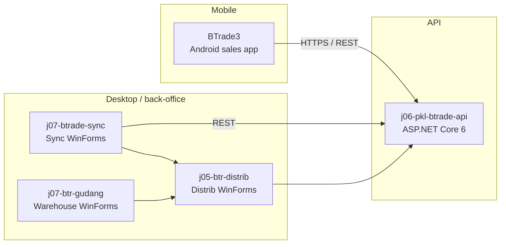

# BTR platform — system map

Monorepo layout after repository consolidation (2026-06-05). Each product under `src/` was an independent repository; boundaries are unchanged.

## High-level topology

## Repository index

| Path | Stack | Entry / solution | Role |
|------|-------|------------------|------|
| `src/BTrade3` | Kotlin, Gradle, Android | `build.gradle.kts`, module `app/` | Field sales: login, check-in, orders, location capture (`com.elsasa.btrade3`) |
| `src/j05-btr-distrib` | .NET Framework 4.8, WinForms | `j05-btr-distrib.sln` | Distribution ERP desktop: sales, finance, inventory UI (`btr.distrib`), shared layers `btr.domain`, `btr.application`, `btr.infrastructure`, `btr.nuna`, sync helper `btr.sync` |
| `src/j06-pkl-btrade-api` | .NET 6, ASP.NET Core | `j06-pkl-btrade-api.sln`, host `btrade.webapi` | Central HTTP API for mobile/sync clients; layered `domain` / `application` / `infrastructure` |
| `src/j07-btr-gudang` | .NET Framework 4.7.2, WinForms | `BtrGudang.Winform/BtrGudang.Winform.csproj` | Warehouse operations UI and supporting tiers (`BtrGudang.*`) |
| `src/j07-btrade-sync` | .NET Framework 4.8, WinForms | `j07-btrade-sync.sln` | Background/sync desktop: customers, orders, check-ins, packing, master data via REST |

## j05-btr-distrib — project map

| Project | Purpose |
|---------|---------|
| `btr.distrib` | Main WinForms application (sales, finance, inventory screens) |
| `btr.domain` | Domain models and logic |
| `btr.application` | Application services |
| `btr.infrastructure` | Data access, external integrations |
| `btr.nuna` | Shared utilities (e.g. Dapper helpers, guards) |
| `btr.sync` | Sync-related components tied to distrib |
| `btr.sql` | SQL Server database project (SSDT; Visual Studio build) |
| `btr.test` | Unit tests (xUnit) |

## j06-pkl-btrade-api — project map

| Project | Purpose |
|---------|---------|
| `btrade.webapi` | HTTP host, Swagger, middleware, controllers |
| `btrade.application` | Use cases / application layer |
| `btrade.domain` | Domain models (e.g. sales orders) |
| `btrade.infrastructure` | Persistence and external services |
| `btrade.sqldb` | SQL database project (SSDT) |

Configuration: `appsettings.json`, optional `appsettings.{MachineName}.json`.

## j07-btr-gudang — project map

| Project | Purpose |
|---------|---------|
| `BtrGudang.Winform` | Main WinForms executable |
| `BtrGudang.AppTier` | Application layer |
| `BtrGudang.Domain` | Domain |
| `BtrGudang.Infrastructure` | Infrastructure |
| `BtrGudang.Helper` | Helpers |
| `BtrGudang.Test` | Tests (`net472` SDK-style) |

## j07-btrade-sync — project map

| Area | Purpose |
|------|---------|
| `j07-btrade-sync/` (project) | WinForms sync shell, services, DALs |
| `Service/*` | Incremental download/upload (customers, orders, check-ins, categories, etc.) |
| `Repository/*` | Dapper data access |

Uses packages such as RestSharp and references shared `Nuna` patterns aligned with j05.

## BTrade3 — module map

| Path | Purpose |
|------|---------|
| `app/src/main/java/com/elsasa/btrade3/` | UI screens, view models, networking, Room DB |
| `app/build.gradle.kts` | Android application config (`applicationId` `com.elsasa.btrade3`) |

Requires Android SDK (`local.properties` / `ANDROID_HOME`) for Gradle builds.

## Documentation and architecture folders

| Path | Purpose |
|------|---------|
| `docs/` | Human and agent documentation (this map, handbook, consolidation notes) |
| `docs/repository-consolidation/` | Git migration records |
| `architecture/` | Reserved for future architecture decision records |

## External dependencies (not in Git)

Several solutions rely on **local or machine-wide** assets ignored by `.gitignore`:

- NuGet `packages/` (restore or copy after clone)
- SSDT for `*.sqlproj` (j05 `btr.sql`, j06 `btrade.sqldb`)
- Syncfusion WinForms assemblies (j05 `btr.distrib` references)
- Android SDK for BTrade3

See root `.gitignore` and [repository-consolidation/PROPOSED-ROOT-GITIGNORE.md](./repository-consolidation/PROPOSED-ROOT-GITIGNORE.md).

## Historical Git remotes (archived per-repo)

| Folder | Former `origin` |
|--------|-----------------|
| BTrade3 | `https://github.com/druryyl/BTrade3.git` |
| j05-btr-distrib | `https://github.com/druryyl/j05-btr-distrib.git` |
| j06-pkl-btrade-api | `https://github.com/druryyl/j06-pkl-btrade-api.git` |
| j07-btr-gudang | `https://github.com/druryyl/j07-btr-gudang.git` |
| j07-btrade-sync | `https://github.com/druryyl/j07-btrade-sync.git` |

Commit history for each product’s `master` branch is reachable in the monorepo graph (subtree import). Original commit SHAs (e.g. `232fc14` for j05) are preserved as ancestors.
