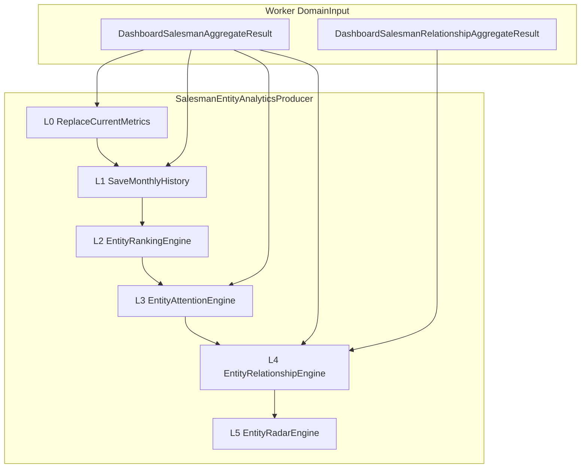

# M32.9 — Salesman Entity Pack — Implementation Summary

**Milestone:** M32.9  
**Date:** 2026-06-24  
**Status:** Complete  
**Prerequisite:** M32.1–M32.8 (L0–L5 platform + Comparison Engine on Customer)

---

## 1. Implementation Summary

Delivered **Salesman** as the second Entity Analytics consumer by mirroring the Customer entity-pack pattern: registrar, attention/relationship catalogs, producer (L0–L5 orchestration), worker hook, SF01 `ProfileRoute` links, frontend profile/compare routes, and reconciliation tests — with **no platform engine or L0–L5 schema changes**.

```text
RefreshDashboardSalesmanSnapshotWorker
  → DashboardSalesmanAggregator (+ Portfolio rows)
  → SalesmanMtdItemRollupDal
  → DashboardSalesmanRelationshipAggregator
  → BTRPD_Salesman snapshot save
  → EntityAnalyticsProducerOrchestrator
        → SalesmanEntityAnalyticsProducer
              L0 CURRENT  (EntityId = SalesPersonId, EntityCode = SalesPersonCode)
              L1 MONTHLY  (TrendEligible KPIs; current month = RepHistory row)
              L2 RANKING  (RankEligible KPIs; peer = all active reps)
              L3 ATTENTION (M18 signal keys via EntityAttentionEngine)
              L4 RELATIONSHIP (Top customers/principals/items + managed customers)
              L5 RADAR     (peer group salesman-all-active)
  → GET profile / search / compare (existing platform API + Vue shells)
```

**Key files**

| Area | Path |
| ---- | ---- |
| Registrar | `Registrars/SalesmanEntityAnalyticsRegistrar.cs` |
| Attention catalog | `Registrars/SalesmanAttentionSignalCatalog.cs` |
| Relationship catalog | `Registrars/SalesmanRelationshipCatalog.cs` |
| Producer | `Producers/SalesmanEntityAnalyticsProducer.cs` |
| Produce input | `Producers/SalesmanEntityAnalyticsProduceInput.cs` |
| Evidence resolver | `Producers/SalesmanEntityAnalyticsEvidenceResolver.cs` |
| Portfolio exposure | `DashboardSnapshotAgg/Models/DashboardSalesmanAggregateResult.cs` |
| Item rollup DAL | `Infrastructure/.../SalesmanMtdItemRollupDal.cs` |
| Relationship aggregator | `DashboardSnapshotAgg/Services/DashboardSalesmanRelationshipAggregator.cs` |
| Worker hook | `UseCases/RefreshDashboardSalesmanSnapshotWorker.cs` |
| SF01 ProfileRoute | `DashboardSalesmanDal.cs`, `GetDashboardSalesmanQuery.cs` |
| Frontend | `SalesmanProfileView.vue`, `SalesmanCompareView.vue`, `router/index.ts` |

**Infrastructure read-path tweak (entity pack support):** `EntityAnalyticsRepository` resolves profile keys by `(EntityId = @key OR EntityCode = @key)` so URLs use `SalesPersonCode` while L0 storage keys by `SalesPersonId`.

**Deferred (non-blocking MVP):** one-time RepHistory → L1 backfill script for prior 36 months (documented here; refresh writes current month only).

---

## 2. KPI Pack Summary

**Pack ID:** `salesman-default`  
**Registrar:** `SalesmanEntityAnalyticsRegistrar`

| KPI ID | Category | Profile role | Trend | Rank | Radar |
| ------ | -------- | ------------ | ----- | ---- | ----- |
| **SF-KPI-008** | Financial | MTD Omzet | ✓ | ✓ | Axis 1 — Revenue |
| **SF-KPI-009** | Financial | Achievement % | ✓ | ✓ | Axis 2 — Target Discipline |
| **SF-KPI-010** | Financial | Open Balance (Piutang) | ✓ | ✓ | Axis 3 — Stability |
| **EA-RADAR-GROWTH-MOM** | Growth | MoM omzet growth | — | — | Axis 4 (`RadarSourceKpiId = SF-KPI-008`) |
| **EA-DIM-CUSTOMER-COUNT** | Portfolio | Managed customer breadth | — | — | Axis 5 — Portfolio |
| **EA-RADAR-ATTENTION-RISK** | Risk | Active attention count | — | — | Axis 6 |
| **EA-DIM-CUSTOMER-ENGAGEMENT** | Activity | MTD active customer count | — | — | Overview dimension (L0); not a radar axis in v1 |

**Overview dimensions (L0 meta):** Wilayah, Segment, Achievement Band, Active MTD, Customer Count, Dormant Customer Count, Overdue Balance, Attention Signals.

**Not in profile KPI pack:** SF-KPI-001–007 (SF01 team headline cards). Per-rep risk is surfaced via **L3 attention signals**.

**Evidence routes:** `/reports/sales`, `/reports/piutang` with filter dimension `salesPersonCode`.

---

## 3. Producer Design (L0–L5)



| Layer | Source | Entity keys |
| ----- | ------ | ----------- |
| **L0** | `Portfolio` rows (~full rep population) | `EntityId = SalesPersonId`, `EntityCode = SalesPersonCode` |
| **L1** | TrendEligible KPI values for current `(Year, Month)` | Must match `BTRPD_SalesmanRepHistory` for same rep/period |
| **L2** | RankEligible KPIs across active reps | Same universe as SF01 rankings |
| **L3** | `AttentionList` grouped by `SalesPersonId` | Signal codes = M18 aggregator constants |
| **L4** | Relationship snapshots from portfolio + `PrincipalAchievement` + relationship aggregator | Pack `salesman-relationships` |
| **L5** | `PeerGroupRuleId = salesman-all-active` | Six radar axes from registrar metadata |

**KPI mapping (L0 numeric rows)**

| KPI ID | Portfolio field |
| ------ | ----------------- |
| SF-KPI-008 | `CompletedOmzet` |
| SF-KPI-009 | `AchievementPercent` |
| SF-KPI-010 | `OpenBalance` |

---

## 4. Relationship Mapping

**Pack ID:** `salesman-relationships`

| RelationshipCode | Display | Target entity | Metric | Source |
| ---------------- | ------- | ------------- | ------ | ------ |
| `ManagedCustomers` | Assigned Customers | Customer | — | Portfolio customer rows (TopN = 10) |
| `TopCustomersByOmzet` | Top Customers | Customer | SF-KPI-008 | `DashboardSalesmanRelationshipAggregator` |
| `TopPrincipalsByOmzet` | Top Principals | Supplier | SF-KPI-011 | `PrincipalAchievement` on aggregate result |
| `TopItemsByOmzet` | Top Products | Item | SF-KPI-008 | `SalesmanMtdItemRollupDal` → relationship aggregator |

**New domain components**

- `ISalesmanMtdItemRollupDal` / `SalesmanMtdItemRollupDal` — FakturItem joined to Faktur header `SalesPersonId` (mirrors `CustomerMtdItemRollupDal`).
- `DashboardSalesmanRelationshipAggregator` — groups item + customer rollups by `SalesPersonId`, Top 10 each.
- `DashboardSalesmanPortfolioRow` — exposes rep state previously trapped in private `RepState` (customer omzet keys, wilayah, overdue, dormant counts, etc.).

---

## 5. Attention Mapping

**Catalog:** `SalesmanAttentionSignalCatalog` (registered in `EntityAnalyticsRegistryBootstrap`)

| M18 signal constant | SignalCode | Category | L3 title |
| ------------------- | ---------- | -------- | -------- |
| `SignalBelowTarget` | `BelowTarget` | Performance | Below Target |
| `SignalMissingTargetSetup` | `MissingTargetSetup` | Performance | Missing Target Setup |
| `SignalHighOverdueExposure` | `HighOverdueExposure` | Finance | High Overdue Exposure |
| `SignalHighPiutangExposure` | `HighPiutangExposure` | Finance | High Piutang Exposure |
| `SignalCustomerConcentration` | `CustomerConcentration` | Portfolio | Customer Concentration |
| `SignalDormantCustomerPortfolio` | `DormantCustomerPortfolio` | Portfolio | Dormant Customer Portfolio |

Producer passes grouped attention rows to `EntityAttentionEngine.DiffAndPersistSignals` — same lifecycle semantics as Customer (no engine changes).

---

## 6. Radar Configuration

| Setting | Value |
| ------- | ----- |
| **Peer group** | `salesman-all-active` (platform registrar) |
| **Minimum peer size** | 5 (platform gate; section hidden if smaller) |
| **Normalization** | Peer percentile (ADR-EA-007) |

| Order | Axis display | KPI ID | Value source |
| ----- | ------------ | ------ | ------------ |
| 1 | Revenue | SF-KPI-008 | L0 KPI |
| 2 | Target Discipline | SF-KPI-009 | L0 KPI |
| 3 | Stability | SF-KPI-010 | L0 KPI (LowerIsBetter) |
| 4 | Growth | EA-RADAR-GROWTH-MOM | L1 MoM on SF-KPI-008 |
| 5 | Portfolio | EA-DIM-CUSTOMER-COUNT | L0 dimension numeric |
| 6 | Attention Risk | EA-RADAR-ATTENTION-RISK | L3 active signal count |

Hook: `_radarEngine.ComputeAndPersistScores(...)` at end of producer pipeline (identical call pattern to Customer).

---

## 7. API Examples

**Configuration** (`appsettings.json` — API + worker):

```json
"EntityAnalytics": {
  "EnabledEntityTypes": [ "Customer", "Salesman" ]
}
```

**Profile (by sales person code)**

```http
GET /api/entity-analytics/Salesman/{salesPersonCode}/profile
```

**Search**

```http
GET /api/entity-analytics/search?entityType=Salesman&q=andi
```

**Compare**

```http
GET /api/entity-analytics/compare?entityType=Salesman&entityIds=SP001,SP002&mode=MultiEntity
```

**SF01 dashboard (unchanged route; adds ProfileRoute on rows)**

```http
GET /api/dashboard/salesmen
```

Example `ProfileRoute` on attention/ranking rows: `/analytics/salesmen/{SalesPersonCode}` → Vue redirect to `/analytics/Salesman/{SalesPersonCode}`.

---

## 8. UI Screenshots

Manual capture required after running portal + worker refresh against a environment with salesman snapshot data.

| Screen | Route | Notes |
| ------ | ----- | ----- |
| SF01 Salesman Dashboard | `/portal/dashboard/salesmen` | Profile links on attention + Top Omzet/Achievement/Piutang |
| Salesman Performance Profile | `/analytics/salesmen/{code}` | Shared `EntityPerformanceProfileShell` sections |
| Salesman Compare | `/analytics/salesmen/compare` | `SalesmanCompareView.vue` |

_Placeholder: attach screenshots to this section or linked folder when captured._

---

## 9. KPI Reconciliation Results

**Test suites**

| Test class | Validates |
| ---------- | --------- |
| `SalesmanEntityAnalyticsProducerTest` | L0 portfolio mapping, L1 monthly write, L3 attention diff, L4 relationship snapshots, L5 radar hook |
| `SalesmanEntityAnalyticsReconciliationTest` | SF-KPI-008/009/010 match SF01 Top rows + RepHistory current month |
| `DashboardSalesmanRelationshipAggregatorTest` | Top customers/items grouping by `SalesPersonId` |

**Reconciliation matrix**

| Profile KPI | SF01 / domain source | Rule |
| ----------- | -------------------- | ---- |
| SF-KPI-008 | Top Omzet row / RepHistory `CompletedOmzet` | Exact |
| SF-KPI-009 | Top Achievement row / RepHistory `AchievementPercent` | Exact |
| SF-KPI-010 | Top Piutang row / RepHistory `OpenBalance` | Exact |
| Trend L1 | `BTRPD_SalesmanRepHistory` same `(SalesPersonId, Year, Month)` | Exact at refresh |
| Attention L3 | `BTRPD_SalesmanAttention` signal keys | Same codes |

**Test methods (7 total)**

- `SalesmanEntityAnalyticsProducerTest`: `Produce_MapsPortfolioRepsToL0Rows`, `Produce_WritesMonthlyHistoryForTrendEligibleKpis`, `Produce_DiffsAttentionSignals`, `Produce_PersistsRelationshipSnapshots`, `Produce_InvokesRadarEngine`
- `SalesmanEntityAnalyticsReconciliationTest`: `ProducedKpis_MatchSf01TopOmzetAndRepHistoryRow`
- `DashboardSalesmanRelationshipAggregatorTest`: `Aggregate_GroupsTopCustomersAndItemsBySalesPerson`

Run: `dotnet test btr.test.csproj --filter "FullyQualifiedName~SalesmanEntityAnalytics|FullyQualifiedName~DashboardSalesmanRelationship"`

Existing platform engine tests (`EntityTrendEngineTest`, `EntityRankingEngineTest`, etc.) unchanged — architecture guard.

---

## 10. Architecture Validation Checklist

| Constraint | Compliance |
| ---------- | ---------- |
| No L0–L5 schema changes | ✓ Generic `BTRPD_EntityAnalytics_*` tables only |
| No engine modifications | ✓ Reused Trend, Ranking, Attention, Relationship, Radar, Comparison engines |
| No Comparison Engine changes | ✓ `SalesmanCompareView` uses existing compare API |
| KPI calculations in aggregators | ✓ Producer maps portfolio/relationship outputs only |
| Single KPI meaning | ✓ Same SF-KPI IDs as SF01 / portal KPI catalog |
| Entity pack = registration + producer + hook | ✓ No platform service edits except repository dual-key lookup |
| Worker transactional hook | ✓ Orchestrator inside existing Save transaction after `ReplaceCurrent` |
| Scrutor auto-registration | ✓ `IEntityAnalyticsProducer` discovered; registrar in DI |

---

## Document Control

| Version | Date | Change |
| ------- | ---- | ------ |
| 1.0 | 2026-06-24 | M32.9 Salesman entity pack complete |
