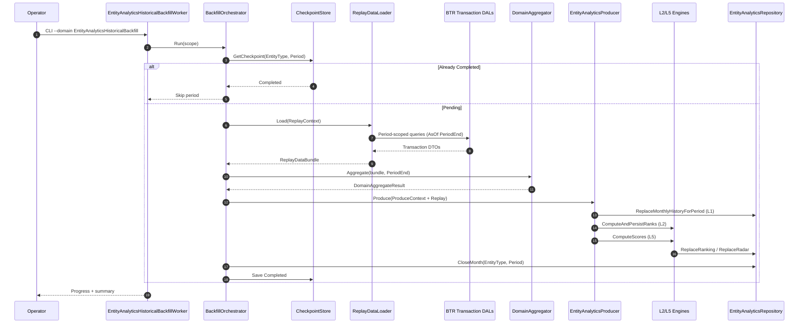
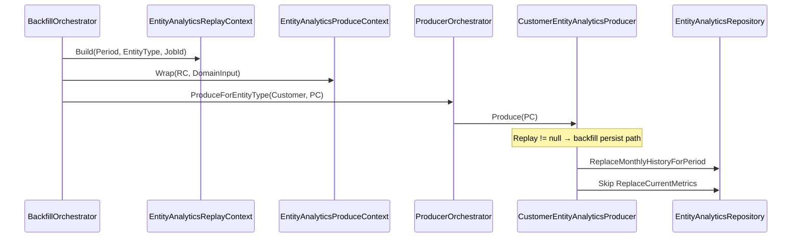
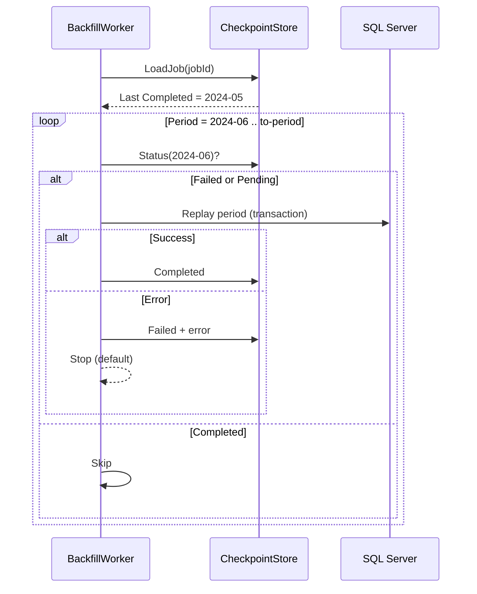

# M32.B1 — Entity Analytics Historical Backfill Architecture

**Status:** Architect deliverable — approved for implementation planning  
**Milestone:** M32.B1  
**Date:** 2026-06-25  
**Audience:** Implementers, Product Owner, Operations  
**Authoritative inputs:** [Entity Analytics Architecture](./entity-analytics-architecture.md), [Entity Analytics Feasibility Study](./Entity-Analytics-Feasibility-Study.md), [Historical Backfill Source Investigation](./Historical%20Backfill%20Source%20Investigation.md), approved architectural constraints (M32.B1 brief)

**Related ADRs:** [adrs/](./adrs/)

---

## Executive Summary

Entity Analytics currently materializes snapshots for the **current period only**. Management requires **36 months** of historical Entity Analytics (Trend, Ranking History, Attention History, Relationship History, Radar) immediately after deployment.

This document defines a **one-time historical replay pipeline** that:

- Reads existing **transactional history** (Faktur, Piutang, Stok, Invoice, Retur, Sales Target, …)
- Reuses **existing domain aggregators**, **Entity Analytics producers**, and **L0–L5 engines**
- Writes to the **same** `BTRPD_EntityAnalytics_*` tables as the live worker
- Is **resumable**, **idempotent**, and **separated** from scheduled refresh workers

This is **not** a recurring operational feature. After the initial seed, normal domain workers continue forward accumulation.

---

## 1. Overall Architecture

### 1.1 Pipeline overview

```text
┌─────────────────────────────────────────────────────────────────────────────┐
│                    ONE-TIME HISTORICAL REPLAY PIPELINE                       │
└─────────────────────────────────────────────────────────────────────────────┘

  Transaction History (BTR_*)
    Faktur · FakturItem · Piutang · PiutangLunas
    Stok · StokMutasi · Invoice · InvoiceItem
    ReturBeli · ReturJual · SalesTarget · …
           │
           ▼
  ┌────────────────────────────┐
  │   Replay Data Loaders      │  Period-scoped DAL reads (AsOf = month-end)
  │   (per domain, no new KPI   │
  │    calculation logic)       │
  └─────────────┬──────────────┘
                │ in-memory DTOs (same types as live workers)
                ▼
  ┌────────────────────────────┐
  │   Domain Aggregators       │  DashboardCustomerAggregator, …
  │   (unchanged formulas)     │  invoked with ReplayContext.BusinessDate
  └─────────────┬──────────────┘
                │ DomainInput (same produce-input types)
                ▼
  ┌────────────────────────────┐
  │ Entity Analytics Producers │  CustomerEntityAnalyticsProducer, …
  │   (unchanged mapping)      │  via EntityAnalyticsProducerOrchestrator
  └─────────────┬──────────────┘
                │
                ▼
  ┌────────────────────────────┐
  │   L0–L5 Engines            │  Trend (L1 persist) · Ranking (L2)
  │   (unchanged)              │  Attention (L3) · Relationship (L4) · Radar (L5)
  └─────────────┬──────────────┘
                │
                ▼
  Historical Snapshot Tables
    BTRPD_EntityAnalytics_Current   (L0 — not written during backfill*)
    BTRPD_EntityAnalytics_Monthly     (L1)
    BTRPD_EntityAnalytics_Ranking     (L2)
    BTRPD_EntityAnalytics_Attention   (L3)
    BTRPD_EntityAnalytics_Relationship (L4)
    BTRPD_EntityAnalytics_Radar       (L5)

  * L0 remains owned by live domain workers. Backfill targets closed historical months only.
```

### 1.2 Component map

| Component | Responsibility | Reuses from live platform |
| --------- | -------------- | ------------------------- |
| `EntityAnalyticsHistoricalBackfillWorker` | CLI entry, orchestration, progress, cancellation | `WorkerProgressScope`, `BTRPD_RefreshLog` |
| `EntityAnalyticsBackfillOrchestrator` | Period loop, entity-type dispatch, checkpoint | — |
| `EntityAnalyticsReplayContext` | Replay month, AsOf date, mode flags | Extends/wraps `EntityAnalyticsProduceContext` |
| `IEntityAnalyticsReplayDataLoader` (per domain) | Period-scoped transactional reads | Existing DAL interfaces |
| Domain aggregators | KPI calculation | `DashboardCustomerAggregator`, etc. |
| `EntityAnalyticsProducerOrchestrator` | Producer dispatch | Existing |
| `IEntityAnalyticsProducer` | L0/L1 mapping + engine invocation | Existing producers |
| L2–L5 engines | Ranking, Attention, Relationship, Radar | `EntityRankingEngine`, etc. |
| `IEntityAnalyticsBackfillCheckpointStore` | Resume state | New persistence |
| `SalesmanRepHistoryBackfillSource` | Fast-path L1 for Salesman | `BTRPD_SalesmanRepHistory` |

### 1.3 Separation from live workers

| Concern | Live worker | Backfill worker |
| ------- | ----------- | --------------- |
| Trigger | Task Scheduler / `--domain Customer` | Manual CLI `--domain EntityAnalyticsHistoricalBackfill` |
| Period | Current business date | Closed historical months only |
| L0 CURRENT | Written each refresh | **Skipped** — live worker owns CURRENT |
| Month close | `EnsurePriorMonthClosed` on live refresh | Pre-close each replayed month after persist |
| Retention purge | `PurgeHistoryOlderThan` on live refresh | **Disabled** during backfill |
| Coexistence | Mutex per entity type (see §10) | Blocks concurrent backfill + live refresh for same entity type |

**Constraint satisfied:** No changes to Entity Analytics **runtime read architecture** or profile API. Only a new write-side orchestration path.

---

## 2. Replay Strategy

### 2.1 Recommended ordering: **month-by-month, oldest → newest, per entity type**

```text
For each EntityType in [Salesman, Customer, Supplier, Item]:
  For each Period P from (Today - 36mo) to (LastClosedMonth) ascending:
    Load transactions where eventDate ∈ [P.start, P.end] or AsOf = P.end
    Aggregate → Produce → L2 → (L3) → (L4) → L5
    Checkpoint (EntityType, P) = Completed
    CloseMonth(EntityType, P)
```

### 2.2 Why this ordering

| Strategy | Verdict | Rationale |
| -------- | ------- | --------- |
| **Oldest → newest** | **Selected** | Matches natural month-close semantics; ranking/radar for month *M* need the full population for *M*, not future months; debugging reads chronologically |
| Newest → oldest | Rejected | Ranking and attention diff logic assume prior months may already exist; harder to validate trend continuity |
| Entity-by-entity (all months for one customer) | Rejected for primary loop | Ranking (L2) and Radar (L5) require **full peer population per period** — entity-by-entity would re-scan transactions N×months inefficiently and break rank computation mid-period |
| Month-by-month (all entities) | **Selected** | One aggregation pass per period produces full population for L2/L5; aligns with live worker grain |
| Parallel months | Deferred | Default `max-parallel = 1`; optional later with entity-type isolation only |

### 2.3 Entity-type sequencing

| Order | Entity type | Rationale |
| ----- | ----------- | --------- |
| 1 | **Salesman** | `BTRPD_SalesmanRepHistory` fast-path for L1; lowest cardinality (~80); validates infrastructure |
| 2 | **Customer** | Highest management value; moderate cardinality (~3k) |
| 3 | **Supplier** | Lower cardinality (~250); reuses proven replay pattern |
| 4 | **Item** | Highest cost (~8k active subset); run last in dedicated maintenance window |

### 2.4 Salesman hybrid fast path

For Salesman L1 months already present in `BTRPD_SalesmanRepHistory`, use **direct L1 migration** (RepHistory → `BTRPD_EntityAnalytics_Monthly`) instead of full transaction replay. Gaps before RepHistory start date use transaction replay.

See [ADR-003](./adrs/m32.b1-adr-003-replay-ordering.md).

---

## 3. Replay Context

### 3.1 `EntityAnalyticsReplayContext`

A dedicated context carries replay semantics without affecting normal workers. Normal workers continue passing plain `EntityAnalyticsProduceContext`.

```csharp
// Conceptual — implementation in M32.B1.2
public sealed class EntityAnalyticsReplayContext
{
    public EntityAnalyticsProduceContext ProduceContext { get; }
    public int PeriodYear { get; }
    public int PeriodMonth { get; }
    public DateTime PeriodStart { get; }      // first day of replay month
    public DateTime PeriodEnd { get; }        // last day of replay month (AsOf)
    public string EntityTypeCode { get; }
    public bool IsDryRun { get; }
    public ReplayResumeMode ResumeMode { get; }  // SkipCompleted | ForceRerun | FromCheckpoint
    public bool SkipLiveMutexCheck { get; }       // test environments only
    public string BackfillJobId { get; }
}
```

`EntityAnalyticsProduceContext` fields during replay:

| Field | Replay value |
| ----- | -------------- |
| `BusinessDate` | `PeriodEnd` (last calendar day of replay month) |
| `GeneratedAt` | Backfill run timestamp (audit; not business time) |
| `RefreshLogId` | `BackfillJobId` or per-batch `BTRPD_RefreshLog` entry |
| `DomainInput` | Same types as live worker (`CustomerEntityAnalyticsProduceInput`, …) |

### 3.2 Producer integration (non-invasive)

Producers **do not** branch on replay in normal code paths. Two approved patterns (implementer chooses one):

**Pattern A — Context extension (preferred):**

```csharp
public class EntityAnalyticsProduceContext
{
    // existing fields …
    public EntityAnalyticsReplayContext Replay { get; set; }  // null in live workers
}
```

When `Replay != null`, producer subsystems use replay-aware repository methods (see §7).

**Pattern B — Ambient scope:**

`EntityAnalyticsReplayScope.Push(replayContext)` for the duration of `Produce()`. Producers unchanged; repository reads scope.

Live workers never set `Replay` / never push scope → zero behavioral change.

### 3.3 Services affected by replay context

| Service | Live behavior | Replay behavior |
| ------- | ------------- | --------------- |
| `EntityAnalyticsMonthCloseService` | Close prior month + purge | **No-op** or skip purge |
| `IEntityAnalyticsRepository.SaveMonthlyHistory` | MERGE only if `IsClosed = 0` | Use `ReplaceMonthlyHistoryForPeriod` (backfill) |
| Ranking / Radar engines | Current period from `BusinessDate` | Explicit `(PeriodYear, PeriodMonth)` from replay context |

---

## 4. Historical Provider Strategy

### 4.1 Decision: **Period-scoped data loaders + existing aggregators**

| Option | Verdict |
| ------ | ------- |
| Dedicated Historical providers (duplicate aggregators) | **Rejected** — duplicates KPI formulas; violates Consistent KPI Semantics |
| Dashboard snapshot replay (`BTRPD_*` history) | **Rejected** — domain snapshots are CURRENT-only except `BTRPD_SalesmanRepHistory` |
| ReplayContext on aggregators + period-scoped DAL reads | **Selected** |

### 4.2 Design

Introduce **`IEntityAnalyticsReplayDataLoader`** per worker domain (not per entity analytics layer):

```text
ICustomerReplayDataLoader.Load(ReplayContext) → CustomerReplayDataBundle
  ├── Faktur rows (FakturDate in period)
  ├── Piutang open balance AsOf PeriodEnd
  ├── LastFaktur AsOf PeriodEnd
  ├── Customer master (current)
  ├── MTD item rollups for period
  └── … (mirrors RefreshDashboardCustomerSnapshotWorker loads)

ISalesmanReplayDataLoader / ISupplierReplayDataLoader / IItemReplayDataLoader — same pattern
```

The loader calls **existing DAL interfaces** with `Periode` or `AsOfDate` parameters. Where a DAL lacks period filtering today, add **AsOf overloads to the DAL** — not new aggregator logic.

Aggregators are invoked exactly as live workers invoke them:

```text
var periode = Periode.FromYearMonth(replay.PeriodYear, replay.PeriodMonth);
var aggregate = _customerAggregator.Aggregate(
    bundle.FakturRows, bundle.PiutangRows, …, periode, replay.PeriodEnd, generatedAt);
```

### 4.3 AsOf semantics for point-in-time KPIs

| KPI class | Replay rule |
| --------- | ------------- |
| MTD omzet, faktur count | Transactions with `FakturDate` ∈ [PeriodStart, PeriodEnd] |
| Open balance, overdue | Piutang reconstructed **AsOf PeriodEnd** from `BTR_Piutang` + `BTR_PiutangLunas` history |
| Stock position, movement class | Stok balance / mutasi cumulative **AsOf PeriodEnd** |
| Dormant (90d) | Last faktur date ≤ PeriodEnd − 90 days |
| Sales target achievement | Target row for `(SalesPersonId, PeriodYear, PeriodMonth)` |

Document approximation limits in [ADR-002](./adrs/m32.b1-adr-002-historical-master-assumptions.md).

---

## 5. Worker Architecture

### 5.1 `EntityAnalyticsHistoricalBackfillWorker`

Registered in `btr.portal.worker` as a **separate domain** — not part of `--domain All`.

```text
btr.portal.worker --domain EntityAnalyticsHistoricalBackfill [options]
```

### 5.2 CLI options

| Option | Purpose | Default |
| ------ | ------- | ------- |
| `--entity-type` | `Customer` \| `Salesman` \| `Supplier` \| `Item` \| `All` | `All` |
| `--from-period` | `YYYY-MM` inclusive | `Today - HistoryRetentionMonths` |
| `--to-period` | `YYYY-MM` inclusive | Last **closed** month |
| `--layers` | `L1,L2,L3,L4,L5` subset | `L1,L2,L5` |
| `--resume` | `true` \| `false` | `true` |
| `--restart` | Clear checkpoints for selected scope; implies `--resume false` for first run | `false` |
| `--force` | Overwrite completed checkpoints / closed months | `false` |
| `--dry-run` | Load + aggregate + count; no writes | `false` |
| `--batch-size` | Entities per persistence transaction (Item tuning) | `500` |
| `--confirm` | Required literal `BACKFILL` to execute writes | — |
| `--cancel-after-period` | Graceful stop after current period completes | — |

### 5.3 Capabilities

| Capability | Design |
| ---------- | ------ |
| **Entity selection** | `--entity-type` + optional `--entity-ids` file for partial reruns |
| **Period range** | Clamped to `EntityAnalyticsOptions.HistoryRetentionMonths` (36) |
| **Resume** | Read checkpoint store; skip `(EntityType, Period)` marked Completed unless `--force` |
| **Restart** | Delete checkpoints for scope; does not delete snapshot data unless `--force` |
| **Progress** | `WorkerProgressScope` steps: `Backfill:Customer:2024-03:Load`, `:Aggregate`, `:Produce`, `:L2`, … |
| **Logging** | `BTRPD_RefreshLog` per entity-type batch; structured log per period |
| **Cancellation** | Cooperative — check `CancellationToken` between periods; complete current period before exit |

### 5.4 Orchestrator flow

```text
EntityAnalyticsHistoricalBackfillWorker
  → EntityAnalyticsBackfillOrchestrator.Run(request)
      1. Validate options, retention window, confirmation token
      2. Acquire entity-type mutex (see §10)
      3. Create BackfillJob row (Running)
      4. For each entity type in execution order:
           For each period ascending:
             if checkpoint.Completed && !force → skip
             if dry-run → load + aggregate + count → checkpoint DryRunCompleted
             else transaction:
               load → aggregate → orchestrator.ProduceForEntityType(...)
               run L2/L5 (and optional L3/L4)
               close month
               save checkpoint Completed
      5. Mark BackfillJob Succeeded / Failed / Cancelled
      6. Release mutex
```

---

## 6. Checkpoint Strategy

### 6.1 Checkpoint grain

**Primary unit:** `(EntityType, PeriodYear, PeriodMonth)` — all entities for that type and month.

This matches the aggregation population requirement for L2/L5.

### 6.2 Checkpoint store

New table: `BTRPD_EntityAnalytics_BackfillCheckpoint` (name finalized at implementation).

| Column | Purpose |
| ------ | ------- |
| `BackfillCheckpointId` | ULID PK |
| `BackfillJobId` | Parent job |
| `EntityType` | Customer, Salesman, … |
| `PeriodYear`, `PeriodMonth` | Replay month |
| `Status` | Pending \| Running \| Completed \| Failed \| Skipped |
| `LayersCompleted` | `L1,L2,L5` |
| `EntityCount` | Population processed |
| `RowCountsJson` | L1/L2/… insert counts |
| `StartedAt`, `CompletedAt` | Timing |
| `LastError` | Truncated failure message |
| `LastRefreshLogId` | Audit link |

### 6.3 Example checkpoint state

```text
BackfillJobId: 01JXXX…
EntityType: Customer
From: 2023-01  To: 2025-12

2023-01  Completed  L1,L2,L5  entities=2847
2023-02  Completed  L1,L2,L5  entities=2851
…
2024-06  Failed     L1        error=Timeout expired
2024-07  Pending
```

Resume restarts at `2024-06` when `--force` or after manual retry. Successful months are skipped.

### 6.4 Job-level record

`BTRPD_EntityAnalytics_BackfillJob` — one row per CLI invocation: scope, options JSON, overall status, operator identity.

---

## 7. Idempotency

### 7.1 Requirement

Executing **January 2025** twice must produce **identical** L1–L5 rows for that period (same KPI values, ranks, radar scores).

### 7.2 Replacement strategy

| Layer | Idempotent write pattern |
| ----- | ------------------------ |
| **L1** | `ReplaceMonthlyHistoryForPeriod(entityType, year, month, rows)` — DELETE all rows for period + INSERT (or MERGE with backfill flag bypassing `IsClosed` guard) |
| **L2** | `ReplaceRankingForPeriod(entityType, year, month)` — delete + recompute |
| **L3** | `ReplaceAttentionForPeriod` — delete period slice + diff persist |
| **L4** | `ReplaceRelationshipForPeriod` — delete + insert |
| **L5** | `ReplaceRadarForPeriod` — delete + insert |

**Why not live `SaveMonthlyHistory` alone?** Live MERGE skips updates when `IsClosed = 1`. Historical months are written directly as closed.

### 7.3 Determinism requirements

- Sort entity population by `EntityCode` before rank assignment
- Fixed `GeneratedAt` per period batch (or omit from equality checks — values must match)
- Same aggregator inputs → same outputs (no `DateTime.Now` in formulas)

See [ADR-004](./adrs/m32.b1-adr-004-idempotent-snapshot-replacement.md).

---

## 8. Performance Strategy

### 8.1 Assumptions

~3,000 customers · ~80 salesmen · ~250 suppliers · ~8,000 active items · ~6 trend KPIs/entity · 36-month retention.

### 8.2 Storage estimates (`BTRPD_EntityAnalytics_*` incremental)

| Horizon | Approximate incremental size |
| ------- | ---------------------------- |
| 12 months | ~45 MB |
| 24 months | ~90 MB |
| 36 months | ~170 MB |

Item domain dominates (~50% of rows).

### 8.3 Runtime estimates (single-threaded, off-peak, transaction replay)

| Entity | 12 mo | 24 mo | 36 mo |
| ------ | ----- | ----- | ----- |
| Salesman (RepHistory path) | 5–15 min | 10–30 min | 15–45 min |
| Customer | 2–4 h | 4–8 h | 6–12 h |
| Supplier | 30–60 min | 1–2 h | 1.5–3 h |
| Item (active subset) | 8–16 h | 16–32 h | 24–48 h |

L3/L4 add ~50–100% when enabled.

### 8.4 Optimizations

| Technique | Application |
| --------- | ----------- |
| **Salesman RepHistory fast path** | Skip transaction scan for months already in RepHistory |
| **Single load per period** | One DAL scan per entity type per month — not per entity |
| **Batch persistence** | Commit L1 rows in batches (`--batch-size`); one transaction per period for L2/L5 |
| **Active item subset** | Stock > 0 OR sale in trailing 24 mo from PeriodEnd (per entity-analytics-architecture Item scope) |
| **Index-friendly filters** | Ensure DAL queries filter on `FakturDate`, `InvoiceDate`, `MutasiDate` — avoid table scans |
| **Disable retention purge** | During backfill job |
| **Off-peak execution** | Weeknight / weekend maintenance window |
| **Item last** | Run after infrastructure validated on smaller domains |
| **Optional L4 scope** | Last 12 months only or defer L4 entirely |

### 8.5 Database load controls

- `max-parallel = 1` default (no concurrent period replay)
- Mutex prevents live `--domain Customer` refresh during Customer backfill
- Monitor SQL Server batch requests/sec and worker duration via `BTRPD_RefreshLog`

---

## 9. Error Recovery

| Failure | Recovery strategy |
| ------- | ----------------- |
| **Single entity aggregation error** | Fail-fast for month (preferred) — partial population breaks L2 ranks. Log entity id; fix data; `--force --from-period YYYY-MM` |
| **Single month fails** | Checkpoint `Failed`; job continues to next month only if `--continue-on-error` (default: stop) |
| **Database timeout** | Retry period up to 3 times with exponential backoff; then `Failed` checkpoint |
| **Worker cancellation** | Complete current period if >80% done; else rollback period transaction; checkpoint `Cancelled` |
| **Process crash** | Resume from last `Completed` checkpoint |
| **Incorrect month data** | `--force --from-period YYYY-MM --to-period YYYY-MM --entity-type X` selective rerun |
| **RepHistory vs replay mismatch** | Reconciliation test (Salesman); `--force` rerun for affected months |

---

## 10. Security & Operations

| Topic | Recommendation |
| ----- | -------------- |
| **Who may execute** | **Administrator only** — Windows service account or ops login with Portal Admin role |
| **Confirmation** | `--confirm BACKFILL` required for non-dry-run; API trigger (if added) requires double confirmation + PO ticket id |
| **Audit** | `BackfillJob` records operator, machine, options, timestamps; links to `BTRPD_RefreshLog` |
| **Mutex with live workers** | **Block** concurrent backfill and live refresh for the **same entity type** — shared distributed lock row or SQL app lock |
| **Live worker during other types** | Allowed — Customer backfill does not block Inventory refresh |
| **Production window** | Change advisory; off-peak; notify stakeholders |
| **Dry-run first** | Mandatory in production runbook before first write |

---

## 11. Sequence Diagrams

### 11.1 End-to-end replay (one period, one entity type)



### 11.2 Replay context propagation



### 11.3 Resume after interruption



---

## 12. Layer Scope for Initial Backfill

| Layer | Initial backfill | Notes |
| ----- | ---------------- | ----- |
| L1 | **Required** | Trend, cross-period comparison |
| L2 | **Required** | Ranking History |
| L5 | **Required** | Radar (depends on L1 population) |
| L3 | Optional phase 2 | Attention timeline; piutang/inventory caveats |
| L4 | Optional / deferred | Expensive; profile usable without historical L4 |
| L0 | **Not backfilled** | Live worker maintains CURRENT |

---

## 13. Architectural Decision Records

| ADR | Title |
| --- | ----- |
| [ADR-001](./adrs/m32.b1-adr-001-one-time-backfill.md) | One-Time Backfill Worker Separation |
| [ADR-002](./adrs/m32.b1-adr-002-historical-master-assumptions.md) | Historical Master Data Assumptions |
| [ADR-003](./adrs/m32.b1-adr-003-replay-ordering.md) | Replay Ordering (Month-by-Month, Oldest First) |
| [ADR-004](./adrs/m32.b1-adr-004-idempotent-snapshot-replacement.md) | Idempotent Snapshot Replacement |
| [ADR-005](./adrs/m32.b1-adr-005-resume-strategy.md) | Checkpoint Resume Strategy |

---

## 14. Success Criteria

After M32.B1 implementation and production run:

1. Performance Profiles show **36 months** of Trend, Ranking History, and Radar for Customer, Salesman, Supplier, and Item (active subset).
2. Backfill is **resumable** after simulated failure without duplicate or corrupt data.
3. Re-running a single month with `--force` produces **identical** snapshots.
4. Live scheduled workers require **no configuration change** and produce correct forward accumulation.
5. No new runtime API or profile architecture changes.

---

## References

- `EntityAnalyticsProducerOrchestrator` — producer dispatch
- `EntityAnalyticsMonthCloseService` — live month-close (bypassed during replay)
- `EntityAnalyticsRepository.SaveMonthlyHistory` — live MERGE semantics
- `RefreshDashboard*SnapshotWorker` — live data load + aggregate pattern to mirror
