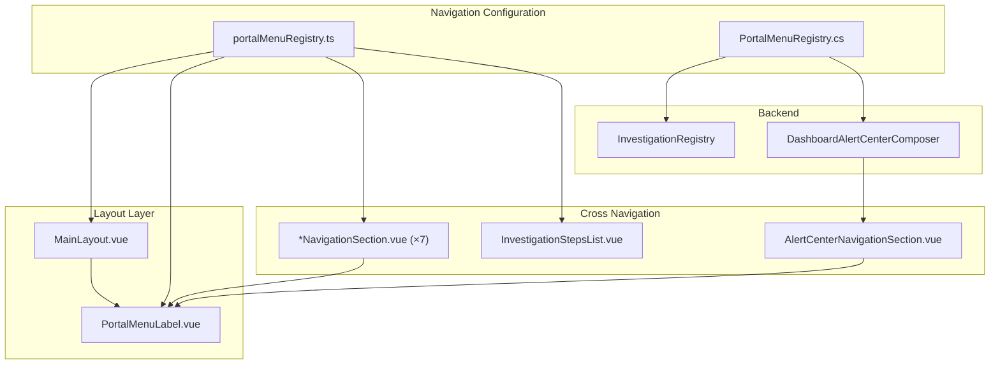

# Implementation Plan — BTR Portal Navigation Refactoring

## Document Status

| Field | Value |
| ----- | ----- |
| Task | Navigation Information Architecture refactoring |
| Authoritative requirements | [portal-navigation-ux-analysis.md](../../features/btr-portal/portal-navigation-ux-analysis.md) |
| Related docs | [navigation-refactoring-task-breakdown.md](./navigation-refactoring-task-breakdown.md) · [navigation-refactoring-risk-analysis.md](./navigation-refactoring-risk-analysis.md) |
| Solution | `src/j05-btr-distrib/btr.portal.web`, `btr.application`, `btr.test` |
| Author role | Architect |
| Implementer input | This document + Implementation Package (§12) |
| Status | **Ready for implementation** |

**Prerequisites:** None — navigation-only change; portal not yet in production.

---

## 1. Goal

Replace the flat "Dashboard / Reports" sidebar with **8 business domain groups** and **visible permanent menu codes** (`CODE · Label`) on every navigation surface, while preserving all existing routes, route names, page behavior, and APIs.

**In scope:**

- Centralized navigation configuration (frontend + backend registries)
- Sidebar domain-group rendering with menu codes
- Cross-navigation label consistency (NavigationSection components, Alert Center, InvestigationRegistry)
- Operational documentation update

**Out of scope:**

- Visual sidebar redesign, collapsible groups, route renaming, Desktop deep links, RBAC menu filtering

---

## 2. Architecture Overview

### 2.1 Design Decision: Dual Registry Pattern

Navigation metadata lives in two mirrored static registries:

| Registry | Location | Consumers |
| -------- | -------- | --------- |
| **Frontend** | `btr.portal.web/src/navigation/portalMenuRegistry.ts` | MainLayout sidebar, NavigationSection components, investigation display enrichment |
| **Backend** | `btr.application/.../Shared/PortalMenuRegistry.cs` | InvestigationRegistry step labels, DashboardAlertCenterComposer domain dashboard list |

Both mirror the authoritative §4.7 menu table. Routes and route names are never invented — only looked up.

### 2.2 Component Diagram



### 2.3 Data Model

#### Frontend Types (`portalMenu.types.ts`)

```typescript
export type PortalMenuCode =
  | 'EX01' | 'EX02'
  | 'SA01' | 'SA02' | 'SA03'
  | 'CU01' | 'CU02' | 'CU03' | 'CU04' | 'CU05'
  | 'FI01' | 'FI02' | 'FI03' | 'FI04'
  | 'SF01' | 'SF02'
  | 'IN01' | 'IN02' | 'IN03' | 'IN04' | 'IN05'
  | 'PU01' | 'PU02'
  | 'OP01'

export type PortalMenuGroupId =
  | 'executive' | 'sales' | 'customers' | 'finance'
  | 'sales-force' | 'inventory' | 'purchasing' | 'operations'

export interface PortalMenuItem {
  code: PortalMenuCode
  label: string
  icon: string
  routeName: string
  route: string
  order: number
}

export interface PortalMenuGroup {
  id: PortalMenuGroupId
  label: string
  order: number
  items: PortalMenuItem[]
}
```

#### Backend DTO (`PortalMenuLinkModel`)

```csharp
public class PortalMenuLinkModel
{
    public string Code { get; set; }
    public string Label { get; set; }
    public string Route { get; set; }
}
```

#### Extended Alert Center Navigation

```csharp
public class DashboardAlertCenterNavigationLinks
{
    // Preserved for category routing (getCategoryDashboardRoute)
    public string ExecutiveDashboardRoute { get; set; }
    public string SalesDashboardRoute { get; set; }
    // ... existing 10 properties unchanged ...

    // New: complete domain dashboard list with codes
    public IList<PortalMenuLinkModel> DomainDashboards { get; set; }
}
```

### 2.4 Menu Code Strategy

- **Constants:** `portalMenuCodes.ts` exports `PortalMenuCodes.EX01`, etc.
- **No magic strings:** Components import codes or use registry lookup by route
- **Format:** `formatMenuLabel(code, label)` → `"EX01 · Executive"`
- **Lookup:** `findMenuItemByRoute("/dashboard/sales")` → `{ code: 'SA01', label: 'Sales', ... }`
- **Immutability:** Codes never renumber; new milestones append next available number per domain

### 2.5 Authoritative Menu Registry (§4.7)

| Code | Label | routeName | Route | Group |
| ---- | ----- | --------- | ----- | ----- |
| EX01 | Executive | `dashboard` | `/dashboard` | Executive |
| EX02 | Alert Center | `alert-center` | `/alerts` | Executive |
| SA01 | Sales | `sales-dashboard` | `/dashboard/sales` | Sales |
| SA02 | Sales Forecast | `sales-forecast-dashboard` | `/dashboard/sales-forecast` | Sales |
| SA03 | Sales Report | `sales-report` | `/reports/sales` | Sales |
| CU01 | Customers | `customers-dashboard` | `/dashboard/customers` | Customers |
| CU02 | Customer Risk Forecast | `customer-risk-forecast-dashboard` | `/dashboard/customer-risk-forecast` | Customers |
| CU03 | Collection Optimization | `collection-optimization-dashboard` | `/dashboard/collection-optimization` | Customers |
| CU04 | Customer Portfolio | `customer-portfolio-dashboard` | `/dashboard/customer-portfolio` | Customers |
| CU05 | Customer Report | `customer-report` | `/reports/customers` | Customers |
| FI01 | Piutang | `piutang-dashboard` | `/dashboard/piutang` | Finance |
| FI02 | Collection | `collection-dashboard` | `/dashboard/collection` | Finance |
| FI03 | Cash Flow Forecast | `cash-flow-forecast-dashboard` | `/dashboard/cash-flow-forecast` | Finance |
| FI04 | Piutang Report | `piutang-report` | `/reports/piutang` | Finance |
| SF01 | Salesmen | `salesmen-dashboard` | `/dashboard/salesmen` | Sales Force |
| SF02 | Field Activity | `field-activity-dashboard` | `/dashboard/field-activity` | Sales Force |
| IN01 | Inventory | `inventory-dashboard` | `/dashboard/inventory` | Inventory |
| IN02 | Inventory Risk | `inventory-risk-dashboard` | `/dashboard/inventory-risk` | Inventory |
| IN03 | Inventory Forecast | `inventory-forecast-dashboard` | `/dashboard/inventory-forecast` | Inventory |
| IN04 | Inventory Optimization | `inventory-optimization-dashboard` | `/dashboard/inventory-optimization` | Inventory |
| IN05 | Inventory Report | `inventory-report` | `/reports/inventory` | Inventory |
| PU01 | Purchasing | `purchasing-dashboard` | `/dashboard/purchasing` | Purchasing |
| PU02 | Purchasing Report | `purchasing-report` | `/reports/purchasing` | Purchasing |
| OP01 | Locations | `locations-dashboard` | `/dashboard/locations` | Operations |

**Group display order:** Executive → Sales → Customers → Finance → Sales Force → Inventory → Purchasing → Operations

**Icons:** Preserve existing PrimeIcons from current `MainLayout.vue` hardcoded values.

### 2.6 Route Compatibility

| Constraint | Decision |
| ---------- | -------- |
| URL paths | **No changes** to `router/index.ts` |
| Route names | **No changes** — registry references existing names |
| Redirects | `/` → `dashboard`, catch-all → `dashboard` unchanged |
| Auth guards | Unchanged |

### 2.7 Folder Structure

**New directories:**

```text
btr.portal.web/src/navigation/
  portalMenu.types.ts
  portalMenuCodes.ts
  portalMenuRegistry.ts
  portalMenuHelpers.ts
  portalMenuRegistry.spec.ts

btr.portal.web/src/components/navigation/
  PortalMenuLabel.vue
```

**New backend file:**

```text
btr.application/ReportingContext/Shared/PortalMenuRegistry.cs
btr.test/ReportingContext/PortalMenuRegistryTest.cs
```

**No folder restructuring** of existing views, components, or router.

---

## 3. Component Refactoring

| Component | Action | Detail |
| --------- | ------ | ------ |
| `MainLayout.vue` | **Modify** | Remove inline `navSections`; import `portalMenuGroups`; render `PortalMenuLabel` |
| `PortalMenuLabel.vue` | **Create** | Renders `<code>CODE</code> · Label` |
| `CustomerNavigationSection.vue` | **Modify** | Use `formatMenuLabelByRoute(route)` for link text |
| `SalesmanNavigationSection.vue` | **Modify** | Same |
| `CollectionNavigationSection.vue` | **Modify** | Same |
| `PurchasingNavigationSection.vue` | **Modify** | Same |
| `InventoryRiskNavigationSection.vue` | **Modify** | Same |
| `LocationNavigationSection.vue` | **Modify** | Same |
| `AlertCenterNavigationSection.vue` | **Modify** | Iterate `navigation.DomainDashboards`; render with codes |
| `InvestigationStepsList.vue` | **Modify** | Enrich step label from route lookup |
| `router/index.ts` | **No change** | — |
| All dashboard/report views | **No change** | — |

**Remove:** Nothing — hardcoded nav in MainLayout replaced, not deleted as separate file.

---

## 4. Cross-Navigation Design

### 4.1 Sidebar (MainLayout)

- Iterate `portalMenuGroups` (8 groups)
- Group heading = domain name (e.g., "Customers")
- Each item: `PortalMenuLabel` with code + label
- Active state: `route.name === item.routeName`

### 4.2 NavigationSection Components

Pattern for all cross-nav links:

```vue
<RouterLink :to="navigation.SalesDashboardRoute">
  <PortalMenuLabel :route="navigation.SalesDashboardRoute" />
</RouterLink>
```

`PortalMenuLabel` accepts `route` prop and resolves code/label from registry. Fallback to raw route if not found.

### 4.3 Alert Center Domain Dashboards

- Backend `BuildNavigation()` populates `DomainDashboards` via `PortalMenuRegistry.GetDomainDashboardLinks()`
- Returns 18 items: all dashboard routes except Alert Center (`EX02`)
- Ordered by domain group then item order (matches sidebar)
- Frontend iterates list; no hardcoded link array

### 4.4 InvestigationRegistry

Step labels currently use semantic text ("Purchasing evidence"). Replace with registry lookup:

```csharp
PortalMenuRegistry.FormatMenuLabel(PurchasingReportRoute)
// → "PU02 · Purchasing Report"
```

Applied to all `InvestigationStep` instances in `BuildEntries()` and helper methods.

---

## 5. File-by-File Modifications

### 5.1 Files to Create

| File | Purpose |
| ---- | ------- |
| `btr.portal.web/src/navigation/portalMenu.types.ts` | Type definitions |
| `btr.portal.web/src/navigation/portalMenuCodes.ts` | Code constants |
| `btr.portal.web/src/navigation/portalMenuRegistry.ts` | Authoritative menu data |
| `btr.portal.web/src/navigation/portalMenuHelpers.ts` | Lookup/format utilities |
| `btr.portal.web/src/navigation/portalMenuRegistry.spec.ts` | Unit tests |
| `btr.portal.web/src/components/navigation/PortalMenuLabel.vue` | Code + label display |
| `btr.application/ReportingContext/Shared/PortalMenuRegistry.cs` | Backend registry |
| `btr.test/ReportingContext/PortalMenuRegistryTest.cs` | Backend tests |

### 5.2 Files to Modify

| File | Change |
| ---- | ------ |
| `btr.portal.web/src/layouts/MainLayout.vue` | Registry-driven sidebar |
| `btr.portal.web/src/models/dashboard.ts` | Add `PortalMenuLinkDto`, extend Alert Center navigation |
| `btr.portal.web/src/components/dashboard/CustomerNavigationSection.vue` | Menu codes |
| `btr.portal.web/src/components/dashboard/SalesmanNavigationSection.vue` | Menu codes |
| `btr.portal.web/src/components/dashboard/CollectionNavigationSection.vue` | Menu codes |
| `btr.portal.web/src/components/dashboard/PurchasingNavigationSection.vue` | Menu codes |
| `btr.portal.web/src/components/dashboard/InventoryRiskNavigationSection.vue` | Menu codes |
| `btr.portal.web/src/components/dashboard/LocationNavigationSection.vue` | Menu codes |
| `btr.portal.web/src/components/alerts/AlertCenterNavigationSection.vue` | DomainDashboards iteration |
| `btr.portal.web/src/components/reports/InvestigationStepsList.vue` | Route-based label enrichment |
| `btr.application/.../DashboardAlertCenterAgg/Queries/GetDashboardAlertCenterQuery.cs` | DTO extension |
| `btr.application/.../DashboardAlertCenterAgg/Services/DashboardAlertCenterComposer.cs` | BuildNavigation update |
| `btr.application/ReportingContext/Shared/InvestigationRegistry.cs` | Step label codes |
| `btr.application/btr.application.csproj` | Include PortalMenuRegistry.cs |
| `btr.test/btr.test.csproj` | Include PortalMenuRegistryTest.cs |
| `docs/features/btr-portal/btr-portal-operational.md` | Navigation Structure update |

### 5.3 Files to Remove

None.

---

## 6. Implementation Phases

See [navigation-refactoring-task-breakdown.md](./navigation-refactoring-task-breakdown.md) for detailed task IDs.

| Phase | Description | Dependency |
| ----- | ----------- | ---------- |
| 1 | Frontend navigation registry + tests | — |
| 2 | Sidebar rendering (MainLayout + PortalMenuLabel) | Phase 1 |
| 3 | Cross-navigation components | Phase 1 |
| 4 | Backend PortalMenuRegistry + InvestigationRegistry | Parallel with Phase 1 |
| 5 | Frontend API model updates | Phase 4 |
| 6 | Investigation display enrichment | Phase 1 |
| 7 | Documentation | Phase 2 |
| 8 | Testing & verification | All |

---

## 7. Testing Strategy

### 7.1 Unit Tests

| Test | File | Assertions |
| ---- | ---- | ---------- |
| Registry completeness | `portalMenuRegistry.spec.ts` | 24 items, 8 groups, unique codes/routes/routeNames |
| Route name validity | `portalMenuRegistry.spec.ts` | Each routeName exists in router |
| Group order | `portalMenuRegistry.spec.ts` | Groups ordered Executive→Operations |
| Label format | `portalMenuHelpers` test | `formatMenuLabel('SA01', 'Sales')` → `'SA01 · Sales'` |
| Backend registry | `PortalMenuRegistryTest.cs` | 24 entries, FormatMenuLabel, GetDomainDashboardLinks count=18 |
| Investigation steps | `InvestigationRegistryTest.cs` | Compound dependency steps contain menu codes |

### 7.2 Integration Tests

| Test | Scope |
| ---- | ----- |
| Router navigation | Existing `navigation.spec.ts`, `index.spec.ts` — must pass unchanged |
| Alert Center API | Manual: `DomainDashboards` array populated with 18 items |

### 7.3 Manual Testing Checklist

- [ ] Sidebar shows 8 domain groups (no "Dashboard" or "Reports" headings)
- [ ] All 24 items visible with `CODE · Label` format
- [ ] Each sidebar link navigates to correct page
- [ ] Active highlight follows current route
- [ ] Presentation Mode: codes still visible
- [ ] Alert Center Domain Dashboards: 18 links with codes
- [ ] Customer/Purchasing/etc. Navigation sections show codes
- [ ] Investigation drill-down steps show codes
- [ ] All existing bookmarks work (`/dashboard/sales`, `/reports/piutang`, etc.)
- [ ] Login redirect to `/dashboard` works
- [ ] Logout works

### 7.4 Regression Checklist

- [ ] All 24 routes load without error
- [ ] Dashboard data loads on each page (API unaffected)
- [ ] Report drill-down from dashboards works
- [ ] Alert Center category cards link to correct domain dashboards
- [ ] Mobile responsive sidebar scrolls correctly

---

## 8. Acceptance Criteria

Implementation is complete when:

1. All menu items grouped per §4.2 wireframes (8 domain groups)
2. Every sidebar menu row displays permanent code (`CODE · Label`)
3. Reports nested under business domain groups (not separate "Reports" section)
4. All routes and route names backward compatible
5. Secondary navigation (NavigationSection, Alert Center, InvestigationRegistry) uses menu codes
6. `btr-portal-operational.md` navigation section updated
7. Unit tests pass (frontend + backend)
8. No existing page functionality broken

---

## 9. Risk Summary

See [navigation-refactoring-risk-analysis.md](./navigation-refactoring-risk-analysis.md).

Primary risks: registry drift (mitigated by paired tests), route mismatch (mitigated by routeName validation test).

---

## 10. Coding Constraints (Implementer)

- Preserve all existing routes, route names, page behavior, APIs, business logic
- Implement only the approved UX specification
- Avoid unrelated refactoring
- Menu codes visible in Presentation Mode
- All authenticated users see all groups (no RBAC filtering)

---

## 11. Success Criteria

A trainer, helpdesk agent, or business owner can locate any portal page by domain group and code without reading source code.

---

## 12. Implementation Package (Implementer Handover)

### Scope

Implement domain-grouped sidebar navigation with visible menu codes across all navigation surfaces. No route changes. No visual redesign beyond code display.

### Files to Create

```text
src/j05-btr-distrib/btr.portal.web/src/navigation/portalMenu.types.ts
src/j05-btr-distrib/btr.portal.web/src/navigation/portalMenuCodes.ts
src/j05-btr-distrib/btr.portal.web/src/navigation/portalMenuRegistry.ts
src/j05-btr-distrib/btr.portal.web/src/navigation/portalMenuHelpers.ts
src/j05-btr-distrib/btr.portal.web/src/navigation/portalMenuRegistry.spec.ts
src/j05-btr-distrib/btr.portal.web/src/components/navigation/PortalMenuLabel.vue
src/j05-btr-distrib/btr.application/ReportingContext/Shared/PortalMenuRegistry.cs
src/j05-btr-distrib/btr.test/ReportingContext/PortalMenuRegistryTest.cs
```

### Files to Modify

```text
src/j05-btr-distrib/btr.portal.web/src/layouts/MainLayout.vue
src/j05-btr-distrib/btr.portal.web/src/models/dashboard.ts
src/j05-btr-distrib/btr.portal.web/src/components/dashboard/CustomerNavigationSection.vue
src/j05-btr-distrib/btr.portal.web/src/components/dashboard/SalesmanNavigationSection.vue
src/j05-btr-distrib/btr.portal.web/src/components/dashboard/CollectionNavigationSection.vue
src/j05-btr-distrib/btr.portal.web/src/components/dashboard/PurchasingNavigationSection.vue
src/j05-btr-distrib/btr.portal.web/src/components/dashboard/InventoryRiskNavigationSection.vue
src/j05-btr-distrib/btr.portal.web/src/components/dashboard/LocationNavigationSection.vue
src/j05-btr-distrib/btr.portal.web/src/components/alerts/AlertCenterNavigationSection.vue
src/j05-btr-distrib/btr.portal.web/src/components/reports/InvestigationStepsList.vue
src/j05-btr-distrib/btr.application/ReportingContext/DashboardAlertCenterAgg/Queries/GetDashboardAlertCenterQuery.cs
src/j05-btr-distrib/btr.application/ReportingContext/DashboardAlertCenterAgg/Services/DashboardAlertCenterComposer.cs
src/j05-btr-distrib/btr.application/ReportingContext/Shared/InvestigationRegistry.cs
src/j05-btr-distrib/btr.application/btr.application.csproj
src/j05-btr-distrib/btr.test/btr.test.csproj
docs/features/btr-portal/btr-portal-operational.md
```

### Files to Remove

None.

### Implementation Sequence

**Phase 1 — Navigation configuration**

1. Create `portalMenu.types.ts`, `portalMenuCodes.ts`
2. Create `portalMenuRegistry.ts` with all 24 items per §2.5 table
3. Create `portalMenuHelpers.ts` with `formatMenuLabel`, `findMenuItemByRoute`, `findMenuItemByRouteName`
4. Create `portalMenuRegistry.spec.ts`

**Phase 2 — Sidebar rendering**

5. Create `PortalMenuLabel.vue`
6. Refactor `MainLayout.vue` to use `portalMenuGroups` + `PortalMenuLabel`

**Phase 3 — Menu grouping**

7. Verify sidebar renders 8 groups in correct order (no code changes if Phase 1 correct)

**Phase 4 — Menu codes (cross-navigation)**

8. Update all 7 `*NavigationSection.vue` components
9. Update `InvestigationStepsList.vue`

**Phase 5 — Cross-navigation (backend)**

10. Create `PortalMenuRegistry.cs`
11. Extend `DashboardAlertCenterNavigationLinks` with `DomainDashboards`
12. Update `DashboardAlertCenterComposer.BuildNavigation()`
13. Update `InvestigationRegistry.cs` step labels
14. Create `PortalMenuRegistryTest.cs`
15. Update `dashboard.ts` models

**Phase 6 — Alert Center**

16. Update `AlertCenterNavigationSection.vue` to iterate `DomainDashboards`

**Phase 7 — Documentation**

17. Update `btr-portal-operational.md` §Navigation Structure

**Phase 8 — Testing**

18. Run vitest + backend tests
19. Manual regression checklist
20. Write `implementation-summary-navigation-refactoring.md`

### Do Not

- Modify `router/index.ts`
- Rename routes or route names
- Add collapsible sidebar groups
- Hide menu codes in Presentation Mode
- Introduce RBAC menu filtering

---

*End of Implementation Plan*
