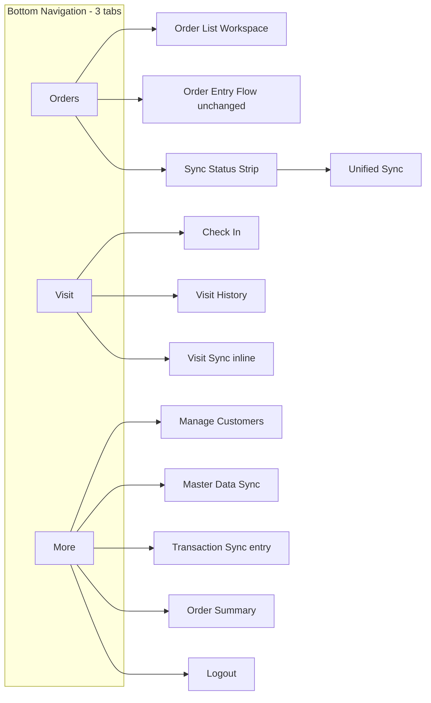

# Mobile App UX Redesign Proposal (v2)

**Artifact type:** UX design proposal — revision  
**Scope:** BTrade3 Android app (`src/BTrade3`) — branded in UI as **Sales Order App**  
**Status:** Proposal — no implementation attached  
**Prior work:**

- [Mobile App Feature Inventory and UX Discovery](../../investigations/mobile-app-feature-inventory.md)
- [Mobile App UX Redesign Proposal (v1)](mobile-app-ux-redesign-proposal.md)

**Revision reason:** Additional business workflow context invalidates several v1 assumptions — particularly the coupling of visits and orders, and the elevation of customer maintenance to primary navigation.

---

## What Changed from v1

| Topic | v1 assumption | v2 correction |
|-------|---------------|---------------|
| Visit → Order relationship | Optional "Create Order after check-in" recommended | **Rejected.** Visits and orders are independent operational activities |
| Customer navigation | Dedicated **Customer** bottom tab | **Customer moves to More.** Coordinate maintenance is a rollout activity, not steady-state primary work |
| Bottom navigation | 4 tabs: Orders \| Visit \| Customer \| More | **3 tabs: Orders \| Visit \| More** |
| Customer persona priority | Secondary with persistent tab | **Supporting activity** — accessible but not first-class navigation |
| Daily workflow model | Orders + visits + customer maintenance | Steady state: **Orders → Visits → Sync** |

Sections 1–2 from v1 remain largely valid. This document focuses on reassessments, revised recommendations, and updated wireframes. Unchanged analysis is referenced rather than repeated.

---

## Non-Goals

Unchanged from v1. Additionally:

- Do not design visit-to-order bridges, post-check-in order prompts, or "Create Order from customer" shortcuts as navigation priorities
- Do not optimize for the assumption that every visit creates an order
- Do not give permanent primary navigation to coordinate-capture rollout work

The app remains a **field-sales operational tool** optimized for:

```text
Create Sales Order → Add Items → Finish Order → Sync Order
```

and, as a **separate daily activity**:

```text
Check In → Continue Route → Sync Visits
```

---

## Business Operating Scenarios

Field operations are not a single linear workflow. Three common patterns:

### Scenario A — Visit Without Order

```text
Check-In → Visit Customer → No Order → Next Customer
```

The salesman records attendance but takes no order during the visit.

### Scenario B — Order Without Visit

```text
Customer calls / WhatsApp order → Salesman inputs order → No Check-In
```

Remote order capture has no visit component.

### Scenario C — Visit Now, Order Later

```text
Check-In → Receive printed PO → Continue visit route → Input order later
```

Visit and order happen at different times, possibly hours apart.

### Design implication

```text
Check-In ≠ Order
Order ≠ Check-In
```

UX must treat them as **parallel operational domains** that share sync infrastructure but not workflow steps. Coupling them — even as optional prompts — misrepresents how the field team works and adds friction to Scenarios A and C.

---

## Section 1 — Current UX Assessment

*Substantively unchanged from v1. See [v1 Section 1](mobile-app-ux-redesign-proposal.md#section-1--current-ux-assessment).*

**v2 additions to friction list:**

| Friction | v2 framing |
|----------|------------|
| Manage Customers in overflow | Important **during coordinate rollout** (~1,600 customers still without GPS of ~2,500 total) but not a daily steady-state need for most users |
| Visit and order on same FAB | Implies a combined workflow that business operations do not follow |
| No visit sync visibility | Same priority as order sync visibility — visits are independent work that also must reach the office |

**What still works well:** Workspace-first launch, order list hub, speed optimizations (sales prefill, bulk barang, recent search, per-card sync), order status lifecycle.

**What still must not change:** Order entry chain, finish/sync gates, per-card order actions.

---

## Section 2 — User Personas

### Revised persona model

| Persona | Priority | v1 | v2 |
|---------|----------|----|----|
| Field Salesman (orders + visits) | **Primary** | Primary | Primary — but visits and orders are separate modes within the day |
| Customer Data Maintainer | **Supporting** (was Secondary) | Customer tab | More area; elevated temporarily during GPS rollout only |
| Self-Review User | Tertiary | More tab | More tab (unchanged) |
| Sales Supervisor | Not supported | Out of scope | Out of scope |

### Field Salesman — revised typical day

Not a single pipeline. A realistic day mixes independent activities:

```text
Morning:   Sync master data (if needed)
Route:     Check-In at Customer A → no order → Check-In at Customer B → ...
Midday:    Phone order from Customer C → New Order → no check-in
Afternoon: Check-In at Customer D → collect PO → continue route
Evening:   Input order for Customer D → Finish → Sync orders + visits
```

**Design implication:** Navigation should make Orders, Visits, and Sync independently accessible. It should not suggest a visit naturally leads to an order.

### Customer Data Maintainer — revised framing

**Current scale:** ~2,500 customers; ~900 with GPS coordinates (~36%). ~1,600 customers still need coordinates.

**Temporal reality:**

| Phase | Customer maintenance importance |
|-------|--------------------------------|
| Now (rollout) | Elevated — many customers lack coordinates; affects check-in proximity matching and maps |
| Steady state (future) | Declining — maintenance frequency drops as coverage improves |

**Design implication:** Customer location tools must remain **findable** but should not occupy a permanent bottom-tab slot sized for a temporary rollout. A More-area entry with optional rollout banner is sufficient.

---

## Section 3 — Proposed Navigation Model (Revised)

### Design principles (v2)

| Principle | Application |
|-----------|-------------|
| Orders remain primary workspace | App opens to Orders tab; no landing page |
| Order-entry workflow untouched | No added steps in New Order → Customer → Sales → Items → Finish → Sync |
| Visits deserve first-class navigation | Dedicated Visit tab — daily activity, independent of orders |
| Customer maintenance is supporting | Lives in More; not a bottom-tab destination |
| Sync visibility is high priority | Status strip on Orders tab shows both order and visit pending counts |

### Reassessment 1 — Bottom Navigation Structure

#### Option A: Orders | Visit | More (recommended)

```text
Orders  —  primary workspace (current home, enhanced)
Visit   —  check-in, history, visit sync context
More    —  customer maintenance, master sync, transaction sync, summary, logout
```

**Rationale:**

- Maps to **steady-state** field operations: Orders, Visits, Sync (sync surfaced on Orders strip + More)
- Three tabs keep thumb reach simple; each tab has a clear, non-overlapping purpose
- Customer maintenance fits More alongside other infrequent-but-necessary tools
- Avoids allocating 25% of persistent navigation to a rollout activity

#### Option B: Orders | Visit | Customer | More (v1 — not recommended)

**Why rejected in v2:**

| Argument for Customer tab | Counter |
|---------------------------|---------|
| "Frequently used" during rollout | Usage is **batch and episodic** (location capture sessions), not daily like orders and visits |
| "2,500 customers" implies browse need | Customer **selection for orders** already happens inside the order flow; browse/maintenance is different |
| Dead tap fix needs a tab | Dead tap fix is a screen-level UX fix, not a navigation-tier decision |
| Discoverability | More-area entry with clear label "Manage Customers" + optional rollout banner achieves discoverability without permanent tab |

**When a Customer tab might be reconsidered:** If field research shows daily customer-maintenance sessions across most users for 12+ months. Current business expectation is the opposite — declining frequency over time.

#### Recommendation

**Adopt 3-tab bottom navigation: Orders | Visit | More.**



No arrows from Visit to Order. No arrows from Check-In to New Order.

### Reassessment 2 — FAB Strategy

#### Context

| Action | Frequency | Context |
|--------|-----------|---------|
| New Order | High on order-capture days | User is in Orders workspace |
| Check In | High on route days | User is moving between customers — may not be "ordering" |

These are both daily activities but in **different operational modes**. They should not share a single ambiguous control.

#### Options evaluated

| Option | Description | Pros | Cons |
|--------|-------------|------|------|
| **A. Single-tap New Order FAB (Orders tab only)** | Remove expand; Check In only on Visit tab | Saves 1 tap per order; clearest order-first signal; aligns with Scenario B (phone orders never need FAB check-in) | Check-in from Orders tab requires 1 tab switch to Visit |
| **B. Expandable FAB (status quo)** | Tap + to expand → New Order or Check In | Both actions reachable from home | 2 taps for New Order; implies combined workflow; violates independence principle |
| **C. Dual FAB** | Two floating buttons on home | Both one-tap from home | Cluttered; competes visually; poor Material Design fit |
| **D. Speed-dial FAB on both tabs** | Expandable on Orders (New Order) and Visit (Check In) | Contextual | Unnecessary complexity; Visit tab has room for a full-width primary button |

#### Recommendation

**Option A: Single-tap New Order FAB on Orders tab only.**

**Rationale:**

- New Order is the **sacred-path** action — it must be one tap, every time
- Check In is equally important but belongs to the **Visit domain** — a primary "Check In Now" button on the Visit tab is more discoverable than a FAB sub-action
- Tab switch Orders → Visit is **1 tap**, same cost as expanding today's FAB — but with clearer mental model
- Scenario B (order without visit) never pays a check-in tax on the FAB
- Scenario A (visit without order) never sees an order prompt after check-in

**Trade-off accepted:** A salesman on the Orders tab who wants to check in taps Visit (1 tap) then Check In Now (1 tap) = 2 taps total. Today: expand FAB (1) + Check In (1) = 2 taps. **No regression in tap count**; gain in clarity and independence.

**Rejected:** Post-check-in or FAB-adjacent order shortcuts — business scenarios A and C explicitly do not want this coupling.

### Reassessment 3 — Overflow Menu

Unchanged intent from v1: **eliminate home overflow menu.** Distribute items:

| Current overflow item | v2 location |
|----------------------|-------------|
| Manage Customers | **More** |
| Check-In History | **Visit** tab |
| Sync Master Data | **More** |
| Sync Transaction | Orders status strip + **More** |
| Order Summary | **More** |
| Logout | **More** |

### Reassessment 4 — App Bar and Quick Actions

| Location | Elements |
|----------|----------|
| Orders tab | Title, server subtitle, search, **sync status strip** (orders + visits pending) |
| Visit tab | Title, unsynced visit badge |
| More tab | Title |

| Quick action | Location |
|--------------|----------|
| Sync Now | Orders status strip — uploads orders + visits |
| Check In Now | Visit tab primary button |
| Sync Visit Data | Visit tab when drafts exist |
| Manage Customers | More list item |

---

## Section 4 — Proposed Home Screen (Orders Tab)

*Largely unchanged from v1 except bottom nav shows 3 tabs.*

```text
┌────────────────────────────────────────────┐
│  Sales Orders                          🔍  │
│  Server: Jogja                             │
├────────────────────────────────────────────┤
│  Orders ready: 12  ·  Visits ready: 3      │
│                          [ Sync Now → ]    │
├────────────────────────────────────────────┤
│                                            │
│  ┌──────────────────────────────────────┐  │
│  │ TOKO MAKMUR              In Progress │  │
│  │ #ORD-0042 · 5 items · Rp 1.250.000  │  │
│  │                              ⋮       │  │
│  └──────────────────────────────────────┘  │
│                                            │
│  ...                                       │
│                                            │
│                               ┌────────┐   │
│                               │   +    │   │
│                               │  New   │   │
│                               │ Order  │   │
│                               └────────┘   │
├────────────────────────────────────────────┤
│      Orders      │      Visit      │  More  │
│        ●         │                 │        │
└────────────────────────────────────────────┘
```

**Sync status strip language (v2):** Use separate labels — "Orders ready" and "Visits ready" — to reinforce that these are independent pending work queues, not one combined task list (even though Sync Now may upload both).

---

## Section 5 — Order Workflow Review

*Unchanged from v1. See [v1 Section 5](mobile-app-ux-redesign-proposal.md#section-5--order-workflow-review).*

**v2 explicit guardrails:**

| Item | v2 decision |
|------|-------------|
| Order creation chain | **Keep as-is** — no structural changes |
| Single-tap New Order FAB | **Keep** recommendation |
| Selesai relabeling / finish prompt | **Keep** — messaging only, no flow change |
| Post-check-in order creation | **Remove** from consideration — not a gap, intentional separation |
| "Create Order from customer detail" | **Remove** — order creation starts from Orders workspace or in-progress order flow only |
| Remember last customer on new orders | **Optional major** — still valid for Scenario B/C; unrelated to visit coupling |

---

## Section 6 — Visit Workflow Review (Revised)

Visit is an **independent operational workspace**, not a prelude to ordering.

### Visit area responsibilities

| Function | In scope | Out of scope |
|----------|----------|--------------|
| Check In | Yes | — |
| Visit History | Yes | — |
| Visit Sync (draft upload) | Yes | — |
| Today's visit summary | Yes | — |
| Create Order | **No** | Orders tab / order flow |
| Customer location maintenance | **No** | More area |

### Check In

| Aspect | Recommendation | Rationale |
|--------|----------------|-----------|
| Entry point | Visit tab → Check In Now | First-class visit navigation; not on Orders FAB |
| GPS auto-start | Keep | Field-appropriate |
| Nearby customers (100 m) | Keep | Fast for on-site visits (Scenario A, C) |
| Manual customer search | Improve (major) | Fallback when GPS weak — supports Scenario A without forcing order context |
| Post check-in action | Return to Visit tab | **Not** order list; user stays in visit context |
| Post check-in order prompt | **Do not implement** | Scenarios A and C explicitly exclude this |
| Confirmation feedback | Improve | Brief success with customer name; then return to Visit tab |

### Visit History

| Aspect | Recommendation | Rationale |
|--------|----------------|-----------|
| Entry | Visit tab → View Full History | Not overflow |
| Date filter, map, delete | Keep | Works well |
| DRAFT / SENT badges | Keep | Visit sync state independent of orders |

### Visit Sync

| Aspect | Recommendation | Rationale |
|--------|----------------|-----------|
| Inline on Visit tab | Yes — when drafts exist | Visit-domain sync without hunting menus |
| Unified Sync Now on Orders strip | Yes — includes visits | End-of-day uploads both domains |
| Separate from order sync logic | Present as two queues in UI | Reinforces independence; one button can still upload both |

### Visit tab wireframe

```text
┌────────────────────────────────────────────┐
│  Visit                          2 unsynced │
├────────────────────────────────────────────┤
│  ┌──────────────────────────────────────┐  │
│  │         [  Check In Now  ]           │  │
│  └──────────────────────────────────────┘  │
│                                            │
│  Today: 4 visits                           │
│  ┌──────────────────────────────────────┐  │
│  │  [ Sync Visit Data (2) ]             │  │
│  └──────────────────────────────────────┘  │
│                                            │
│  ── Today's visits ──────────────────────  │
│  10:32   TOKO MAKMUR           DRAFT  🗺  │
│  09:15   WARUNG SEJAHTERA       SENT  🗺  │
│  08:50   CV BERKAH JAYA         SENT  🗺  │
│                                            │
│  [ View Full History → ]                   │
│                                            │
├────────────────────────────────────────────┤
│      Orders      │      Visit      │  More  │
│                  │        ●        │        │
└────────────────────────────────────────────┘
```

**After check-in (v2 — no order bridge):**

```text
┌────────────────────────────────────────────┐
│  ✓ Checked in at TOKO MAKMUR               │
│  10:32 · saved locally                     │
│                                            │
│  [ Done ]                                  │
└────────────────────────────────────────────┘
         → returns to Visit tab
```

---

## Section 7 — Customer Workflow Review (Revised)

### Placement decision

| Option | Recommendation |
|--------|----------------|
| Dedicated Customer tab | **No** |
| More area entry | **Yes** |
| Inside order flow only | **Yes** (unchanged — customer picker for orders) |

### Rationale

1. **Steady-state operations are Orders, Visits, Sync** — not customer browsing
2. **~1,600 customers still lack GPS** — significant rollout work, but episodic batch activity, not daily navigation for most users
3. **Customer selection for orders** already lives inside the order flow (`fromMain=false`) — no tab needed for that
4. **Customer maintenance** (location capture, maps) is accessed when deliberately doing coordinate work — a More-area entry is sufficient

### What still should improve (lower priority than v1)

| Improvement | Tier | Notes |
|-------------|------|-------|
| Fix dead tap in browse mode (`fromMain=true`) | Medium | Screen-level fix; tap opens detail with Set Location, Open in Maps |
| "Manage Customers" clear label in More | Quick win | With sublabel: "Search customers, update locations" |
| Rollout banner in More (optional) | Quick win | "~1,600 customers need GPS — help update locations" — dismissible; acknowledges temporary elevation without permanent tab |
| "Customers missing location" filter | Major (deprioritized) | Useful during rollout; implement in More customer screen, not as tab driver |
| Search-first empty state for 2,500 customer list | Major (deprioritized) | Performance/clarity; not navigation-tier |
| Create Order from customer detail | **Removed** | Couples customer browse to order flow unnecessarily |

### Customer access paths (v2)

```text
Order flow:     New Order → Select Customer (unchanged)
Maintenance:    More → Manage Customers → search → Set Location
Maps:           Customer card map icon → Google Maps (unchanged)
```

---

## Section 8 — Sync Experience Review

*Core recommendations unchanged from v1. v2 emphasis on dual-queue visibility.*

### Sync visibility (highest ROI)

Users must always see, without opening menus:

```text
Orders Ready To Sync: N
Visits Ready To Sync: M
```

**Status strip on Orders tab:**

```text
Orders ready: 12  ·  Visits ready: 3     [ Sync Now → ]
```

Tapping either count or Sync Now opens unified sync hub showing **two independent sections** that can be uploaded together:

```text
┌────────────────────────────────────────────┐
│  ←  Sync                                   │
├────────────────────────────────────────────┤
│  Orders ready to sync (12)                 │
│  ☑ ORD-0041  WARUNG SEJAHTERA              │
│  ☑ ORD-0042  TOKO MAKMUR                    │
│  ...                                       │
│                                            │
│  Visits ready to sync (3)                  │
│  ☑ 10:32  TOKO MAKMUR                      │
│  ...                                       │
│                                            │
│  [ Sync All Pending (15) ]                 │
│                                            │
│  Last sync: today 16:42                    │
└────────────────────────────────────────────┘
```

**Design note:** One button uploads both queues for end-of-day convenience (Scenario: finish route, sync everything). The UI still **displays them separately** so users understand orders and visits are independent work products.

### Master data sync

Unchanged from v1: Sync All button, remove stale Future card, entry in More.

---

## Section 9 — Wireframes (v2)

Three bottom-navigation areas plus More. Customer wireframe removed as top-level tab; customer maintenance shown under More.

### 9.1 Orders Tab

```text
┌────────────────────────────────────────────┐
│  Sales Orders                          🔍  │
│  Server: Jogja                             │
├────────────────────────────────────────────┤
│  Orders ready: 12  ·  Visits ready: 3      │
│                          [ Sync Now → ]    │
├────────────────────────────────────────────┤
│  (order list — unchanged cards)              │
│                                            │
│                               ┌────────┐   │
│                               │   +    │   │
│                               │  New   │   │
│                               │ Order  │   │
│                               └────────┘   │
├────────────────────────────────────────────┤
│      Orders      │      Visit      │  More  │
│        ●         │                 │        │
└────────────────────────────────────────────┘
```

### 9.2 Visit Tab

*See Section 6 wireframe.*

### 9.3 More Tab

```text
┌────────────────────────────────────────────┐
│  More                                      │
├────────────────────────────────────────────┤
│                                            │
│  ── Sync ────────────────────────────────  │
│  ┌──────────────────────────────────────┐  │
│  │  ☁️  Sync Transactions           →   │  │
│  └──────────────────────────────────────┘  │
│  ┌──────────────────────────────────────┐  │
│  │  🔄  Sync Master Data            →   │  │
│  └──────────────────────────────────────┘  │
│                                            │
│  ── Customers ───────────────────────────  │
│  ┌──────────────────────────────────────┐  │
│  │  📍  Manage Customers              →   │  │
│  │      Search, update locations          │  │
│  └──────────────────────────────────────┘  │
│  ┌──────────────────────────────────────┐  │
│  │  ℹ️  ~1,600 customers need GPS       │  │
│  │      (rollout banner — dismissible)  │  │
│  └──────────────────────────────────────┘  │
│                                            │
│  ── Reports ─────────────────────────────  │
│  ┌──────────────────────────────────────┐  │
│  │  📊  Order Summary               →   │  │
│  └──────────────────────────────────────┘  │
│                                            │
│  ── Account ─────────────────────────────  │
│  Server: Jogja (JOG)                       │
│  user@gmail.com                            │
│  [ Logout ]                                │
│                                            │
├────────────────────────────────────────────┤
│      Orders      │      Visit      │  More  │
│                  │                 │   ●    │
└────────────────────────────────────────────┘
```

### 9.4 Manage Customers (from More — not a tab)

```text
┌────────────────────────────────────────────┐
│  ←  Manage Customers                       │
├────────────────────────────────────────────┤
│  ┌──────────────────────────────────────┐  │
│  │ 🔍  Search by code, name, address... │  │
│  └──────────────────────────────────────┘  │
│  [ Missing location only ☐ ]  (optional)     │
│                                            │
│  ┌──────────────────────────────────────┐  │
│  │ WARUNG SEJAHTERA          (no GPS)   │  │
│  │ C-042 · Jl. Merapi                   │  │
│  │              [ Set Location ]  🗺    │  │
│  └──────────────────────────────────────┘  │
│                                            │
│  (tap row → detail: address, Set Location, │
│   Open in Maps — no Create Order action)   │
└────────────────────────────────────────────┘
```

---

## Section 10 — Migration Plan (Revised Priorities)

Priorities re-ranked by ROI against **steady-state** field operations. Coordinate-capture features deprioritized relative to v1.

### Tier 1 — Highest ROI (do first)

Sync visibility, navigation clarity, reduced hidden features. **Regression risk to order flow: None.**

| # | Item | v1 tier | v2 tier | Impact |
|---|------|---------|---------|--------|
| P1 | Sync status strip — orders + visits counts + Sync Now | Q1 | **Tier 1** | Solves #1 discoverability problem |
| P2 | Single-tap New Order FAB | Q2 | **Tier 1** | Saves tap on sacred path |
| P3 | 3-tab bottom nav (Orders \| Visit \| More) | M1 (4-tab) | **Tier 1** | Persistent wayfinding; simpler than v1 |
| P4 | Remove home overflow; distribute to tabs/More | M2 | **Tier 1** | Eliminates hidden menu |
| P5 | Visit tab (Check In, today, history, visit sync) | M3 | **Tier 1** | Independent visit workspace |
| P6 | Unified sync hub (separate queues, one upload) | M5 | **Tier 1** | End-of-day clarity |

### Tier 2 — Medium ROI (after Tier 1)

Messaging fixes and moderate screen improvements. Low order-flow risk.

| # | Item | v1 tier | v2 tier | Impact |
|---|------|---------|---------|--------|
| P7 | Rename Selesai → Back to Order | Q3 | Tier 2 | Reduces finish confusion |
| P8 | Finish prompt on Order Entry after items | Q4 | Tier 2 | Catches forgotten finish |
| P9 | Sync All Master Data + remove Future card | Q5, Q6 | Tier 2 | Master sync clarity |
| P10 | Fix customer browse dead tap | M4 (tab) | **Tier 2** (More screen only) | UX fix without Customer tab |
| P11 | Visit tab inline Sync Visit Data | M6 | Tier 2 | Visit-domain sync |
| P12 | Last sync timestamp | Q7 | Tier 2 | End-of-day confidence |
| P13 | Manage Customers label + rollout banner in More | New | Tier 2 | Temporary rollout visibility without permanent tab |

### Tier 3 — Lower ROI / defer

Coordinate rollout and polish. Implement based on field feedback after Tier 1–2.

| # | Item | v1 tier | v2 tier | Notes |
|---|------|---------|---------|-------|
| P14 | Manual customer search on Check-In | J4 | Tier 3 | GPS fallback; visit-domain |
| P15 | Search-first empty state (customer/barang) | J6 | Tier 3 | Perf at 2,500 customers |
| P16 | Missing-location filter in Manage Customers | J7 | Tier 3 | Rollout helper |
| P17 | Remember last customer on new orders | J2 | Tier 3 | Optional; Scenario B/C |
| P18 | Sales person search | J5 | Tier 3 | Nice-to-have |
| P19 | Order list status filter chips | M7/J8 | Tier 3 | Power-user |
| P20 | First-login master data prompt | J3 | Tier 3 | Onboarding |
| — | Post-check-in Create Order | J1 | **Removed** | Invalidated by business context |
| — | Customer bottom tab | M1 (partial) | **Removed** | Invalidated by business context |
| — | Create Order from customer detail | v1 §7 | **Removed** | Couples independent domains |

### Recommended phasing (v2)

```text
Phase 1 — Highest ROI
  P1, P2, P7, P9
  → Sync visibility + FAB + messaging; no nav restructure yet

Phase 2 — Navigation shell
  P3, P4, P5, P6, P11
  → 3-tab nav, Visit workspace, unified sync, overflow eliminated

Phase 3 — Supporting improvements
  P8, P10, P12, P13
  → Customer browse fix in More, rollout banner, polish

Phase 4 — As needed
  P14–P20 based on field feedback
  → Deprioritize coordinate-rollout features as GPS coverage improves
```

### Risk summary (v2)

| Risk | Mitigation |
|------|------------|
| Customer maintenance harder to find without tab | Clear More entry + optional rollout banner; monitor during GPS rollout |
| Visit check-in harder from Orders tab | 1 tab switch = same tap count as today's expand FAB; clearer separation |
| Accidental visit-order coupling in future | Explicit non-goal; remove J1 permanently |
| Over-investing in rollout UX | Rollout banner is dismissible; no permanent tab real estate |

---

## Appendix A — v1 → v2 Decision Log

| Decision | v1 | v2 | Reason |
|----------|----|----|--------|
| Bottom nav tabs | 4 | **3** | Customer maintenance is supporting, not steady-state primary |
| Customer tab | Yes | **No** | ~900/2,500 with GPS; rollout activity with declining frequency |
| Visit-order coupling | Optional post-check-in order | **None** | Scenarios A, B, C are independent |
| FAB | Single-tap New Order | **Unchanged** | Still correct; Check In on Visit tab |
| Sync strip | Combined count | **Separate labels** | Reinforces independent queues |
| Customer detail Create Order | Medium priority | **Removed** | Couples browse to order |
| Customer tab tap-to-detail | High (tab) | Medium (More screen) | Fix retained, placement demoted |

## Appendix B — Traceability

| Business input | v2 section | Outcome |
|----------------|------------|---------|
| Check-In ≠ Order | §6, Non-Goals, P20 removed | No visit-order bridges |
| Scenario B — order without visit | §3 FAB reassessment | New Order FAB on Orders only |
| Customer not primary steady-state | §2, §3, §7 | Customer in More, not tab |
| ~2,500 customers / ~900 GPS | §2, §7, §9.3 | Rollout banner; deprioritize maintenance UX |
| Orders \| Visit \| More preferred | §3 | Adopted over 4-tab |
| Sync visibility priority | §4, §8, Tier 1 | Status strip highest ROI |

---

*v2 revision based on v1 proposal, feature inventory, and additional field-sales business workflow context. No runtime user testing performed.*
