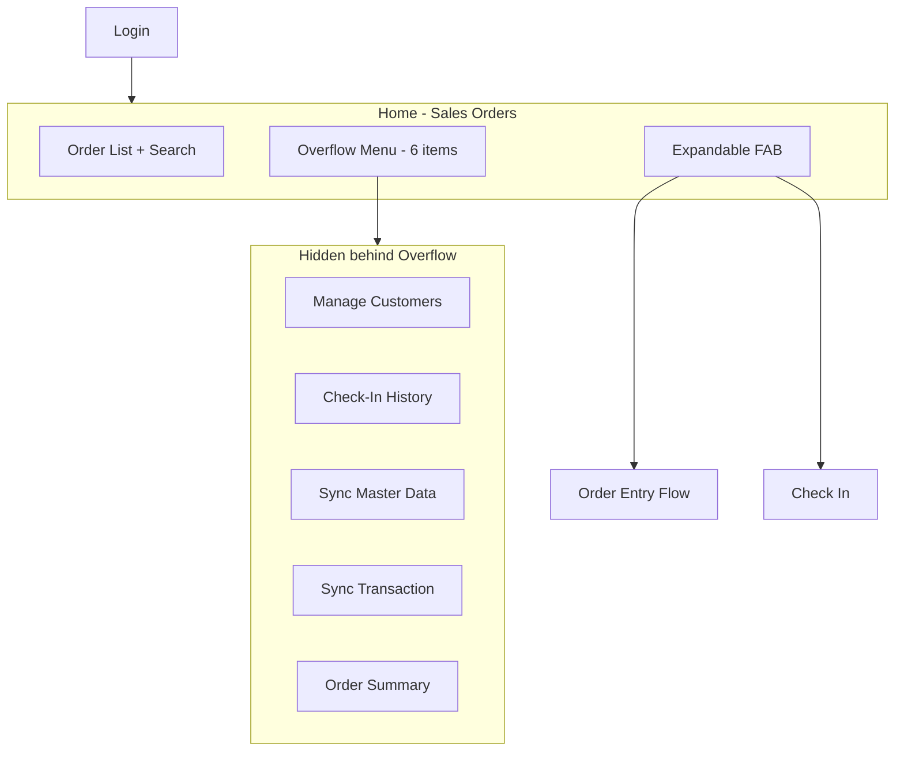
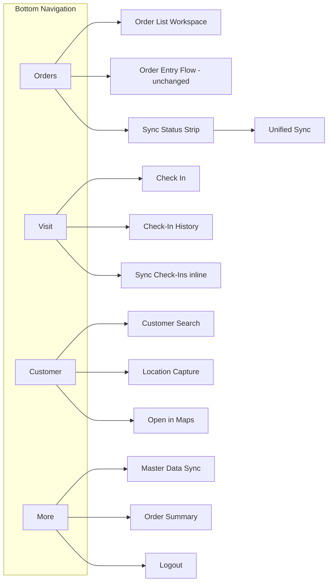

# Mobile App UX Redesign Proposal

**Artifact type:** UX design proposal  
**Scope:** BTrade3 Android app (`src/BTrade3`) — branded in UI as **Sales Order App**  
**Status:** Proposal — no implementation attached  
**Prior work:** [Mobile App Feature Inventory and UX Discovery](../../investigations/mobile-app-feature-inventory.md)

---

## Non-Goals

This proposal explicitly does **not** recommend:

- A dashboard-centric or KPI-first home screen
- A tile launcher or module grid
- Supervisor, team, or manager-oriented views
- Portal integration, approval workflows, collection entry, or route planning
- API or backend changes
- Implementation tasks or technical architecture

The app is a **field-sales operational tool**. The redesign preserves and optimizes the core workflow:

```text
Create Sales Order → Add Items → Finish Order → Sync Order
```

---

## Section 1 — Current UX Assessment

### What Currently Works Well

**Workspace-first launch is correct.** After login, users land directly on the Sales Orders list (`OrderListScreen`). There is no intermediate launcher or dashboard. This matches how field sales personnel use the app: they open it to work on orders, not to browse modules.

**The order list is a capable operational hub.** Users can search by customer name, code, or local order ID; see status at a glance (In Progress, Ready, Sent); tap a card to edit; long-press for bulk delete; and sync a single ready order from the card menu without opening a separate screen. The server target (Jogja or Magelang) is visible in the app bar subtitle, which helps users confirm they are on the correct backend partition.

**Several screens are already optimized for repeat field use:**

| Optimization | Where | Benefit |
|--------------|-------|---------|
| Last sales person pre-filled on new orders | Order Entry | Skips one selection for repeat users |
| Recent search history | Customer, Barang selection | Faster lookup for frequent accounts/products |
| Multi-word AND search | Customer, Barang selection | Precise filtering in large master lists |
| Bulk barang selection | Barang Selection | Add multiple same-price items in one pass |
| Tap-to-edit line items | Item List | Direct path to edit qty/discounts |
| Proximity-based customer list | Check-In | No manual search needed when GPS is accurate |
| Per-order sync from card menu | Order List | End-of-visit upload without batch screen |
| Pre-checked ready orders on batch sync | Sync Transaction | Defaults to syncing everything ready |

**The order status lifecycle is clear in code and UI.** `IN_PROGRESS` → `READY_TO_SYNC` → `SENT` gates editing and sync eligibility. Finish Order validates customer, sales person, and at least one line item before allowing sync.

**Stack navigation with back arrows is familiar.** Inner screens (order entry, item list, barang selection) follow a predictable drill-down pattern that experienced users already know.

### What Should Remain Unchanged

| Area | Rationale |
|------|-----------|
| Sales Orders as default destination after login | Core workspace; changing this would add friction |
| Multi-screen order creation chain (customer → sales → items → finish) | Deep but intentional; restructuring adds steps and retraining cost |
| Order Entry, Item List, Add Item, Barang Selection screens | Heavily tuned for operational speed; bulk mode and pricing fields serve real field needs |
| Status lifecycle and Finish / Reopen behavior | Business rule alignment; sync depends on explicit finish |
| Per-card Edit, Delete, Sync actions | Power shortcuts that frequent users rely on |
| External Google Maps for navigation | Appropriate for field use; no need for in-app maps |
| Google Sign-In + server selection at login | Simple gate; server change is rare |

### What Causes Friction

**Overflow menu as the only path to secondary features.** Five of six non-order capabilities — Manage Customers, Check-In History, Sync Master Data, Sync Transaction, Order Summary — plus Logout live behind a single triple-dot (⋮) on the home app bar. Users must remember that Sync Transaction exists at all. There is no visual affordance indicating pending sync work.

**Two-tap expandable FAB.** New Order and Check In share one FAB. Users tap `+` to expand, then choose an action. For the highest-frequency action (New Order), this is an unnecessary extra tap on every order creation.

**"Selesai" does not finish the order.** On the Item List screen, the top-bar "Selesai" button navigates back to the Sales Orders list. It does not change order status. Finish Order is a separate action on Order Entry. Users who tap Selesai after adding items may believe the order is complete and ready to sync when it remains `IN_PROGRESS`.

**Manage Customers mode has a dead tap.** When opened from the overflow menu (`fromMain=true`), tapping a customer row does nothing. Location maintenance requires finding the small edit-location icon on each card. This is unintuitive for users who expect tap-to-open.

**Master data sync requires three manual actions.** Sync Barang, Sync Customer, and Sync Sales Person are separate buttons. A "Future Sync Options" card still lists customer and sales sync as upcoming even though those buttons exist above it — creating confusion about what is available.

**Check-in sync is disconnected from check-in.** After checking in, the user returns to the order list. Uploading check-ins requires overflow → Sync Transaction → a separate "Sync Check-In Data" button on a screen primarily about orders.

**No persistent navigation chrome.** Outside the order list, users have only a back arrow. There is no tab bar or other persistent indicator of major app areas. Returning to Customers or Sync requires backing out to home and opening the overflow menu again.

**Check-in limited to 100 m proximity.** When GPS lock is slow or the user is slightly outside range, no manual customer search is available on the Check-In screen.

**Sales person selection has no search.** For organizations with many sales persons, scrolling the full list is slower than customer or barang search.

### What Causes Discoverability Issues

| Feature | Current access | Problem |
|---------|--------------|---------|
| Sync Transaction | Overflow menu only | Business-critical; users may not know it exists |
| Pending sync count | Not shown on home | Users cannot see how much work remains without opening sync |
| Check-In History | Overflow menu only | Visit audit trail is invisible until remembered |
| Manage Customers | Overflow menu only | Frequently needed for location updates; buried |
| Sync Master Data | Overflow menu only | New users may not know to sync before first order |
| Order Summary | Overflow menu only | Acceptable for tertiary use; low priority |
| Draft check-ins awaiting upload | Not shown on home | Silent accumulation until user finds Sync Transaction |

### Current Navigation Summary

```text
Login
└── Sales Orders [HOME]
    ├── Search (app bar)
    ├── Overflow (⋮): Customers, Check-In History, Master Sync, Transaction Sync, Summary, Logout
    ├── FAB (expand): New Order | Check In
    └── Order cards: tap edit, long-press select, ⋮ Edit/Delete/Sync
```



---

## Section 2 — User Personas

BTrade3 does not implement role-based UI. All authenticated users see the same navigation tree. Personas below are **usage patterns** inferred from feature design, screen investment, and BTR domain knowledge — not separate app modes.

### Persona 1: Field Salesman (Primary)

**Who:** A sales representative working in the field, capturing orders and recording customer visits during the day.

**Typical day:**

```text
Login → [optional master sync] → create/edit orders → check in at customers → finish orders → sync at end of shift
```

**Needs:**

- Fast order creation with minimal taps
- Reliable offline product and customer lookup
- Clear visibility of orders ready to upload
- Quick check-in at customer locations
- End-of-day sync without hunting through menus

**Why primary:** The app opens to Sales Orders. The home FAB prioritizes New Order. The deepest screen investment (order entry, item list, barang selection with bulk mode, pricing fields) serves this persona. Mobile identity maps to `SalesPerson.Email` in master data — the user *is* a salesman in the business model.

**Design implication:** Every redesign decision must be tested against: "Does this help or hurt the field salesman completing an order and syncing it?"

### Persona 2: Customer Data Maintainer (Secondary)

**Who:** Often the same field salesman, occasionally updating customer GPS coordinates for map display, check-in accuracy, and office records.

**Typical session:**

```text
Overflow → Manage Customers → search customer → edit location → capture GPS → save
```

**Needs:**

- Easy path to customer search
- Obvious location-set action for customers missing GPS
- Map preview or external navigation to verify coordinates

**Why secondary:** Location maintenance is important but not daily for every user. It supports the primary order and check-in workflows rather than standing alone.

**Design implication:** Customer area deserves persistent navigation (not overflow), but should not compete with Orders for home-screen prominence.

### Persona 3: Self-Review User (Tertiary)

**Who:** A salesman reviewing their own local sales totals — orders count, item count, gross sales by date.

**Typical session:**

```text
Overflow → Order Summary → [optional date filter] → review totals
```

**Needs:**

- Access to local performance summary
- Date range filtering

**Why tertiary:** `OrderSummaryScreen` aggregates local DB data only. It is useful for self-check but not part of the critical order-sync path. It belongs in a "More" area, not the primary workspace.

### Persona 4: Sales Supervisor (Not Supported — Out of Scope)

**Who:** A supervisor monitoring team performance, approving orders, or reviewing field activity across salesmen.

**Current reality:** BTrade3 has no team views, approval inbox, sign-request workflows, route assignment, or role-gated menus. A supervisor using the app today follows the same flows with their own Google account (which must match a `SalesPerson.Email` record).

**Why out of scope for this redesign:**

- Adding supervisor features would shift the app toward management dashboard territory — explicitly excluded
- The discovery inventory confirms absent features: collection entry, approvals, portal dashboards, route planning
- Field sales operational speed must not be sacrificed for supervisor tooling that does not exist today

**Design implication:** Do not add executive summaries, team leaderboards, or approval queues. Order Summary remains a personal local tool in the More area.

### Persona Priority Summary

| Persona | Priority | Home screen relationship |
|---------|----------|--------------------------|
| Field Salesman | **Primary** | Orders tab is their workspace |
| Customer Data Maintainer | Secondary | Customer tab |
| Self-Review User | Tertiary | More tab |
| Sales Supervisor | Not supported | N/A |

---

## Section 3 — Proposed Navigation Model

### Design Principles Applied

| Principle | How the model addresses it |
|-----------|---------------------------|
| Workspace first | Orders tab = current home; no new landing screen |
| Order flow is sacred | Order screens unchanged; FAB simplified to single-tap New Order only |
| Important features visible | Visit, Customer, sync status strip surfaced persistently |
| Reduce navigation ambiguity | 4-tab bottom bar shows major areas at all times |

### Pattern Evaluation

#### Bottom Navigation — Adopt (4 tabs)

**Recommendation:** Add a bottom navigation bar with four destinations: **Orders | Visit | Customer | More**.

**Rationale:**

- Provides persistent wayfinding without a menu-first experience
- Each tab maps to a real usage cluster discovered in the inventory
- Orders tab remains the default selected tab on launch — workspace first
- Does not add a tap to start work; users still land in their order list

**Rejected alternative — 5+ tabs:** Sync does not warrant its own tab. Sync is an action across orders and check-ins, better surfaced as a status strip CTA and within More.

#### Overflow Menu — Reduce

**Recommendation:** Remove the home-screen overflow menu from the Orders tab. Relocate its items:

| Current overflow item | New location |
|----------------------|--------------|
| Manage Customers | Customer tab (already the same screen) |
| Check-In History | Visit tab |
| Sync Master Data | More tab |
| Sync Transaction | Orders status strip "Sync Now" + More tab |
| Order Summary | More tab |
| Logout | More tab |

**Rationale:** The overflow menu is the root cause of discoverability failures. Eliminating it from the primary workspace forces important features into visible navigation.

**Retain overflow only where contextual:** Per-order card menu (Edit, Delete, Sync) stays — these are item-level actions, not app-level navigation.

#### FAB — Simplify

**Recommendation:** On the Orders tab only, replace the expandable two-action FAB with a **single-tap New Order** FAB.

**Rationale:**

- New Order is the highest-frequency create action
- Removing Check In from the FAB eliminates the expand step for every new order
- Check In moves to the Visit tab as a primary button — equally prominent, better contextualized

**Rejected:** Keeping both actions on FAB — continues two-tap friction for order creation.

**Rejected:** Removing FAB entirely — New Order must remain one tap from the workspace.

#### App Bar — Enhance

**Recommendation:**

- **Orders tab:** Title "Sales Orders" + server subtitle (unchanged) + search icon. Add sync status strip directly below app bar.
- **Visit tab:** Title "Visit" + optional unsynced badge
- **Customer tab:** Title "Customers"
- **More tab:** Title "More"

No triple-dot on Orders tab app bar.

#### Quick Actions — Add

| Quick action | Location | Purpose |
|--------------|----------|---------|
| Sync Now | Orders status strip | One-tap entry to unified sync |
| Check In | Visit tab primary button | Replaces FAB check-in |
| Sync check-ins | Visit tab (when drafts exist) | Contextual upload without leaving visit area |
| Set Location | Customer card action | Location maintenance without icon hunting |

### Proposed Navigation Structure



### Rejected Patterns

| Pattern | Why rejected |
|---------|--------------|
| Tile launcher / module grid | Menu-first; users must browse before working |
| Dashboard home with KPIs | Wrong persona; operational app not executive tool |
| Drawer navigation | Hides features same as overflow; less thumb-reachable on phones |
| Check-In on FAB alongside New Order | Two-tap FAB; competes with sacred order flow |
| Dedicated Sync tab | Sync is an action, not a workspace; would add navigation without reducing taps |
| Role-based navigation | Out of scope; no RBAC in app today |

---

## Section 4 — Proposed Home Screen

The "home screen" in this proposal is the **Orders tab** — the same workspace users have today, enhanced with sync visibility and simplified FAB. There is no separate landing page.

### Layout Mockup

```text
┌────────────────────────────────────────────┐
│  Sales Orders                          🔍  │
│  Server: Jogja                             │
├────────────────────────────────────────────┤
│  Ready to sync: 12  ·  Draft visits: 3     │
│                          [ Sync Now → ]    │
├────────────────────────────────────────────┤
│  [In Progress] [Ready] [Sent]   (optional)   │
├────────────────────────────────────────────┤
│                                            │
│  ┌──────────────────────────────────────┐  │
│  │ TOKO MAKMUR              In Progress │  │
│  │ #ORD-0042 · 5 items · Rp 1.250.000  │  │
│  │                              ⋮       │  │
│  └──────────────────────────────────────┘  │
│                                            │
│  ┌──────────────────────────────────────┐  │
│  │ WARUNG SEJAHTERA              Ready  │  │
│  │ #ORD-0041 · 3 items · Rp 890.000    │  │
│  │                              ⋮       │  │
│  └──────────────────────────────────────┘  │
│                                            │
│  ...                                       │
│                                            │
│                               ┌──────┐     │
│                               │  +   │     │
│                               │ Order│     │
│                               └──────┘     │
├────────────────────────────────────────────┤
│  Orders  │  Visit  │  Customer  │  More   │
│    ●     │         │            │         │
└────────────────────────────────────────────┘
```

### Element Rationale

| Element | Purpose |
|---------|---------|
| App bar + server subtitle | Unchanged; confirms environment |
| Search icon | Unchanged; inline search mode for finding orders |
| Sync status strip | Surfaces pending work; replaces hidden Sync Transaction menu item |
| "Sync Now" CTA | One tap to unified sync (orders + check-ins) |
| Status filter chips (optional) | Quick win for users managing many orders; not required for v1 |
| Order list | Unchanged cards with status, totals, per-card actions |
| Single-tap FAB | New Order only; no expand step |
| Bottom navigation | Persistent access to Visit, Customer, More without leaving workspace context |

### What Is Deliberately Absent

- KPI cards, charts, or daily target widgets
- Module tiles or feature grid
- Greeting banner or "welcome back" dashboard
- Notification center or approval inbox

The order list remains the dominant visual element. The status strip is informational and actionable, not analytical.

---

## Section 5 — Order Workflow Review

### Order Creation

| Aspect | Recommendation | Rationale |
|--------|----------------|-----------|
| Screen flow (Entry → Customer → Sales → Items → Barang) | **Keep as-is** | Restructuring adds steps; users are trained on current path |
| Auto-create order on New Order | **Keep** | Immediate local ID; no waiting |
| Last sales person prefill | **Keep** | Proven speed optimization |
| Last customer prefill | **Improve** (optional, major) | Sales is prefilled; customer would save one screen for repeat visits |
| FAB access | **Improve** | Single-tap New Order removes expand step |
| Customer / sales picker screens | **Keep** | SavedStateHandle return pattern works well |

### Order Editing

| Aspect | Recommendation | Rationale |
|--------|----------------|-----------|
| Tap card to edit | **Keep** | Fastest path for returning to an order |
| Card menu Edit / Delete | **Keep** | Power-user shortcuts |
| Editable only when IN_PROGRESS | **Keep** | Business rule; prevents accidental edits on synced orders |
| Reopen for Editing | **Keep** | Necessary escape hatch after premature finish |
| Bulk selection delete | **Keep** | Maintenance for power users; does not interfere with normal flow |

### Item Entry

| Aspect | Recommendation | Rationale |
|--------|----------------|-----------|
| Item List → Add Item → Barang Selection → qty/discounts | **Keep** | Deep but supports complex pricing (qty besar/kecil, bonus, 4 discounts) |
| Bulk barang mode | **Keep** | Major speed win for multi-SKU orders |
| Recent barang searches | **Keep** | Repeat product entry |
| Tap line item to edit | **Keep** | Direct edit path |
| Barang catalog shown when search empty | **Improve** (major) | Can be slow with large master data; default to search-first or empty state prompt |
| Four discount fields | **Keep** | Business requirement; simplifying risks data loss |
| Item List "Selesai" label | **Improve** | Rename to "Back to Order" or "Kembali ke Order" to clarify it does not finish the order |

### Order Completion

| Aspect | Recommendation | Rationale |
|--------|----------------|-----------|
| Finish Order on Order Entry | **Keep** | Explicit status transition; gates sync |
| Validation (customer + sales + ≥1 item) | **Keep** | Prevents incomplete uploads |
| Selesai on Item List returning to list only | **Improve** | Rename label; consider prompt on Order Entry when user returns with items added: "Finish this order?" |
| Helper text on Finish button | **Keep** | "Only finished orders can be synced" is valuable |
| Two-step mental model (done adding vs ready to sync) | **Simplify** (messaging) | Cannot merge into one action without changing business rules; clarify through labels and optional prompt |

### Order Sync

| Aspect | Recommendation | Rationale |
|--------|----------------|-----------|
| Per-card Sync for READY orders | **Keep** | Fastest path for single-order upload |
| Batch sync on Sync Transaction screen | **Improve** visibility | Move entry to status strip; unify with check-in sync |
| Pre-checked ready orders in batch | **Keep** | Defaults to syncing all — correct for end-of-day |
| Progress per order during batch | **Keep** | Good feedback |
| Status strip showing ready count on home | **Improve** | Users see pending work without opening sync |

### Order Workflow Summary

```text
Today:     FAB(2 taps) → Entry → Customer → Sales → Items → Add → Barang → Selesai → [forget Finish] → hunt Sync in menu

Proposed:  FAB(1 tap) → Entry → Customer → Sales → Items → Add → Barang → Back to Order → Finish → Sync Now on home strip
```

No additional screens added to the sacred path. Improvements are tap reduction (FAB), labeling (Selesai), visibility (sync strip), and optional finish prompt.

---

## Section 6 — Check-In Workflow Review

### Check In

| Aspect | Current | Recommendation | Rationale |
|--------|---------|----------------|-----------|
| Entry point | Home FAB (2 taps) | **Visit tab primary button** | Equally prominent; frees FAB for orders only |
| GPS auto-start | Yes | **Keep** | Correct for field use |
| Nearby customers (100 m) | Yes | **Keep** | Fast selection when GPS is good |
| Manual customer search on check-in | No | **Improve** (major) | Fallback when GPS is weak or user is outside range |
| Post check-in navigation | Return to order list | **Keep** (v1) | Predictable; optional order shortcut in major tier |
| Confirmation feedback | Toast / immediate pop | **Improve** | Brief success message with customer name before pop |

### Check-In History

| Aspect | Current | Recommendation | Rationale |
|--------|---------|----------------|-----------|
| Entry point | Overflow menu | **Visit tab** | Discoverable; grouped with check-in |
| Date filter (prev/next, picker) | Yes | **Keep** | Works well for daily review |
| Map icon per record | Yes | **Keep** | External navigation appropriate |
| Delete unsynced records | Yes | **Keep** | Local maintenance |
| DRAFT / SENT badges | Yes | **Keep** | Clear sync state |

### Check-In Sync

| Aspect | Current | Recommendation | Rationale |
|--------|---------|----------------|-----------|
| Entry point | Overflow → Sync Transaction → separate button | **Improve** | Inline on Visit tab when drafts exist; included in unified Sync Now |
| Coupling with order sync | Same screen, separate buttons | **Simplify** | One "Sync All Pending" action uploads orders and check-ins together |
| Draft count visibility | Not on home | **Improve** | Show in status strip and Visit tab badge |

### Should Check-In Remain a FAB Action?

**No.** Moving Check-In to the Visit tab is recommended because:

1. It removes the two-tap FAB expand for New Order — the highest-frequency action
2. Check-in is a distinct workflow cluster (visit, history, visit sync) that benefits from its own tab
3. Field users doing visit rounds naturally think "I'm doing visits" not "I'm on the order screen expanding a FAB"
4. The Visit tab can show today's check-ins and unsynced count — context the FAB cannot provide

### Should Check-In Connect to Order Creation?

**Optional enhancement (major tier, not v1).** After successful check-in, offer:

```text
Checked in at TOKO MAKMUR
[ Create Order for This Customer ]
[ Done ]
```

**Rationale for deferring:** Valuable for visit-to-order workflow but adds a decision point after every check-in. Users who only check in without ordering would need to dismiss. Implement after core navigation redesign is stable.

### Check-In Workflow Summary

```text
Proposed Visit tab:

┌────────────────────────────────────┐
│  Visit                             │
├────────────────────────────────────┤
│  ┌──────────────────────────────┐  │
│  │      [ Check In Now ]        │  │
│  └──────────────────────────────┘  │
│                                    │
│  Today: 4 check-ins · 2 unsynced   │
│  [ Sync Visit Data ]               │
│                                    │
│  ── Recent ──────────────────────  │
│  10:32  TOKO MAKMUR        DRAFT   │
│  09:15  WARUNG ABC         SENT    │
│                                    │
│  [ View Full History → ]           │
├────────────────────────────────────┤
│  Orders │ Visit │ Customer │ More  │
│         │   ●   │            │     │
└────────────────────────────────────┘
```

---

## Section 7 — Customer Workflow Review

### Customer Search

| Aspect | Current | Recommendation | Rationale |
|--------|---------|----------------|-----------|
| Entry point | Overflow → Manage Customers | **Customer tab** | Frequently used; deserves persistent nav |
| Multi-word search | Yes | **Keep** | Effective for large customer master |
| Recent searches | Yes | **Keep** | Speed for repeat lookups |
| Full list when search empty | Yes | **Improve** (major) | Same issue as barang; consider search-first empty state |
| Select for order (`fromMain=false`) | Tap returns to order | **Keep** | Works correctly in order flow |

### Customer Location Maintenance

| Aspect | Current | Recommendation | Rationale |
|--------|---------|----------------|-----------|
| Entry | Edit location icon on card | **Keep icon** + **add tap-to-detail** | Icon alone is easy to miss |
| `fromMain=true` tap behavior | Does nothing | **Improve** | Tap opens customer detail sheet: name, address, location status, Set Location, Open in Maps |
| Location Capture screen | GPS capture, save, nearby customers | **Keep** | Functional flow |
| Save syncs to server | Yes | **Keep** | Correct behavior |
| Visual indicator for missing GPS | `surfaceVariant` background | **Keep** | Good affordance; make more prominent in Customer tab |

### Maps

| Aspect | Current | Recommendation | Rationale |
|--------|---------|----------------|-----------|
| External Google Maps | Yes, via MapUtils | **Keep** | Appropriate for field navigation |
| Map icon hidden when lat/long = 0 | Yes | **Keep** | Correct; pair with "Set Location" CTA when missing |
| Map from order cards | Yes, when coords exist | **Keep** | Useful during order review |

### Missing UX Opportunities

| Opportunity | Priority | Description |
|-------------|----------|-------------|
| Customer detail on tap (browse mode) | High | Fix dead tap; show actions without requiring icon discovery |
| "Customers missing location" filter | Medium | Help data maintenance persona find incomplete records |
| Quick "Create Order" from customer detail | Medium | Shortcut: Customer tab → tap customer → Create Order pre-fills customer |
| In-app map preview | Low | External maps sufficient; not worth implementation cost |

### Customer Workflow Summary

The Customer tab reuses the existing `CustomerSelectionScreen` search and card layout but fixes browse-mode behavior and adds a detail layer on tap. Order-creation customer picking (`fromMain=false`) continues to work from within the order flow unchanged.

---

## Section 8 — Sync Experience Review

### Current State

| Sync type | Entry | UX issues |
|-----------|-------|-----------|
| Master Data (Barang, Customer, Sales Person) | Overflow → Sync Master Data | Three separate buttons; stale "Future" card; hidden from new users |
| Transaction (orders) | Overflow → Sync Transaction; or per-card Sync | Hidden; no home visibility of pending count |
| Check-in upload | Sync Transaction screen, separate button | Disconnected from check-in flow |
| Single-order sync | Card menu | Good; keep |

### Is Sync Sufficiently Visible?

**No.** Sync Transaction — the business-critical end-of-day action — is buried in the same overflow menu as Order Summary and Logout. Users have no home-screen indication that 12 orders are waiting to upload.

### Can Users Easily Understand What Remains Unsynced?

**Partially.** On the Sync Transaction screen, ready orders are listed with checkboxes and in-progress orders are shown separately. But users must navigate there first. Check-in drafts are only visible on the Sync Transaction screen or Check-In History badges — not on home.

### Recommendations

#### 1. Sync Status Strip on Orders Tab (Quick Win)

Persistent bar below app bar:

```text
Ready to sync: 12  ·  Draft visits: 3     [ Sync Now → ]
```

Tap counts or CTA opens unified sync. Solves discoverability without adding navigation taps to the order flow.

#### 2. Unified Sync Hub (Medium)

Combine order batch sync and check-in upload into one screen with one primary action:

```text
┌────────────────────────────────────┐
│  ← Sync                            │
├────────────────────────────────────┤
│  Ready to upload                   │
│                                    │
│  ☑ 12 orders ready                 │
│  ☑ 3 visit check-ins               │
│                                    │
│  [ Sync All (15 items) ]           │
│                                    │
│  ── Still editing (3 orders) ──    │
│  ...                               │
│                                    │
│  Last sync: today 16:42            │
└────────────────────────────────────┘
```

Retain ability to sync orders individually from card menu. Unified screen is for batch end-of-day.

#### 3. Master Data Sync Improvements

| Change | Tier | Rationale |
|--------|------|-----------|
| Add "Sync All Master Data" button | Quick win | One tap for full refresh |
| Keep individual buttons under "Advanced" | Quick win | Power users may want selective sync |
| Remove stale "Future Sync Options" card | Quick win | Reduces confusion |
| First-login prompt when master data empty | Major | Guides new users without permanent UI clutter |

#### 4. Last Sync Timestamp

Show on status strip or unified sync screen. Helps users confirm end-of-day upload completed.

### Operational Flow Comparison

```text
Today (end of day):
  Home → ⋮ → Sync Transaction → review orders → Sync Selected
                              → scroll down → Sync Check-In Data

Proposed (end of day):
  Home → see "Ready: 12 · Visits: 3" → Sync Now → Sync All → done
```

Reduces from 4+ taps across two buttons to 2 taps with full visibility throughout the day.

---

## Section 9 — Wireframes

Low-fidelity text wireframes for the four bottom-navigation areas. Implementation-independent; focus on information hierarchy and user actions.

### 9.1 Home / Orders Tab

```text
┌────────────────────────────────────────────┐
│  Sales Orders                          🔍  │
│  Server: Jogja                             │
├────────────────────────────────────────────┤
│  Ready to sync: 12  ·  Draft visits: 3     │
│                          [ Sync Now → ]    │
├────────────────────────────────────────────┤
│                                            │
│  ┌──────────────────────────────────────┐  │
│  │ TOKO MAKMUR              In Progress │  │
│  │ #ORD-0042 · 5 items                  │  │
│  │ Rp 1.250.000                   ⋮   │  │
│  └──────────────────────────────────────┘  │
│                                            │
│  ┌──────────────────────────────────────┐  │
│  │ WARUNG SEJAHTERA              Ready  │  │
│  │ #ORD-0041 · 3 items                  │  │
│  │ Rp 890.000                     ⋮   │  │
│  └──────────────────────────────────────┘  │
│                                            │
│  ┌──────────────────────────────────────┐  │
│  │ CV BERKAH JAYA                 Sent  │  │
│  │ #ORD-0040 · 8 items                  │  │
│  │ Rp 2.100.000                   ⋮   │  │
│  └──────────────────────────────────────┘  │
│                                            │
│                               ┌────────┐   │
│                               │   +    │   │
│                               │  New   │   │
│                               │ Order  │   │
│                               └────────┘   │
├────────────────────────────────────────────┤
│   Orders   │   Visit   │  Customer  │ More  │
│     ●      │           │            │       │
└────────────────────────────────────────────┘
```

**Search mode (unchanged pattern):**

```text
┌────────────────────────────────────────────┐
│  ←  [ Search orders...              ✕ ]   │
├────────────────────────────────────────────┤
│  (filtered order list)                     │
├────────────────────────────────────────────┤
│   Orders   │   Visit   │  Customer  │ More  │
└────────────────────────────────────────────┘
```

### 9.2 Visit Area

```text
┌────────────────────────────────────────────┐
│  Visit                                     │
├────────────────────────────────────────────┤
│                                            │
│  ┌──────────────────────────────────────┐  │
│  │                                      │  │
│  │         [  Check In Now  ]           │  │
│  │                                      │  │
│  └──────────────────────────────────────┘  │
│                                            │
│  Today                                     │
│  4 check-ins  ·  2 waiting to sync         │
│                                            │
│  ┌──────────────────────────────────────┐  │
│  │  [ Sync Visit Data (2) ]             │  │
│  └──────────────────────────────────────┘  │
│                                            │
│  ── Today's visits ──────────────────────  │
│                                            │
│  10:32   TOKO MAKMUR           DRAFT  🗺  │
│  09:15   WARUNG SEJAHTERA       SENT  🗺  │
│  08:50   CV BERKAH JAYA         SENT  🗺  │
│                                            │
│  ┌──────────────────────────────────────┐  │
│  │  View Full History  →                │  │
│  └──────────────────────────────────────┘  │
│                                            │
├────────────────────────────────────────────┤
│   Orders   │   Visit   │  Customer  │ More  │
│            │     ●     │            │       │
└────────────────────────────────────────────┘
```

**Check-In screen (unchanged flow, entered from Visit tab):**

```text
┌────────────────────────────────────────────┐
│  ←  Check In                               │
├────────────────────────────────────────────┤
│  GPS: Acquiring location...                │
│  Accuracy: 8 m                             │
│                                            │
│  Nearby customers (within 100 m)           │
│                                            │
│  ○ TOKO MAKMUR          45 m               │
│  ○ WARUNG SEJAHTERA     72 m               │
│                                            │
│  [ Search customer manually ]  (proposed)  │
│                                            │
│  ┌──────────────────────────────────────┐  │
│  │  Check In - TOKO MAKMUR              │  │
│  └──────────────────────────────────────┘  │
└────────────────────────────────────────────┘
```

### 9.3 Customer Area

```text
┌────────────────────────────────────────────┐
│  Customers                                 │
├────────────────────────────────────────────┤
│  ┌──────────────────────────────────────┐  │
│  │ 🔍  Search by code, name, address... │  │
│  └──────────────────────────────────────┘  │
│                                            │
│  ┌──────────────────────────────────────┐  │
│  │ TOKO MAKMUR                          │  │
│  │ C-001 · Jl. Malioboro · Yogyakarta   │  │
│  │ 📍 Location set          🗺  📍edit  │  │
│  └──────────────────────────────────────┘  │
│                                            │
│  ┌──────────────────────────────────────┐  │
│  │ WARUNG SEJAHTERA          (no GPS)   │  │
│  │ C-042 · Jl. Merapi · Magelang        │  │
│  │ ⚠ Location missing    [ Set Location ]│  │
│  └──────────────────────────────────────┘  │
│                                            │
│  ┌──────────────────────────────────────┐  │
│  │ CV BERKAH JAYA                       │  │
│  │ C-015 · Jl. Sudirman · Yogyakarta    │  │
│  │ 📍 Location set          🗺  📍edit  │  │
│  └──────────────────────────────────────┘  │
│                                            │
├────────────────────────────────────────────┤
│   Orders   │   Visit   │  Customer  │ More  │
│            │           │     ●      │       │
└────────────────────────────────────────────┘
```

**Customer detail (on tap, proposed):**

```text
┌────────────────────────────────────────────┐
│  ←  TOKO MAKMUR                            │
├────────────────────────────────────────────┤
│  Code: C-001                               │
│  Address: Jl. Malioboro No. 12             │
│  City: Yogyakarta                          │
│                                            │
│  Location: -7.7956, 110.3695 (8 m)         │
│                                            │
│  [ Open in Maps ]                          │
│  [ Update Location ]                       │
│  [ Create Order for Customer ]  (optional) │
│                                            │
└────────────────────────────────────────────┘
```

### 9.4 More Area

```text
┌────────────────────────────────────────────┐
│  More                                      │
├────────────────────────────────────────────┤
│                                            │
│  ── Data ────────────────────────────────  │
│                                            │
│  ┌──────────────────────────────────────┐  │
│  │  🔄  Sync Master Data            →   │  │
│  └──────────────────────────────────────┘  │
│  ┌──────────────────────────────────────┐  │
│  │  ☁️  Sync Transactions           →   │  │
│  └──────────────────────────────────────┘  │
│                                            │
│  ── Reports ─────────────────────────────  │
│                                            │
│  ┌──────────────────────────────────────┐  │
│  │  📊  Order Summary               →   │  │
│  └──────────────────────────────────────┘  │
│                                            │
│  ── Account ─────────────────────────────  │
│                                            │
│  Server: Jogja (JOG)                       │
│  Signed in as: user@gmail.com              │
│                                            │
│  ┌──────────────────────────────────────┐  │
│  │  Logout                              │  │
│  └──────────────────────────────────────┘  │
│                                            │
├────────────────────────────────────────────┤
│   Orders   │   Visit   │  Customer  │ More  │
│            │           │            │   ●   │
└────────────────────────────────────────────┘
```

**Master Data Sync screen (improved):**

```text
┌────────────────────────────────────────────┐
│  ←  Data Synchronization                   │
├────────────────────────────────────────────┤
│                                            │
│  ┌──────────────────────────────────────┐  │
│  │  [ Sync All Master Data ]            │  │
│  └──────────────────────────────────────┘  │
│                                            │
│  ── Individual (advanced) ───────────────  │
│                                            │
│  [ Sync Barang Data ]                      │
│  [ Sync Customer Data ]                    │
│  [ Sync Sales Person ]                     │
│                                            │
│  Last master sync: yesterday 07:15         │
│                                            │
└────────────────────────────────────────────┘
```

---

## Section 10 — Migration Plan

Recommendations classified by effort, user impact, implementation risk, and regression risk to the order flow.

### Quick Wins

Small UX improvements achievable without navigation restructure. **Regression risk to order flow: Low.**

| # | Recommendation | User impact | Impl. risk | Order flow risk | Notes |
|---|----------------|-------------|------------|-----------------|-------|
| Q1 | Sync status strip on Orders tab (counts + Sync Now) | **High** — solves #1 discoverability issue | Low | None | Read-only counts from existing DAOs |
| Q2 | Single-tap New Order FAB (remove expand) | **High** — saves one tap per order | Low | None | Remove multi-action FAB on home only |
| Q3 | Rename Selesai → "Back to Order" / "Kembali ke Order" | **Medium** — reduces finish confusion | Low | None | Copy change on Item List |
| Q4 | Finish prompt on Order Entry when returning from items | **Medium** — catches forgotten finish | Low | None | Conditional dialog/banner |
| Q5 | Remove stale "Future Sync Options" card on Sync screen | **Low** — reduces confusion | Low | None | Delete outdated UI |
| Q6 | Add "Sync All Master Data" button | **Medium** — faster setup/refresh | Low | None | Wraps existing three sync calls |
| Q7 | Show last sync timestamp on sync screens | **Low** — confidence for end-of-day | Low | None | Persist timestamp in preferences |

### Medium Changes

Moderate navigation restructure. Requires bottom navigation shell and relocating overflow items. **Regression risk to order flow: Low** if Orders tab preserves current home behavior.

| # | Recommendation | User impact | Impl. risk | Order flow risk | Notes |
|---|----------------|-------------|------------|-----------------|-------|
| M1 | 4-tab bottom navigation (Orders, Visit, Customer, More) | **High** — persistent wayfinding | Medium | Low | Orders tab = current home; default selected tab |
| M2 | Remove home overflow menu; distribute items to tabs | **High** — eliminates hidden menu | Medium | None | Biggest discoverability win |
| M3 | Visit tab with Check In, today's list, history link | **High** — elevates visit workflow | Medium | None | Reuses existing check-in/history screens |
| M4 | Customer tab with fixed tap-to-detail behavior | **Medium** — fixes dead tap | Medium | None | New detail sheet; browse mode only |
| M5 | Unified sync screen (orders + check-ins, one action) | **High** — simplifies end-of-day | Medium | None | Merges existing sync logic |
| M6 | Visit tab inline "Sync Visit Data" when drafts exist | **Medium** — contextual check-in upload | Low | None | Shortcut to check-in portion of unified sync |
| M7 | Optional status filter chips on Orders list | **Low–Medium** — faster list filtering | Low | None | In Progress / Ready / Sent |

### Major Changes

Larger implementation effort or behavioral shifts. Evaluate after Quick Wins and Medium Changes are stable.

| # | Recommendation | User impact | Impl. risk | Order flow risk | Notes |
|---|----------------|-------------|------------|-----------------|-------|
| J1 | Post-check-in "Create Order for this customer" | **Medium** — visit-to-order bridge | Medium | Low | Optional dismiss; pre-fills customer |
| J2 | Remember last customer on new orders | **Medium** — saves one screen | Low | Low | Matches existing sales person pattern |
| J3 | First-login / empty master data onboarding prompt | **Medium** — helps new users | Medium | None | One-time or dismissible banner |
| J4 | Manual customer search on Check-In screen | **Medium** — GPS fallback | Medium | None | Search overlay on check-in |
| J5 | Sales person search on Sales Selection | **Low–Medium** — large org support | Low | None | Reuse SearchBar pattern |
| J6 | Search-first empty state for customer/barang lists | **Medium** — perf + clarity | Medium | None | Avoid rendering full master catalog |
| J7 | "Customers missing location" filter on Customer tab | **Low** — data maintenance | Low | None | Filter on GPS = 0 |
| J8 | Order list status filter chips (if not done in M7) | **Low–Medium** | Low | None | Alternative to M7 |
| J9 | End-of-day sync reminder notification | **Low** | High | None | Requires notification infrastructure not present today |

### Recommended Phasing

```text
Phase 1 — Quick Wins (1–2 weeks equivalent)
  Q1, Q2, Q3, Q5, Q6
  → Immediate discoverability and tap reduction without navigation restructure

Phase 2 — Navigation Shell (2–4 weeks equivalent)
  M1, M2, M3, M4, M5, M6
  → Bottom nav, tab content, unified sync, overflow elimination

Phase 3 — Polish (as needed)
  Q4, Q7, M7, selected Major items based on field feedback
  → J2, J4, J1 prioritized by user research
```

### Risk Summary

| Risk | Mitigation |
|------|------------|
| Users disoriented by bottom nav | Orders tab is default; content identical to today |
| Order flow regression | No changes to Entry → Customer → Sales → Items → Barang chain |
| Check-in harder to find after FAB removal | Visit tab with prominent Check In Now button |
| Over-engineering sync | Phase 1 status strip delivers 80% of sync visibility alone |
| Scope creep into supervisor features | Non-goals section; persona priority enforced |

---

## Appendix — Traceability to Discovery

| Discovery finding | Proposal section | Recommendation |
|-------------------|------------------|----------------|
| 5/6 non-order features in overflow | §1, §3, §10 M2 | Bottom nav + eliminate overflow |
| Sync Transaction buried | §1, §4, §8, §10 Q1 | Status strip + unified sync |
| Two-tap FAB | §1, §3, §5, §10 Q2 | Single-tap New Order |
| Selesai ≠ Finish | §1, §5, §10 Q3/Q4 | Rename + finish prompt |
| Manage Customers dead tap | §1, §7, §10 M4 | Customer detail on tap |
| Three master sync buttons | §1, §8, §10 Q6 | Sync All + advanced individual |
| Check-in sync disconnected | §6, §8, §10 M5/M6 | Unified sync + Visit tab inline |
| No persistent navigation | §3, §10 M1 | 4-tab bottom bar |
| No supervisor workflows | §2, Non-Goals | Out of scope |

---

*Proposal based on static analysis of `src/BTrade3` and [mobile-app-feature-inventory.md](../../investigations/mobile-app-feature-inventory.md). No runtime user testing performed.*
