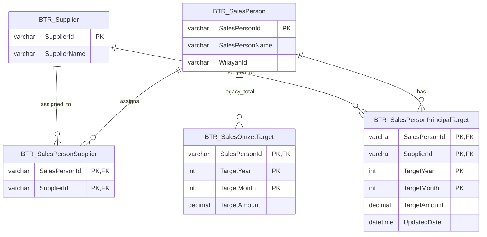

# Salesman Monthly Target Management — Analysis & Architecture

**Status:** Implemented in BTR.Distrib (SM6 — `SalesPersonPrincipalTargetForm`, `BTR_SalesPersonPrincipalTarget`). See `docs/features/sales-person-principal-target/feature.md`.  
**Scope:** Business analysis and technical design only. No implementation tasks or code.  
**Date:** 2026-06-10 (Product Owner decisions recorded 2026-06-10)  
**System:** BTR.Distrib (`src/j05-btr-distrib`)  
**Related artifacts:** `docs/features/sales-person-principal/feature.md`, `docs/work/btr-portal/M18 Salesman Performance - Analysis.md`

---

## Context Summary

BTR already maintains:

| Capability | Artifact / Table | Status |
|------------|------------------|--------|
| Sales Person master | `BTR_SalesPerson`, SM1 | Exists |
| Sales Person–Principal assignment | `BTR_SalesPersonSupplier`, SM5 | Exists (recent) |
| Monthly sales target (aggregate per rep) | `BTR_SalesOmzetTarget` | Table + read DAL exist; **no Desktop maintenance UI** |
| Target consumption | RO2 chart, Portal M13/M18 snapshots | Read-only consumers |

**Gap:** Management needs **monthly targets per Principal** (Supplier), constrained to Principals already assigned to each Sales Person. There is no maintenance screen and no per-Principal target storage.

**Example requirement:**

| Year | Month | Sales Person | Principal | Target |
|------|-------|--------------|-----------|--------|
| 2026 | Jan | Budi | Unilever | 500,000,000 |
| 2026 | Jan | Budi | Wings | 300,000,000 |
| 2026 | Feb | Budi | Unilever | 550,000,000 |
| 2026 | Feb | Budi | Wings | 320,000,000 |

---

# A. Business Analysis

## A.1 Business Process

### Current state

1. **SM1** — Sales Person master data is maintained.
2. **SM5** — Operations assigns which Principals each Sales Person handles (`BTR_SalesPersonSupplier`).
3. **Planning** — Management sets monthly sales plans outside BTR (spreadsheets, verbal targets) because there is no per-Principal target entry.
4. **Monitoring** — RO2 Sales Omzet report and Portal dashboards compare **company-level** or **single aggregate rep target** (`BTR_SalesOmzetTarget`) against invoiced omzet. Principal-level plan vs actual is not available in-system.

### Target state

1. Before or at the start of each month, operational staff (sales admin / supervisor) define monthly targets per Sales Person **per assigned Principal**.
2. Targets are entered only for `(Sales Person, Principal)` pairs that exist in SM5 at save time.
3. During the month, management can review achievement (future reporting); maintenance staff can correct targets when plans change.
4. Principal assignment changes in SM5 do not rewrite historical targets but affect which Principals appear for **new** target entry.

### Actors

| Actor | Role |
|-------|------|
| Sales Admin / Supervisor | Primary maintainer — sets monthly targets for many reps |
| Sales Manager | Reviews completeness; may approve revisions |
| Management / Portal user | Consumes aggregated achievement (M18, RO2) — not a maintainer |

### Process flow (proposed)

```text
[Monthly planning cycle]
     │
     ├─► (Optional) Copy previous month targets for selected period
     │
     ├─► Select Year + Month
     │
     ├─► For each Sales Person (or search one rep):
     │       Load assigned Principals from SM5
     │       Enter / adjust TargetAmount per Principal
     │       Save
     │
     └─► System validates assignment + amounts
```

**Cadence:** Monthly setup is the primary use case. Year is explicit on every row so targets can be prepared for future months (e.g. Q1 planning in December).

---

## A.2 Business Rules

### Target granularity

| Dimension | Rule |
|-----------|------|
| **Period** | Calendar month (`TargetYear` + `TargetMonth`, 1–12) |
| **Sales Person** | One row set per Sales Person per month |
| **Principal** | One target amount per assigned Principal per Sales Person per month |
| **Branch / Wilayah** | **Not in scope** — Sales Person already carries `WilayahId`; targets follow the person, not a separate branch dimension |

### Core rules

1. **Assignment gate** — A target may only be saved for a Principal that is **currently assigned** to the Sales Person in `BTR_SalesPersonSupplier`.
2. **Uniqueness** — At most one target per `(Sales Person, Principal, Year, Month)`.
3. **Non-negative amount** — `TargetAmount >= 0`. Zero is allowed (explicit “no expectation” for that Principal in that month).
4. **Principal = Supplier** — Business term Principal maps to `BTR_Supplier` / `SupplierId` (consistent with SM5).
5. **Independence from transactions** — Target records do not create or modify Faktur, Sales Order, or assignment master data.
6. **Historical sales unaffected** — Changing or deleting a target does not change posted sales documents.

### Relationship to existing aggregate target (`BTR_SalesOmzetTarget`)

The legacy table stores **one total per Sales Person per month** (no Principal). It is already consumed by RO2 and Portal M13/M18.

| Rule (recommended) | Rationale |
|--------------------|-----------|
| Per-Principal targets are the **source of truth** when present | Matches management’s stated planning granularity |
| Rep-level total for dashboards = **SUM** of Principal targets for that rep/month when any Principal target rows exist | Keeps M18 achievement % consistent with detailed plan |
| If no Principal targets exist for a rep/month, **fall back** to legacy `BTR_SalesOmzetTarget` row | Preserves existing data and avoids forced migration |
| Do **not** require duplicate entry in both tables | Operational staff maintain Principal lines only |

### Achievement measurement (Product Owner — Q7, Q8)

| Rule | Detail |
|------|--------|
| **Target basis (Q7)** | Invoice Amount (Omzet Faktur) per Principal — `FakturItem.Total` attributed via `Brg.SupplierId` |
| **Achievement numerator (Q8)** | Sales omzet only; **retur does not reduce** achievement in v1 |
| **Formula** | `Achievement % = Sales Omzet / Target Omzet × 100` |
| **Out of scope v1** | Gross vs net, margin, retur-adjusted omzet, collection-adjusted omzet |

### Assignment change rules

| Event | Behavior (recommended) |
|-------|------------------------|
| Principal **added** to Sales Person | Appears in target grid with blank/zero default for open months; no auto-target |
| Principal **removed** from Sales Person | Hidden from active entry grid; **existing target rows retained** for history |
| Save attempted for unassigned Principal | **Rejected** with clear message |

### Revision rules (recommended defaults)

| Question | Recommended rule |
|----------|------------------|
| Revise after month starts? | **Yes** — plans change; last saved value wins |
| Multiple revisions / versioning? | **No** in v1 — single current row per key; optional `UpdatedDate` for audit |
| Mandatory for all assigned Principals? | **No** — partial setup allowed; UI shows completeness indicator |
| Mandatory for all Sales Persons? | **No** — same as today (`GetTargetAmount` returns null → Unknown achievement) |

---

## A.3 Validation Rules

| # | Validation | When | Message intent |
|---|------------|------|----------------|
| V1 | `TargetYear` valid (e.g. 2000–2100) | Save | Invalid year |
| V2 | `TargetMonth` in 1–12 | Save | Invalid month |
| V3 | `SalesPersonId` exists and active in master | Load/Save | Unknown sales person |
| V4 | `SupplierId` exists in `BTR_Supplier` | Save | Unknown principal |
| V5 | `(SalesPersonId, SupplierId)` exists in `BTR_SalesPersonSupplier` | Save | Principal not assigned to this sales person |
| V6 | `TargetAmount >= 0` | Save | Amount cannot be negative |
| V7 | No duplicate `(SalesPersonId, SupplierId, Year, Month)` | Save | Duplicate target |
| V8 | Decimal precision within `DECIMAL(18,2)` | Save | Amount too large |

**Soft validations (warnings, not blocks):**

| # | Condition | Purpose |
|---|-----------|---------|
| W1 | Assigned Principal has no target row for selected month | Highlight incomplete monthly setup |
| W2 | Sum of Principal targets differs from legacy `BTR_SalesOmzetTarget` when both exist | Data migration / reconciliation alert |
| W3 | Target rows exist for Principals no longer assigned | Orphan historical data indicator |

---

## A.4 Product Owner Decisions (Authoritative)

All open questions are resolved. The following four decisions are binding for implementation.

| # | Question | **Decision** |
|---|----------|--------------|
| **Q7** | Target measurement basis | **Invoice Amount (Omzet Faktur) per Principal** — Faktur item total attributed via Item → `Brg.SupplierId` |
| **Q8** | Should retur reduce achievement? | **No, not in v1** — achievement uses sales omzet only, not net-after-retur |
| **Q10** | Who may edit targets? | **Same permission scope as SM5** (Sales Person Principal Assignment) |
| **Q11** | Copy Previous Month for all salesmen? | **Approved for v1** — primary monthly rollover workflow |

### Q7 — Target basis

**Decision:** Invoice Amount (Omzet Faktur) attributed to Principal through Item → Supplier.

- Existing sales and omzet reports already use omzet thinking.
- Salesmen are measured by sales achievement, not net-after-return profitability.
- User-facing explanation: *Target Rp 500 juta, actual sales Rp 450 juta → 90%.*

**Explicitly out of scope for v1 target/achievement pairing:**

- Gross vs Net distinctions
- Margin-based targets
- Retur-adjusted omzet
- Collection-adjusted omzet

Those remain future analytics concerns (e.g. separate KPIs in M18).

### Q8 — Retur and achievement

**Decision:** Retur does **not** reduce achievement in v1.

```text
Achievement % = Sales Omzet / Target Omzet × 100
```

Not `(Net Sales − Retur) / Target`.

- Consistent with existing RO2 and Portal logic.
- Avoids historical dashboard behavior changes.
- Keeps v1 implementation simple.

If management later needs Sales Achievement, Net Achievement, and Collection Achievement as separate KPIs, those can be added in M18 without revising the v1 target model.

### Q10 — Permissions

**Decision:** Users who maintain Sales Person and Sales Person Principal (SM1, SM5) may also maintain Sales Person Principal Target (SM6).

- Same operational owner.
- No new permission infrastructure.
- Lowest implementation cost.

### Q11 — Copy for all salesmen

**Decision:** **Copy Previous Month for All Salesmen** is approved and required in v1.

Expected monthly cycle:

```text
July targets  →  Copy to August  →  Adjust only changed values
```

This is anticipated to be the most-used function on the screen for distribution operations with many salesmen.

---

## A.5 Adopted Business Rules (from analysis)

The following items were resolved during analysis and remain in effect. No further Product Owner action required.

| # | Topic | Rule |
|---|-------|------|
| Q1 | Revise after month starts | **Yes** — last-write-wins |
| Q2 | Multiple revisions / versioning | **No in v1** — optional `UpdatedDate` only |
| Q3 | Mandatory for all assigned Principals | **No** — warnings for incomplete setup |
| Q4 | Principal assignment changes | **Retain historical targets**; block saves for removed Principals |
| Q5 | Historical preservation | **Keep all target rows indefinitely** |
| Q6 | Branch-specific targets | **Out of scope** — defer to future |
| Q9 | `BTR_SalesOmzetTarget` coexistence | **Principal sum supersedes**; legacy row as fallback |

---

## A.6 UX Analysis — Maintenance Workflow Options

Operational staff must maintain targets for **many salesmen × several principals × 12 months**. Efficiency is critical.

### Option A — Sales Person → Month → Target Entries

**Flow:** Pick Sales Person (list/search) → pick Year/Month → grid of assigned Principals with amount column → Save.

| Pros | Cons |
|------|------|
| Matches SM5 mental model and UI pattern | Slow for “set entire company for March” |
| Natural when one rep’s plan is negotiated individually | Repeated period selection per rep |
| Low error rate — only assigned Principals shown | |
| Easy training: “same as SM5 but with amounts” | |

### Option B — Period → Salesman Grid → Target Matrix

**Flow:** Pick Year/Month → matrix (rows = Sales Persons, columns = Principals or sparse list) → bulk edit → Save.

| Pros | Cons |
|------|------|
| Fast month-wide setup | Wide grids when many Principals (sparse matrix problem) |
| Good overview of completeness | Harder when each rep has different Principal set |
| Single period context | Higher risk of mis-entry across rows |

### Option C — Bulk Setup / Copy Previous Month

**Flow:** Select target month → “Copy from previous month” (or pick source month) → optionally filter salesmen → review diff → Save.

| Pros | Cons |
|------|------|
| Dramatically reduces repetitive entry | Copied amounts may be wrong if assignments changed |
| Fits recurring monthly ritual | Needs preview + selective overwrite |
| Complements A or B | Not sufficient alone |

### UX Recommendation

**Primary: Option A** with **Option C embedded** as a first-class action.

| Choice | Justification |
|--------|---------------|
| **Option A as primary** | Aligns with SM5 (`SalesPersonSupplierForm`), minimizes training, respects different Principal sets per rep |
| **Option C as mandatory adjunct** | Monthly rollover is the highest-frequency bulk operation (**PO-approved Q11**) |
| **Option B as lightweight variant** | Optional “Period overview” read-only grid showing completeness % per rep; drill-down opens Option A for editing — not full matrix edit in v1 |

**Efficiency features (v1 — Q11 approved):**

- Remember last selected Year/Month
- Search Sales Person by name/code
- Keyboard-friendly amount entry in grid (Tab between cells)
- **Copy Previous Month** for current Sales Person
- **Copy Previous Month for All Sales Persons** — **required v1 feature**; confirmation dialog; only creates/updates rows for current assignments; does not delete orphans
- Visual completeness: `3/5 Principals have target` for selected rep/month
- Save once per rep (not per cell) — standard BTR form pattern

---

# B. Architecture Design

## B.1 Domain Model

### Bounded context

**Sales Context — Master Data / Planning** (alongside SM1, SM5).

Targets are planning master data, not sales transactions.

### Entities and relationships

```text
SalesPerson (existing)
    │
    ├──< SalesPersonSupplier (existing) >── Supplier/Principal (existing)
    │         │
    │         └── eligibility for ──► SalesPersonPrincipalTarget (new)
    │
    └──< SalesOmzetTarget (existing, legacy aggregate) ── optional fallback
```

### Aggregate: `SalesPersonPrincipalTarget` (new)

| Aspect | Design |
|--------|--------|
| **Aggregate root** | One target row = one `(SalesPersonId, SupplierId, TargetYear, TargetMonth)` |
| **Ownership** | Owned by Sales planning; references Sales Person and Supplier master data |
| **Consistency boundary** | Save validates against current `SalesPersonSupplier` assignment |
| **Not an aggregate of SM5** | Assignment changes do not cascade-delete targets |

### Domain invariants

1. `SalesPersonId` + `SupplierId` + `TargetYear` + `TargetMonth` is unique.
2. `TargetAmount >= 0`.
3. On insert/update, `(SalesPersonId, SupplierId)` must exist in `SalesPersonSupplier`.
4. `SupplierId` references a valid Supplier.
5. `SalesPersonId` references a valid Sales Person.

### Value objects

| Name | Fields |
|------|--------|
| `TargetPeriod` | `Year`, `Month` |
| `TargetAmount` | `decimal` (non-negative, 2 decimal places) |

### Application services (conceptual)

| Service | Responsibility |
|---------|----------------|
| `SalesPersonPrincipalTargetWriter` | Upsert/delete targets with validation |
| `SalesPersonPrincipalTargetDal` | List by rep+period, list by period, copy month |
| `SalesPersonPrincipalTargetResolver` | Resolve rep total = sum(principal) or legacy fallback |
| `SalesPersonPrincipalTargetValidator` | V1–V8 rules |

---

## B.2 Entity Relationship (logical)



---

## B.3 Database Schema Proposal

### New table: `BTR_SalesPersonPrincipalTarget`

Recommended name follows existing `BTR_SalesPersonSupplier` prefix pattern. Business documents may refer to “Salesman Principal Target.”

```sql
CREATE TABLE BTR_SalesPersonPrincipalTarget
(
    SalesPersonId VARCHAR(5)  NOT NULL,
    SupplierId    VARCHAR(5)  NOT NULL,
    TargetYear    INT         NOT NULL,
    TargetMonth   INT         NOT NULL,
    TargetAmount  DECIMAL(18, 2) NOT NULL
        CONSTRAINT DF_BTR_SalesPersonPrincipalTarget_TargetAmount DEFAULT (0),
    UpdatedDate   DATETIME    NOT NULL
        CONSTRAINT DF_BTR_SalesPersonPrincipalTarget_UpdatedDate DEFAULT (GETDATE()),

    CONSTRAINT PK_BTR_SalesPersonPrincipalTarget
        PRIMARY KEY CLUSTERED (SalesPersonId, SupplierId, TargetYear, TargetMonth),

    CONSTRAINT FK_BTR_SalesPersonPrincipalTarget_SalesPerson
        FOREIGN KEY (SalesPersonId) REFERENCES BTR_SalesPerson (SalesPersonId),

    CONSTRAINT FK_BTR_SalesPersonPrincipalTarget_Supplier
        FOREIGN KEY (SupplierId) REFERENCES BTR_Supplier (SupplierId),

    CONSTRAINT CK_BTR_SalesPersonPrincipalTarget_TargetMonth
        CHECK (TargetMonth BETWEEN 1 AND 12),

    CONSTRAINT CK_BTR_SalesPersonPrincipalTarget_TargetAmount
        CHECK (TargetAmount >= 0)
)
GO

CREATE INDEX IX_BTR_SalesPersonPrincipalTarget_YearMonth
    ON BTR_SalesPersonPrincipalTarget (TargetYear, TargetMonth)
    INCLUDE (SalesPersonId, SupplierId, TargetAmount)
GO

CREATE INDEX IX_BTR_SalesPersonPrincipalTarget_SalesPerson_Period
    ON BTR_SalesPersonPrincipalTarget (SalesPersonId, TargetYear, TargetMonth)
    INCLUDE (SupplierId, TargetAmount)
GO
```

### Design decisions

| Topic | Decision | Notes |
|-------|----------|-------|
| **Composite PK** | `(SalesPersonId, SupplierId, TargetYear, TargetMonth)` | Natural key; no surrogate ID needed; matches `BTR_SalesPersonSupplier` style |
| **Surrogate `SalesPersonPrincipalTargetId`** | Not recommended | Adds join complexity without benefit at this scale |
| **`CreatedDate`** | Optional; omit in v1 if inconsistent with Sales tables | `UpdatedDate` sufficient for “last changed” |
| **`CreatedBy` / `UpdatedBy`** | Optional v2 | BTR Sales tables rarely use user audit columns |
| **Revision / versioning table** | Not in v1 | Revisit if compliance requires immutable history |
| **FK to `BTR_SalesPersonSupplier`** | Not as DB FK | Assignment can be removed while history remains; enforce in application layer |
| **Soft delete** | No | Use amount = 0 or delete row; orphans kept when assignment removed |

### Coexistence with `BTR_SalesOmzetTarget`

| Approach | Recommendation |
|----------|----------------|
| Migrate existing rows | **No automatic split** — legacy rows stay until staff enter Principal detail |
| Rep total resolution | Extend `ISalesOmzetTargetDal.GetTargetAmount`: if `SUM(PrincipalTarget)` > 0 for rep/month, return sum; else legacy row |
| `SumTargetAmountForMonth` | Sum resolved rep totals (not double-count) |
| Future deprecation | Once all reps use Principal targets, `BTR_SalesOmzetTarget` can be read-only legacy |

### Achievement data source (future consumers)

Per-Principal achievement (not in v1 UI, but design must allow):

```text
Faktur (SalesPersonId, FakturDate)
  → FakturItem (BrgId, Total)
    → Brg (SupplierId)
Group by SalesPersonId, SupplierId, Year(FakturDate), Month(FakturDate)
```

Same join pattern as `OmzetSupplierViewDal`, filtered by `SalesPersonId` and void date.

---

## B.4 Desktop UI Design Proposal

### Menu placement

| Item | Value |
|------|-------|
| Menu group | Master Sales (with SM1, SM5) |
| Suggested code | **SM6-Principal Target** |
| Form | `SalesPersonPrincipalTargetForm` |
| Pattern | Extend SM5 layout: Sales Person list + period toolbar + Principal target grid |

### Wireframe — Main screen

```text
┌─────────────────────────────────────────────────────────────────────────────┐
│ SM6 - Sales Person Principal Target                                         │
├─────────────────────────────────────────────────────────────────────────────┤
│ Period: [Year ▼ 2026]  [Month ▼ Jan]   [Copy Prev Month ▼] [Copy All Reps] │
│ Search: [____________] [Search]                              [Save] [Refresh]│
├──────────────────────┬──────────────────────────────────────────────────────┤
│ Sales Person         │ Principal Targets for: Budi (SP001) — Jan 2026       │
│ ┌────┬──────┬──────┐ │ Completeness: 2/2 assigned principals                │
│ │Code│ Name │ Done │ │ ┌────────────┬──────────────┬─────────────────────┐ │
│ ├────┼──────┼──────┤ │ │Principal   │ Code         │ Target Amount       │ │
│ │SP01│ Budi │  ✓   │ │ ├────────────┼──────────────┼─────────────────────┤ │
│ │SP02│ Ani  │  ○   │ │ │ Unilever   │ UNV          │ [   500,000,000.00] │ │
│ │SP03│ ...  │      │ │ │ Wings      │ WNG          │ [   300,000,000.00] │ │
│ │    │      │      │ │ └────────────┴──────────────┴─────────────────────┘ │
│ └────┴──────┴──────┘ │ Total: 800,000,000.00                                │
└──────────────────────┴──────────────────────────────────────────────────────┘
```

### UI behaviors

| Element | Behavior |
|---------|----------|
| **Sales Person list (left)** | Same search/grid pattern as SM5; “Done” column = all assigned Principals have target row (or non-zero, configurable) |
| **Period selectors** | Changing period reloads grid for selected rep |
| **Principal grid (right)** | One row per **currently assigned** Principal; amounts editable; `SupplierId` hidden |
| **Total row** | Read-only sum of Principal targets |
| **Save** | Upsert all rows for current rep/period; validate V1–V7 |
| **Copy Previous Month** | Current rep only; copies amounts for Principals assigned in **both** months; new assignments get 0 |
| **Copy for All Reps** | Batch copy previous → current month with confirmation dialog showing affected rep count |
| **Orphan indicator** | If historical targets exist for removed Principals, optional “Show history” toggle (read-only) — v2 nice-to-have |

### Search / filter strategy

- Left panel: filter by name/code (client-side on loaded list, same as SM5)
- No multi-select edit in v1
- Period is global for the session (applies to all reps until changed)

### Module layout (aligned with BTR conventions)

```text
btr.domain/SalesContext/SalesPersonPrincipalTargetAgg/
btr.application/SalesContext/SalesPersonPrincipalTargetAgg/
btr.infrastructure/SalesContext/SalesPersonPrincipalTargetAgg/
btr.distrib/SalesContext/SalesPersonPrincipalTargetAgg/
btr.sql/Tables/SalesContext/BTR_SalesPersonPrincipalTarget.sql
```

---

## B.5 Future Scalability Considerations

| Future requirement | Design compatibility |
|--------------------|------------------------|
| **Target achievement % per Principal** | Achievement = grouped FakturItem by `Brg.SupplierId` + `Faktur.SalesPersonId`; **no retur deduction (Q8)**; target key matches |
| **Rep-level achievement (M18)** | `GetTargetAmount` sums Principal targets; extend `ListTargetsForMonth` unchanged contract |
| **Dashboard integration** | Portal snapshot workers already use `ISalesOmzetTargetDal` — extend implementation, not consumer contracts |
| **Salesman performance ranking** | M18 Top Achievement % uses rep total; Principal breakdown = additional ranking dimension later |
| **Principal performance analysis** | Natural group-by on `SupplierId` across all reps |
| **M18 Salesman Performance Dashboard** | Below Target / No Target signals work at rep level immediately; Principal-level attention cards = additive |
| **Incentive / commission** | Principal-level targets enable proportional commission rules; store basis enum column later if Net vs Gross needed |
| **Branch-specific targets** | Would require `(SalesPersonId, SupplierId, WilayahId?, Year, Month)` — not blocked if column added later |
| **Target versioning** | Add `BTR_SalesPersonPrincipalTargetHistory` with effective date — current PK remains “current” row |
| **Retur-adjusted / net achievement** | Separate KPI in M18 later; v1 uses sales omzet only per Q8; add `AchievementBasis` enum if multiple formulas coexist |
| **Portal / mobile read** | Read-only API can expose same DAL; no sync to BTrade3 required for master data |
| **Bulk import (Excel)** | Batch upsert by natural key; validation reuse |

**Explicit non-blockers:** Composite PK can migrate to surrogate later; `TargetAmount` precision matches financial amounts system-wide; indexes support month-wide queries for dashboard refresh.

---

# C. Final Recommendation

## C.1 Business workflow

Adopt **Option A (Sales Person → Month → Principal grid)** as the primary maintenance workflow, with **Copy Previous Month** (per rep and **all-rep batch — PO Q11**) as required v1 features. Use a read-only period overview for completeness checking, not full matrix editing in v1.

**Measurement basis (Q7):** Invoice Amount (Omzet Faktur) per Principal — Faktur item totals via `Brg.SupplierId`, Faktur date in calendar month. No gross/net/margin/retur/collection adjustments in v1.

**Achievement formula (Q8):** `Sales Omzet / Target Omzet` — retur does not reduce numerator in v1.

**Permissions (Q10):** Same scope as SM5.

**Governance:** Allow mid-month revisions with last-write-wins; do not require targets for every Principal; retain historical target rows when SM5 assignments change.

## C.2 Technical design

Introduce **`BTR_SalesPersonPrincipalTarget`** with composite primary key `(SalesPersonId, SupplierId, TargetYear, TargetMonth)` and application-enforced assignment validation against `BTR_SalesPersonSupplier`.

Extend **`ISalesOmzetTargetDal`** resolution so rep-level totals prefer the **sum of Principal targets**, falling back to **`BTR_SalesOmzetTarget`** for unmigrated data — preserving RO2 and M18 behavior without duplicate data entry.

Desktop UI: new **SM6** form mirroring SM5 layout with period toolbar, editable Principal amount grid, copy-month actions, and completeness indicators.

## C.3 Justification

| Decision | Why |
|----------|-----|
| New table vs extending `BTR_SalesOmzetTarget` | Principal dimension breaks existing PK and would force migration of all consumers |
| Assignment validation in app, not FK | Supports historical targets after assignment removal |
| Sum-for-rep fallback strategy | Zero disruption to Portal M13/M18 while enabling richer planning |
| SM5-style UI | Lowest training cost for operational staff who already maintain assignments |
| Copy month batch (Q11) | PO-approved primary monthly workflow; avoids re-entry across many salesmen |
| No versioning in v1 | Simplest model that satisfies planning and achievement; expand only if audit demands |

## C.4 Out of scope (this plan)

- Implementation tasks, code, or SQL scripts
- Retur-adjusted / net / collection-adjusted achievement (explicitly out of scope v1 per Q7/Q8)
- Principal-level achievement reports and Portal UI
- Excel import
- Automatic target suggestion from prior-year actuals
- Deprecation/removal of `BTR_SalesOmzetTarget`

---

**Next step:** Architect produces `docs/work/salesman-target/implementation-plan.md`; Implementer executes upon approval.
